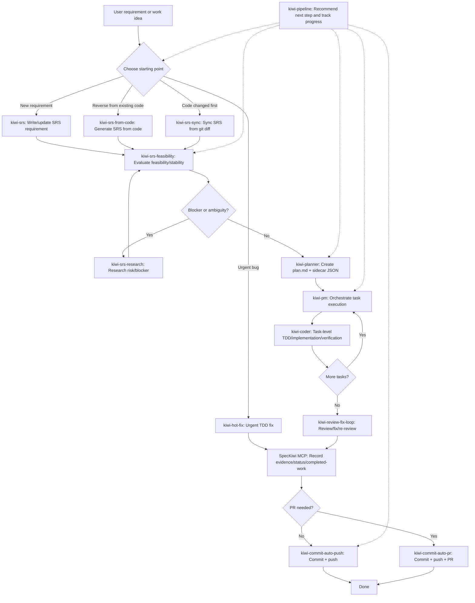
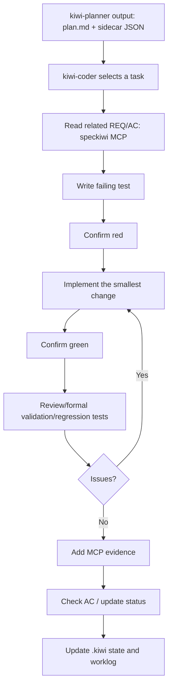
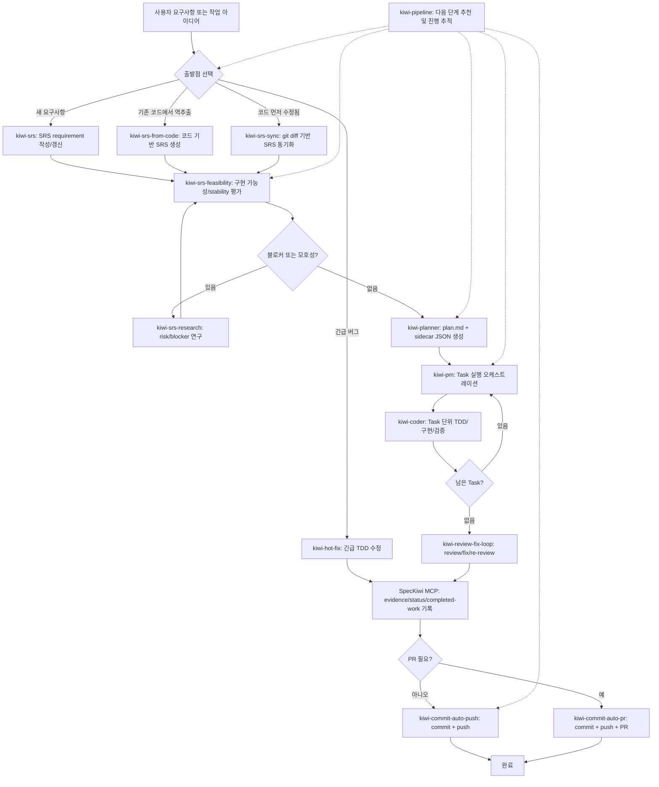
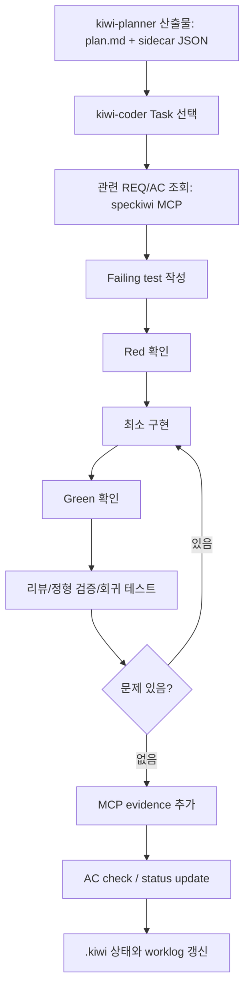

<p align="center">
  <a href="#english-version"><strong>📖 View English documentation</strong></a>
  &nbsp;·&nbsp;
  <a href="#korean-version"><strong>📖 한국어 문서 보기</strong></a>
</p>

---

<a id="english-version"></a>

# SpecKiwi

SpecKiwi is a local-first workflow tool that treats Markdown SRS (Software Requirements Specification) documents inside a Git repository as the canonical source of requirements. It gives people and coding agents a single shared view of the same requirements through a **CLI** and a **stdio MCP server**.

**Kiwi skills** are coding-agent skills built on top of SpecKiwi. They connect requirement authoring, feasibility review, implementation planning, TDD-based coding, SRS synchronization, commit, and push into one pipeline.

- Requirements live in `docs/spec/**/*.srs.md` (GitHub-Flavored Markdown). No YAML, no database, no requirements server.
- The CLI and the MCP server share the same core parser, validator, query, and mutation engine.
- Everything is a normal Git-tracked file, so requirements are reviewed and versioned like code.

**Key terms.** A **Target** (e.g. `v0.1.0`) groups requirements for a release; the **Active Target** is the one new work defaults to. A **Scope** is a functional area with an ID prefix (`App:APP` → `FR-APP-001`). Each requirement carries two independent lifecycle fields — **Status** (implementation/verification progress) and **Stability** (change-control maturity).

## Table of Contents

1. [Requirements](#en-requirements)
2. [Install SpecKiwi](#en-install)
3. [Initialize a project — and what `init` does](#en-init)
4. [Install Kiwi Skills (standalone)](#en-skills)
5. [Connect the MCP server](#en-mcp)
6. [Kiwi skill types](#en-skill-types)
7. [Skill pipeline](#en-pipeline)
8. [Command reference](#en-commands)
9. [SRS working principles](#en-principles)
10. [Package development](#en-dev)
11. [Related requirements](#en-reqs)

<a id="en-requirements"></a>

## 1. Requirements

- **Node.js 22 or newer** (`engines.node` is `>=22`)
- **npm**
- **Git** (SpecKiwi resolves the project root by searching upward for a Git repository)
- One supported coding agent: `codex`, `claude`, `opencode`, or `hermes`

<a id="en-install"></a>

## 2. Install SpecKiwi

Install SpecKiwi in your project:

```sh
npm install speckiwi@latest
```

After a local install, run it with `npx`:

```sh
npx speckiwi --version   # -> 2.4.0
npx speckiwi --help
```

To put `speckiwi` on your PATH directly, install it globally:

```sh
npm install -g speckiwi@latest
speckiwi --version
```

The examples below use the short `speckiwi` form. If you installed locally only, prefix each command with `npx`.

**Global options** available on every command:

| Option | Description |
| --- | --- |
| `--root <path>` | Project root to operate on (default: search upward from the current directory). |
| `--json` | Emit machine-readable JSON to stdout. |
| `--no-color` | Disable ANSI color. |
| `--quiet` | Suppress non-essential human output. |
| `-V, --version` | Print the version. |
| `-h, --help` | Print help for the command. |

<a id="en-init"></a>

## 3. Initialize a project — and what `init` does

Run `init` once at the Git project root to create (or top up) a SpecKiwi SRS workspace **and** onboard your coding agents in a single step:

```sh
speckiwi init --target v0.1.0 --scope "App:APP"
```

### What `speckiwi init` performs

The whole operation runs under an SRS mutation lock and is **idempotent** — existing files are reported as `skipped` (never overwritten unless you pass `--force`), and the agent-instruction block is upgraded in place when an older version is present.

| # | Step | Result |
| --- | --- | --- |
| 1 | **SRS scaffold** | `docs/spec/00.index.md` (Target Map, Scope Map, Completed Work Log center), `docs/spec/90.appendix.md`, and an empty scope document `docs/spec/<NN>.<scope>.srs.md` derived from `--scope`. |
| 2 | **Step state** | `docs/spec/steps/state.md` with a `Mode: wait` metadata block and an empty step-state table. |
| 3 | **Authoring rules** | `docs/rule/SRS-MD-Rules-v1.0.0.md` and `docs/rule/SDS-MD-Rules-v1.0.0.md` (the bundled SRS-MD and SDS-MD authoring rules). |
| 4 | **Agent instructions** | Inserts/updates the *SpecKiwi SRS workflow* block in both `AGENTS.md` and `CLAUDE.md`. An older version of the block is replaced in place; a current block is left untouched. |
| 5 | **Hooks** | `docs/.kiwi/hooks/{pre-commit.mjs,trace.mjs}` + `docs/.kiwi/trace/`; a Git `.git/hooks/pre-commit` gate that delegates to the runner; `.claude/settings.json` (PostToolUse trace hook); `.codex/hooks.json` (apply_patch trace hook). Pre-existing hooks are never clobbered — they are left as-is with a warning. |
| 6 | **MCP registration** | Registers the SpecKiwi stdio MCP server in `.mcp.json` (idempotent; `skipped` if already present). Disable with `--no-mcp`. |
| 7 | **Skill provisioning** | Installs the bundled Kiwi skills for **Claude** (`.claude/skills`) and **Codex** (`.agents/skills`), then prunes orphaned `kiwi-*` skill directories that SpecKiwi previously managed. Disable with `--no-skills`. |

The result is reported as an envelope of five arrays: **`created` / `updated` / `skipped` / `removed` / `warnings`** (add `--json` for the machine-readable form).

Typical layout after a first run:

```text
AGENTS.md                     # SpecKiwi SRS workflow block
CLAUDE.md                     # SpecKiwi SRS workflow block
.mcp.json                     # speckiwi MCP server registration
.claude/skills/kiwi-*         # Claude Kiwi skills
.agents/skills/kiwi-*         # Codex Kiwi skills
.claude/settings.json         # PostToolUse trace hook
.codex/hooks.json             # apply_patch trace hook
.git/hooks/pre-commit         # delegates to docs/.kiwi/hooks/pre-commit.mjs
docs/
├─ .kiwi/hooks/               # bundled hook runners + trace output
├─ rule/
│  ├─ SRS-MD-Rules-v1.0.0.md
│  └─ SDS-MD-Rules-v1.0.0.md
└─ spec/
   ├─ 00.index.md             # targets, scopes, completed work log
   ├─ 10.app.srs.md           # your first scope document
   ├─ 90.appendix.md
   └─ steps/state.md
```

`docs/spec/00.index.md` is the hub for targets, scopes, and the completed work log. Requirement bodies live in `docs/spec/**/*.srs.md`, which remains the **canonical source of truth**.

### `init` options

| Option | Description |
| --- | --- |
| `--target <target>` | Initial Active Target to register (e.g. `v0.1.0`). |
| `--scope "Name:PREFIX"` | Initial scope; creates the scope document and Scope Map row (e.g. `"App:APP"` → `FR-APP-001`). |
| `--no-mcp` | Skip registering the MCP server in `.mcp.json`. |
| `--no-skills` | Skip installing the bundled Kiwi skills (and the orphan prune). |
| `--dry-run` | Preview every step (populates `created`/… ) without writing anything to disk. |
| `--force` | Overwrite existing scaffolded files instead of skipping them. |
| `--ignore-lock` | Bypass a stale SRS mutation lock. |
| `--json` | Emit the result envelope as JSON. |

**Exit codes:** `0` success · `2` usage error (e.g. unknown flag) · `5` init failure (e.g. a held mutation lock).

> **MCP parity note.** The MCP `init_project` tool only scaffolds the SRS files — it never registers the MCP server or installs skills. Those two steps are CLI defaults, so running `init` through an agent's MCP connection can never self-install skills or edit `.mcp.json`.

<a id="en-skills"></a>

## 4. Install Kiwi Skills (standalone)

`speckiwi init` already provisions Claude + Codex project skills. Use the standalone installer when you want a **different agent** (OpenCode, Hermes), a **global** install, or a **custom destination**:

```sh
speckiwi skills install <agent> <skill|all>
```

Supported `<agent>` values: `codex`, `claude`, `opencode`, `hermes`.

```sh
speckiwi skills install codex all
speckiwi skills install claude all
speckiwi skills install opencode all
speckiwi skills install hermes all --global
```

Preview the plan before copying files:

```sh
speckiwi skills install codex all --dry-run --json
```

### Agents and destinations

| Agent | Package source root | Default project destination | Global destination |
| --- | --- | --- | --- |
| Codex | `skills/codex` | `.agents/skills/<skill>` | `${CODEX_HOME:-$HOME/.codex}/skills/<skill>` |
| Claude | `skills/claude` | `.claude/skills/<skill>` | `$HOME/.claude/skills/<skill>` |
| OpenCode | `skills/etc` | `.opencode/skills/<skill>` | `$HOME/.config/opencode/skills/<skill>` |
| Hermes | `skills/etc` | requires `--dest <dir>` | `$HOME/.hermes/skills/<category>/<skill>` |

### Options

| Option | Description |
| --- | --- |
| `--global`, `-g` | Install into the user-level skill directory. |
| `--dest <dir>` | Install into a custom destination root; each skill lands under `<dir>/<skill>`. |
| `--category <name>` | Hermes global-install category (default `kiwi`; Hermes global only). |
| `--dry-run` | Print the install plan without copying files. |
| `--json` | Print machine-readable JSON output. |

`--global` and `--dest` are mutually exclusive. Per-skill operations are reported as **`install` / `update` / `skip` / `conflict`**. A `conflict` (an unsafe path or a destination that is not a valid skill) aborts without a partial install.

<a id="en-mcp"></a>

## 5. Connect the MCP server

Normal Kiwi skill workflows expect a connected SpecKiwi MCP server:

```sh
speckiwi mcp
```

The server speaks **stdio** and does **not** accept `--root`. It resolves the project root from the server process's current working directory by searching upward, so set the client's working directory (cwd) to the project root. Running the server with `--root` exits with an error instead of starting.

`speckiwi init` writes this registration into `.mcp.json`:

```json
{
  "mcpServers": {
    "speckiwi": {
      "command": "npx",
      "args": ["-y", "speckiwi", "mcp"]
    }
  }
}
```

After `init` writes `.mcp.json`, reload or restart your agent so it launches the server. Run `speckiwi mcp` by hand only for debugging — it blocks on stdio and can look like it is hanging.

### MCP tools

Kiwi skills use MCP tools for all reads and safe SRS mutations. CLI equivalents exist as a fallback for diagnostics and manual operation — they are not the normal mutation path.

| Category | Tools |
| --- | --- |
| Target & goal | `get_active_target`, `set_active_target`, `set_target_goal`, `summarize_target` |
| Read | `list_requirements`, `get_requirement`, `list_completed_work`, `search_requirements`, `get_next_work_order` |
| Status & stability | `update_status`, `update_stability` |
| Evidence & trace | `check_acceptance_criteria`, `add_verification_evidence`, `add_trace_link` |
| Authoring & editing | `add_requirement`, `append_section_note`, `add_completed_work`, `edit_requirement_fields`, `edit_requirement_table_rows`, `replace_acceptance_criteria`, `supersede_requirement` |
| Work mode | `get_work_mode`, `set_work_mode` |
| Steps & TDD First | `claim_step`, `scaffold_step`, `validate_step`, `synthesize_step_srs`, `promote_step_requirement`, `update_step_state`, `set_sds_status`, `list_steps`, `check_vibe_gate` |
| Duplicate-ID repair | `diagnose_requirement_id_collisions`, `plan_requirement_id_collision_repair`, `apply_requirement_id_collision_repair` |
| Workspace | `validate_spec`, `sync_index`, `init_project` |

### Your first run

With the MCP server connected, drive the work in natural language — the Kiwi skills trigger on intent (or invoke one by name, e.g. `/kiwi-srs`). For example, ask your agent:

> *Use kiwi-srs to capture a requirement: a user can reset their password by email.*

`kiwi-srs` allocates a Requirement ID and writes it into `docs/spec/<scope>.srs.md`; from there `kiwi-srs-feasibility` → `kiwi-planner` → `kiwi-pm` / `kiwi-coder` carry it to implementation. The pipeline in §7 shows the full flow.

<a id="en-skill-types"></a>

## 6. Kiwi skill types

| Skill | Main purpose |
| --- | --- |
| `kiwi-srs` | Analyze a new request or change request and register/align SpecKiwi SRS requirements. |
| `kiwi-srs-from-code` | Reverse-analyze an existing codebase and generate scope-level SRS drafts. |
| `kiwi-srs-feasibility` | Evaluate active-target requirements for feasibility, risk, and stability. |
| `kiwi-srs-research` | Research ambiguous requirements, blockers, external constraints, and risks. |
| `kiwi-planner` | Decompose active-target requirements into phases and tasks, producing `plan.md` + sidecar JSON. |
| `kiwi-coder` | Execute task-level TDD, implementation, verification, and MCP evidence recording. |
| `kiwi-pm` | Run a `kiwi-planner` plan by dispatching each task to `kiwi-coder` sequentially. |
| `kiwi-srs-sync` | Analyze `git diff` after code-first work and synchronize the SRS afterward. |
| `kiwi-commit-auto-push` | Connect Git changes to requirement evidence, then commit and push. |
| `kiwi-commit-auto-pr` | Commit and push, then create/update a GitHub PR with PR evidence links. |
| `kiwi-hot-fix` | Handle urgent bugs with TDD, regression checks, and post-fix SRS sync. |
| `kiwi-review-fix-loop` | Run review/fix/re-review over local changes or PR comments; optionally verify REQs. |
| `kiwi-pipeline` | Read `kiwi/pipeline.jsonl` and recommend or run the next Kiwi skill step. |
| `kiwi-step` | Author step-local requirement drafts under `docs/spec/steps/<name>/` — claim a step, write only inside it (no body-scope SRS edits), then validate it locally. The lightweight counterpart of `kiwi-srs`. |
| `kiwi-tdd` | Drive one step through the `tdd` work-mode's TDD First cycle: author the SDS (`design.md`), turn its EARS acceptance contracts into failing tests (red), implement to green, run regression, then synthesize and promote the step requirement with mandatory evidence. |
| `kiwi-wave-master` | Split a large task (epic/roadmap/long research) into ordered waves, register a dedicated target per wave, and run each wave's pipeline sequentially. Resumable via `kiwi/waves.jsonl`. |

The same skill set ships in agent-specific source trees: **`skills/codex`** (Codex invocation + clarification-gate wording), **`skills/claude`** (Claude skill environment), and **`skills/etc`** (Agent Skills format for OpenCode / Hermes and local-LLM usage; defaults to a single evaluator/sub-agent profile).

<a id="en-pipeline"></a>

## 7. Skill pipeline

A new feature or change request usually flows like this:



Inside `kiwi-coder`, each task runs a TDD loop:



This is the per-task loop inside `kiwi-coder` on the main pipeline. For **step-scoped** work the `tdd` work-mode runs a parallel **TDD First** cycle via `kiwi-tdd` — SDS → red → green → regression → `promote_step_requirement` — instead of routing through `kiwi-planner` / `kiwi-pm` (see §8, *Work modes and steps*).

<a id="en-commands"></a>

## 8. Command reference

### Validate the workspace

```sh
speckiwi validate                    # exit 0 = ok, 1 = validation failed
speckiwi validate --fail-on-warning  # treat warnings as failures
speckiwi validate --json
speckiwi explain SRS-E002            # explain a diagnostic code
```

### Read requirements and status

```sh
speckiwi active-target                        # resolve the Active Target
speckiwi targets                              # list registered targets
speckiwi summary --target v0.1.0              # status/stability/type rollups + blockers
speckiwi list --target v0.1.0                 # list requirements (JSON via --json)
speckiwi show FR-APP-001 --markdown           # a single requirement
speckiwi search "login timeout"               # full-text search
speckiwi scopes                               # registered scopes
speckiwi completed-work --target v0.1.0 --order latest
speckiwi doctor                               # workspace/agent-file/rules-drift diagnostics
```

### Maintain the index

```sh
speckiwi sync-index            # recompute the §5/§6 rollup summaries in 00.index.md
speckiwi sync-index --dry-run
```

### Resolve duplicate Requirement IDs after a merge

When two branches each add requirements, a merge can produce duplicate IDs (`SRS-E002`) and `validate` fails. Do not hand-edit IDs — use the guided repair workflow (also available as MCP tools). Select the keep/rename occurrences explicitly by `file:line:blockHash`:

```sh
speckiwi repair requirement-id-collisions diagnose --json
speckiwi repair requirement-id-collisions plan --duplicate-id <id> \
  --keep <file:line:blockHash> --rename <file:line:blockHash> --allocate-next \
  --write-plan .kiwi/id-repair.json --json
speckiwi repair requirement-id-collisions apply --plan .kiwi/id-repair.json --json
```

### Track progress and traceability

```sh
speckiwi release-readiness --target v0.1.0   # release gate rollup
speckiwi coverage --target v0.1.0            # acceptance-criteria coverage
speckiwi rtm --target v0.1.0                 # requirements traceability matrix
speckiwi history FR-APP-001                  # change history of one requirement
speckiwi changed-since 2026-07-01            # requirements changed since a date
speckiwi stale                               # requirements with no recent activity
speckiwi attention                           # requirements needing attention
speckiwi links check                         # trace-link integrity (workflow gate)
```

### Work modes and steps

The work mode is persisted in `docs/spec/steps/state.md`; a fresh project starts in `wait`.

- **`wait`** — default; no Active Task, the SRS-first rules apply.
- **`sdd`** — spec-driven body work (author/adjust body-scope requirements first, then implement).
- **`vibe`** — code-first: write code against an Active Task, then synthesize the SRS afterward (`vibe-gate` blocks unsynthesized commits).
- **`tdd`** — step-scoped **TDD First** cycle via `kiwi-tdd`: author an SDS (Software Design Specification, `design.md`) with EARS-style acceptance contracts, turn them into failing tests (red), implement to green, run regression, then synthesize and promote the step requirement.

```sh
speckiwi mode                                    # show the current work mode (sdd | vibe | wait | tdd)
speckiwi mode tdd                                # switch mode (sdd, vibe, wait, or tdd)
speckiwi step claim <name> --touches-scope APP   # claim a step before authoring it
speckiwi step scaffold <name>                    # create design.md + intent.md stubs
speckiwi step validate <name>                    # validate a step-local draft under docs/spec/steps/<name>/
speckiwi step sds-status <name> agreed           # advance the SDS lifecycle (draft -> agreed -> superseded)
speckiwi step synthesize <name>                  # synthesize the step SRS from design.md
speckiwi step promote <id> --from-step <name> --to-scope APP   # promote into a body scope (evidence required in tdd)
speckiwi step update-state <name> --status merged              # transition the step through the completion gate
speckiwi vibe-gate check                         # CI gate that blocks unsynthesized vibe/tdd commits
```

### Mutations (MCP is the normal path; CLI is for manual operation and diagnostics)

`--reason` records a Change Notes row; `--dry-run` previews the result before applying.

```sh
speckiwi update-status FR-APP-001 implemented --reason "AC met, regression passed"
speckiwi update-stability FR-APP-001 stable --reason "interface finalized"
speckiwi check-ac FR-APP-001 AC-1 AC-2
speckiwi add-evidence FR-APP-001 --type command --reference "npm test" --covers all --notes "regression passed"
speckiwi add-trace FR-APP-001 --type code --reference "src/app.ts:42" --relation implements
speckiwi append-note FR-APP-001 --section rationale --text "record decision background"
speckiwi set-target-goal v0.1.0 --goal "first usable release"
speckiwi set-active-target v0.2.0
speckiwi add-completed-work --date 2026-07-13 --target v0.1.0 --scope APP --summary "..."
```

Most mutation commands accept `--json`, `--dry-run`, and `--ignore-lock`. A mutation failure exits with `5`.

<a id="en-principles"></a>

## 9. SRS working principles

- Before any change, read `docs/spec/00.index.md`, find the relevant Requirement ID, and cite it in your work summary. If no matching requirement exists, stop and ask whether to author one first.
- `docs/spec/**/*.srs.md` is the only canonical requirements source. Never create an alternate source of truth or edit generated JSON as if it were canonical.
- **Do not invent requirement IDs by hand** — allocate them with SpecKiwi mutation tools.
- Requirement metadata has two independent lifecycle fields:
  - **`Status`** tracks implementation and verification progress — `planned`, `in_progress`, `blocked`, `implemented`, `verified`, `discarded`.
  - **`Stability`** tracks requirement maturity and change control — `draft` → `evolving` → `stable` → `frozen`, plus `deprecated`. Do not implement a `draft` or `deprecated` requirement without explicit approval.
- When `Status` is `discarded` or `Stability` is `draft`, the requirement heading is automatically decorated with a `[DISCARDED]` / `[DRAFT — pending decision]` marker; the marker is removed on revival.
- Use `verified` only after acceptance criteria are checked **and** verification evidence is linked. Bulk mutations that flip many requirements to `verified` at once or empty the Active Target are blocked at the tool level.
- Follow TDD for behavior changes: write a failing test for the target Requirement ID first, make the smallest change to pass, then refactor.
- Kiwi skills never use raw Markdown edits as the normal mutation path — MCP tools come first.

<a id="en-dev"></a>

## 10. Package development

From a source checkout:

```sh
npm ci
npm run build
node bin/speckiwi --help
```

Validation commands:

```sh
npm run typecheck
npm run lint
npm test                  # vitest, --no-file-parallelism
npm run test:coverage
npm run test:integration
npm run release:check
```

Release baseline tag example:

```sh
git tag srs-v1.0.0-baseline
```

The npm package distributes:

```text
bin/
dist/
docs/rule/SRS-MD-Rules-v1.0.0.md
docs/rule/SDS-MD-Rules-v1.0.0.md
skills/codex/
skills/claude/
skills/etc/
```

<a id="en-reqs"></a>

## 11. Related requirements

The onboarding, skill-installation, mutation, and workflow behavior documented above maps to these SpecKiwi requirements:

- `FR-NODE-067` / `FR-NODE-068` / `FR-NODE-069` / `FR-NODE-070` / `IR-CLI-070`: `speckiwi init` MCP registration, Claude/Codex skill provisioning, orphan `kiwi-*` prune, and the unified dry-run/report envelope.
- `IR-CLI-027` / `FR-NODE-016`: `speckiwi skills install <agent> <skill|all>` CLI and its core service.
- `FR-FLOW-012`: Kiwi skills require the SpecKiwi MCP for normal operation.
- `FR-PARSE-032` / `FR-FLOW-036` / `FR-FLOW-037` / `FR-MCP-052`: the `tdd` work-mode, the SDS-MD authoring standard (`design.md`), the `kiwi-tdd` skill, and the `get_work_mode` / `set_work_mode` MCP tools (TDD First mode).
- `MIG-FLOW-002`: `skills/etc` variant for OpenCode and Hermes.
- `FR-PARSE-017` / `FR-MCP-017` / `IR-CLI-026`: Stability lifecycle and `update_stability`.
- `FR-MCP-018`: `append_section_note` mutation.
- `FR-PARSE-018` / `FR-MCP-019`: Target Goal meta block and `set_target_goal`.
- `FR-ARCH-005`: Mutation tool-kind classification (bulk-mutation governance).
- `FR-PARSE-016` / `FR-NODE-015` / `IR-CLI-024` / `FR-MCP-016`: Completed Work Log report paths.

---

<a id="korean-version"></a>

# SpecKiwi (한국어)

SpecKiwi는 Git 저장소 안의 Markdown SRS(Software Requirements Specification) 문서를 요구사항의 **유일한 원본(canonical source)**으로 사용하고, **CLI**와 **stdio MCP 서버**를 통해 사람과 코딩 에이전트가 같은 요구사항 데이터를 함께 다루게 해 주는 local-first workflow 도구입니다.

**Kiwi skills**는 SpecKiwi 위에서 동작하는 코딩 에이전트용 작업 스킬 모음으로, 요구사항 작성 · 구현 가능성 검토 · 계획 수립 · TDD 기반 코딩 · SRS 동기화 · 커밋 · push를 하나의 파이프라인으로 연결합니다.

- 요구사항은 `docs/spec/**/*.srs.md`(GitHub-Flavored Markdown)에 저장됩니다. YAML도, 데이터베이스도, 별도 요구사항 서버도 없습니다.
- CLI와 MCP 서버는 동일한 core parser · validator · query · mutation 엔진을 공유합니다.
- 모든 것이 Git으로 추적되는 일반 파일이므로 요구사항을 코드처럼 리뷰하고 버전 관리합니다.

**핵심 용어.** **Target**(예: `v0.1.0`)은 릴리스 단위로 요구사항을 묶고, **Active Target**은 새 작업이 기본으로 향하는 target입니다. **Scope**는 ID 접두사를 가진 기능 영역입니다(`App:APP` → `FR-APP-001`). 각 요구사항은 독립된 두 lifecycle 필드 — **Status**(구현·검증 진행)와 **Stability**(변경 통제 성숙도) — 를 가집니다.

## 목차

1. [요구 사항](#ko-requirements)
2. [SpecKiwi 설치](#ko-install)
3. [프로젝트 초기화 — `init`이 하는 일](#ko-init)
4. [Kiwi Skills 개별 설치](#ko-skills)
5. [MCP 서버 연결](#ko-mcp)
6. [Kiwi skill 종류](#ko-skill-types)
7. [Skill 파이프라인](#ko-pipeline)
8. [명령 레퍼런스](#ko-commands)
9. [SRS 작업 원칙](#ko-principles)
10. [패키지 개발](#ko-dev)
11. [관련 요구사항](#ko-reqs)

<a id="ko-requirements"></a>

## 1. 요구 사항

- **Node.js 22 이상** (`engines.node`는 `>=22`)
- **npm**
- **Git** (SpecKiwi는 상위 디렉터리로 올라가며 Git 저장소를 찾아 project root를 해석합니다)
- 지원 코딩 에이전트 하나: `codex`, `claude`, `opencode`, `hermes` 중 하나

<a id="ko-install"></a>

## 2. SpecKiwi 설치

프로젝트에 SpecKiwi를 설치합니다.

```sh
npm install speckiwi@latest
```

로컬 설치 후에는 `npx`로 실행합니다.

```sh
npx speckiwi --version   # -> 2.4.0
npx speckiwi --help
```

`speckiwi` 명령을 PATH에서 바로 쓰려면 전역 설치합니다.

```sh
npm install -g speckiwi@latest
speckiwi --version
```

이 README의 예시는 짧게 `speckiwi`로 표기합니다. 로컬 설치만 했다면 각 명령 앞에 `npx`를 붙이세요.

모든 명령에서 쓸 수 있는 **전역 옵션**:

| 옵션 | 설명 |
| --- | --- |
| `--root <path>` | 대상 project root (기본: 현재 디렉터리에서 상위 탐색). |
| `--json` | 자동화용 JSON을 stdout으로 출력합니다. |
| `--no-color` | ANSI 색상을 끕니다. |
| `--quiet` | 비필수 사람용 출력을 억제합니다. |
| `-V, --version` | 버전을 출력합니다. |
| `-h, --help` | 명령 도움말을 출력합니다. |

<a id="ko-init"></a>

## 3. 프로젝트 초기화 — `init`이 하는 일

Git 프로젝트 루트에서 `init`을 한 번 실행하면 SpecKiwi SRS workspace를 생성(또는 보강)하고 **코딩 에이전트 온보딩까지 한 번에** 수행합니다.

```sh
speckiwi init --target v0.1.0 --scope "App:APP"
```

### `speckiwi init`이 수행하는 작업

전체 동작은 SRS mutation lock 하에서 실행되며 **멱등(idempotent)**합니다. 이미 존재하는 파일은 `skipped`로 보고되고(`--force` 없이는 절대 덮어쓰지 않음), 에이전트 지시 블록은 구 버전이 있으면 제자리에서 최신 버전으로 교체됩니다.

| # | 단계 | 결과 |
| --- | --- | --- |
| 1 | **SRS scaffold** | `docs/spec/00.index.md`(Target Map · Scope Map · Completed Work Log의 중심), `docs/spec/90.appendix.md`, 그리고 `--scope`에서 파생된 빈 scope 문서 `docs/spec/<NN>.<scope>.srs.md`. |
| 2 | **Step state** | `docs/spec/steps/state.md` — `Mode: wait` 메타 블록과 빈 step-state 표. |
| 3 | **저작 규칙** | `docs/rule/SRS-MD-Rules-v1.0.0.md`와 `docs/rule/SDS-MD-Rules-v1.0.0.md` (번들된 SRS-MD · SDS-MD 저작 규칙). |
| 4 | **에이전트 지시문** | `AGENTS.md`와 `CLAUDE.md`에 *SpecKiwi SRS workflow* 블록을 삽입/갱신. 구 버전 블록은 제자리에서 교체되고, 최신 블록은 그대로 둡니다. |
| 5 | **Hooks** | `docs/.kiwi/hooks/{pre-commit.mjs,trace.mjs}` + `docs/.kiwi/trace/`; 러너에 위임하는 Git `.git/hooks/pre-commit` 게이트; `.claude/settings.json`(PostToolUse trace hook); `.codex/hooks.json`(apply_patch trace hook). 기존 hook은 절대 덮어쓰지 않고 경고와 함께 유지합니다. |
| 6 | **MCP 등록** | SpecKiwi stdio MCP 서버를 `.mcp.json`에 등록(멱등; 이미 있으면 `skipped`). `--no-mcp`로 비활성화. |
| 7 | **Skill 설치** | 번들된 Kiwi skills를 **Claude**(`.claude/skills`) · **Codex**(`.agents/skills`)에 설치한 뒤, SpecKiwi가 관리하던 orphan `kiwi-*` skill 디렉터리를 정리(prune). `--no-skills`로 비활성화. |

결과는 다섯 배열의 envelope로 보고됩니다 — **`created` / `updated` / `skipped` / `removed` / `warnings`** (`--json`으로 기계가 읽는 형태).

첫 실행 후 대략적인 구조:

```text
AGENTS.md                     # SpecKiwi SRS workflow 블록
CLAUDE.md                     # SpecKiwi SRS workflow 블록
.mcp.json                     # speckiwi MCP 서버 등록
.claude/skills/kiwi-*         # Claude Kiwi skills
.agents/skills/kiwi-*         # Codex Kiwi skills
.claude/settings.json         # PostToolUse trace hook
.codex/hooks.json             # apply_patch trace hook
.git/hooks/pre-commit         # docs/.kiwi/hooks/pre-commit.mjs로 위임
docs/
├─ .kiwi/hooks/               # 번들 hook 러너 + trace 출력
├─ rule/
│  ├─ SRS-MD-Rules-v1.0.0.md
│  └─ SDS-MD-Rules-v1.0.0.md
└─ spec/
   ├─ 00.index.md             # targets, scopes, completed work log
   ├─ 10.app.srs.md           # 첫 scope 문서
   ├─ 90.appendix.md
   └─ steps/state.md
```

`docs/spec/00.index.md`는 target · scope · completed work log의 허브입니다. 요구사항 본문은 `docs/spec/**/*.srs.md`에 있으며 이것이 **canonical source of truth**입니다.

### `init` 옵션

| 옵션 | 설명 |
| --- | --- |
| `--target <target>` | 등록할 초기 Active Target (예: `v0.1.0`). |
| `--scope "Name:PREFIX"` | 초기 scope; scope 문서와 Scope Map 행을 생성 (예: `"App:APP"` → `FR-APP-001`). |
| `--no-mcp` | `.mcp.json`에 MCP 서버 등록을 건너뜁니다. |
| `--no-skills` | 번들 Kiwi skills 설치(및 orphan prune)를 건너뜁니다. |
| `--dry-run` | 디스크에 아무것도 쓰지 않고 모든 단계를 미리보기(`created`/… 채워짐). |
| `--force` | 이미 있는 scaffold 파일을 건너뛰지 않고 덮어씁니다. |
| `--ignore-lock` | 잔여 SRS mutation lock을 우회합니다. |
| `--json` | 결과 envelope를 JSON으로 출력합니다. |

**Exit code:** `0` 성공 · `2` 사용법 오류(예: 알 수 없는 플래그) · `5` init 실패(예: 점유된 mutation lock).

> **MCP parity 주의.** MCP `init_project` 도구는 SRS 파일 scaffold만 수행하고 MCP 등록·skill 설치는 하지 않습니다. 이 두 단계는 CLI 기본값이므로, 에이전트의 MCP 연결을 통해 `init`을 실행해도 스스로 skill을 깔거나 `.mcp.json`을 편집하는 일은 없습니다.

<a id="ko-skills"></a>

## 4. Kiwi Skills 개별 설치

`speckiwi init`은 이미 Claude + Codex 프로젝트 skill을 설치합니다. **다른 에이전트**(OpenCode, Hermes), **전역 설치**, **사용자 지정 경로**가 필요할 때 개별 설치 명령을 사용합니다.

```sh
speckiwi skills install <agent> <skill|all>
```

지원 `<agent>`: `codex`, `claude`, `opencode`, `hermes`.

```sh
speckiwi skills install codex all
speckiwi skills install claude all
speckiwi skills install opencode all
speckiwi skills install hermes all --global
```

파일 복사 전 계획 미리보기:

```sh
speckiwi skills install codex all --dry-run --json
```

### 에이전트와 설치 위치

| Agent | 패키지 source root | 기본 프로젝트 설치 위치 | 전역 설치 위치 |
| --- | --- | --- | --- |
| Codex | `skills/codex` | `.agents/skills/<skill>` | `${CODEX_HOME:-$HOME/.codex}/skills/<skill>` |
| Claude | `skills/claude` | `.claude/skills/<skill>` | `$HOME/.claude/skills/<skill>` |
| OpenCode | `skills/etc` | `.opencode/skills/<skill>` | `$HOME/.config/opencode/skills/<skill>` |
| Hermes | `skills/etc` | `--dest <dir>` 필요 | `$HOME/.hermes/skills/<category>/<skill>` |

### 옵션

| 옵션 | 설명 |
| --- | --- |
| `--global`, `-g` | 사용자 전역 skill 디렉터리에 설치합니다. |
| `--dest <dir>` | 사용자 지정 destination root에 설치; 각 skill은 `<dir>/<skill>` 아래에 들어갑니다. |
| `--category <name>` | Hermes 전역 설치 category (기본 `kiwi`; Hermes global 전용). |
| `--dry-run` | 파일을 복사하지 않고 설치 계획만 출력합니다. |
| `--json` | 자동화용 JSON을 출력합니다. |

`--global`과 `--dest`는 함께 쓸 수 없습니다. skill별 처리 결과는 **`install` / `update` / `skip` / `conflict`**로 보고됩니다. `conflict`(안전하지 않은 경로 또는 유효한 skill이 아닌 대상)가 있으면 부분 설치 없이 중단합니다.

<a id="ko-mcp"></a>

## 5. MCP 서버 연결

Kiwi skills의 정상 작업 흐름은 연결된 SpecKiwi MCP 서버를 전제로 합니다.

```sh
speckiwi mcp
```

이 서버는 **stdio**로 통신하며 `--root`를 **받지 않습니다**. 서버 프로세스의 현재 작업 디렉터리에서 상위 탐색으로 project root를 해석하므로, MCP 클라이언트 설정에서 실행 디렉터리(cwd)를 프로젝트 루트로 지정하세요. `--root`와 함께 실행하면 서버를 시작하지 않고 오류로 종료합니다.

`speckiwi init`은 아래 등록을 `.mcp.json`에 기록합니다.

```json
{
  "mcpServers": {
    "speckiwi": {
      "command": "npx",
      "args": ["-y", "speckiwi", "mcp"]
    }
  }
}
```

`speckiwi init`이 `.mcp.json`을 쓴 뒤에는 에이전트를 reload/재시작해야 서버가 로드됩니다. `speckiwi mcp`를 손으로 실행하는 것은 디버깅용입니다 — stdio에서 블록되어 멈춘 것처럼 보입니다.

### MCP 도구

Kiwi skills는 모든 조회와 안전한 SRS mutation을 MCP 도구로 수행합니다. 동일 기능의 CLI는 진단·수동 운영용 fallback이며 정상 mutation 경로가 아닙니다.

| 구분 | 도구 |
| --- | --- |
| Target & goal | `get_active_target`, `set_active_target`, `set_target_goal`, `summarize_target` |
| 조회 | `list_requirements`, `get_requirement`, `list_completed_work`, `search_requirements`, `get_next_work_order` |
| Status & stability | `update_status`, `update_stability` |
| Evidence & trace | `check_acceptance_criteria`, `add_verification_evidence`, `add_trace_link` |
| 저작·편집 | `add_requirement`, `append_section_note`, `add_completed_work`, `edit_requirement_fields`, `edit_requirement_table_rows`, `replace_acceptance_criteria`, `supersede_requirement` |
| 작업 모드 | `get_work_mode`, `set_work_mode` |
| Step & TDD First | `claim_step`, `scaffold_step`, `validate_step`, `synthesize_step_srs`, `promote_step_requirement`, `update_step_state`, `set_sds_status`, `list_steps`, `check_vibe_gate` |
| 중복 ID repair | `diagnose_requirement_id_collisions`, `plan_requirement_id_collision_repair`, `apply_requirement_id_collision_repair` |
| Workspace | `validate_spec`, `sync_index`, `init_project` |

### 첫 실행

MCP 서버가 연결되면 자연어로 작업을 지시합니다 — Kiwi skills는 의도(intent)로 트리거됩니다(또는 `/kiwi-srs`처럼 이름으로 직접 호출). 예를 들어 에이전트에게:

> *kiwi-srs로 요구사항을 등록해줘: 사용자가 이메일로 비밀번호를 재설정할 수 있다.*

`kiwi-srs`가 Requirement ID를 발급해 `docs/spec/<scope>.srs.md`에 기록하고, 이후 `kiwi-srs-feasibility` → `kiwi-planner` → `kiwi-pm` / `kiwi-coder`가 구현까지 이어갑니다. 전체 흐름은 §7 파이프라인을 참고하세요.

<a id="ko-skill-types"></a>

## 6. Kiwi skill 종류

| Skill | 주 용도 |
| --- | --- |
| `kiwi-srs` | 신규 요청/변경 요청을 분석해 SpecKiwi SRS requirement로 등록하거나 정합성을 맞춥니다. |
| `kiwi-srs-from-code` | 기존 코드베이스를 역분석해 scope별 SRS 초안을 생성합니다. |
| `kiwi-srs-feasibility` | 활성 target의 SRS를 구현 가능성 · risk · stability 관점에서 평가합니다. |
| `kiwi-srs-research` | 모호한 requirement · blocker · 외부 제약 · risk를 별도 research 단계로 분석합니다. |
| `kiwi-planner` | 활성 target requirement를 Phase/Task로 분해하고 `plan.md` + sidecar JSON을 생성합니다. |
| `kiwi-coder` | Task 단위 TDD · 구현 · 검증 · MCP evidence 기록을 수행합니다. |
| `kiwi-pm` | `kiwi-planner` 계획을 읽고 각 Task를 `kiwi-coder`로 순차 실행합니다. |
| `kiwi-srs-sync` | code-first 작업 후 `git diff`를 분석해 SRS를 사후 동기화합니다. |
| `kiwi-commit-auto-push` | Git 변경을 requirement evidence와 연결해 commit + push합니다. |
| `kiwi-commit-auto-pr` | commit + push 후 GitHub PR을 생성/갱신하고 PR evidence를 연결합니다. |
| `kiwi-hot-fix` | 긴급 버그를 TDD · 회귀 검증 · 사후 SRS sync로 처리합니다. |
| `kiwi-review-fix-loop` | 로컬 변경 또는 PR 코멘트를 review/fix/re-review 루프로 정리하고 선택적으로 REQ를 verified 전이합니다. |
| `kiwi-pipeline` | `kiwi/pipeline.jsonl`을 읽어 다음 Kiwi skill 단계를 추천/자동 진행합니다. |
| `kiwi-step` | `docs/spec/steps/<name>/` 아래 step-local 요구 초안을 저작 — step을 선점(claim)하고 그 안에만 작성(body-scope SRS 미수정) 후 step 국소 검증. `kiwi-srs`의 경량 대응물. |
| `kiwi-tdd` | 하나의 step을 `tdd` work-mode의 TDD First 사이클로 진행 — SDS(`design.md`) 저작 → EARS acceptance contract를 실패 테스트(red)로 변환 → green 구현 → 회귀 → step SRS 합성 및 evidence 필수 승격(promote). |
| `kiwi-wave-master` | 대형 작업(에픽/로드맵/장기 연구)을 순서 있는 wave로 분해하고 wave마다 전용 target을 등록한 뒤 wave별 파이프라인을 순차 실행. `kiwi/waves.jsonl`로 재개 가능. |

같은 skill set은 에이전트별 source tree로 배포됩니다 — **`skills/codex`**(Codex 호출 + clarification gate 용어), **`skills/claude`**(Claude skill 환경), **`skills/etc`**(OpenCode/Hermes 및 local-LLM용 Agent Skills 형식; 기본 단일 evaluator/sub-agent profile).

<a id="ko-pipeline"></a>

## 7. Skill 파이프라인

신규 기능/변경 요청은 보통 다음 순서로 진행합니다.



kiwi-coder 내부에서 각 Task는 TDD 루프로 진행됩니다.



이는 메인 파이프라인의 `kiwi-coder` 내부 per-task 루프입니다. **step 단위** 작업에서는 `tdd` work-mode가 `kiwi-planner` / `kiwi-pm`를 거치지 않고 `kiwi-tdd`로 병렬 **TDD First** 사이클 — SDS → red → green → 회귀 → `promote_step_requirement` — 을 진행합니다(§8 *작업 모드와 step* 참조).

<a id="ko-commands"></a>

## 8. 명령 레퍼런스

### workspace 검증

```sh
speckiwi validate                    # exit 0 = 정상, 1 = 검증 실패
speckiwi validate --fail-on-warning  # 경고를 실패로 취급
speckiwi validate --json
speckiwi explain SRS-E002            # 진단 코드 설명
```

### 요구사항·상태 조회

```sh
speckiwi active-target                        # Active Target 해석
speckiwi targets                              # 등록된 target 목록
speckiwi summary --target v0.1.0              # status/stability/type 집계 + blocker
speckiwi list --target v0.1.0                 # 요구사항 목록 (--json)
speckiwi show FR-APP-001 --markdown           # 단일 요구사항
speckiwi search "login timeout"               # 전문 검색
speckiwi scopes                               # 등록된 scope
speckiwi completed-work --target v0.1.0 --order latest
speckiwi doctor                               # workspace/에이전트 파일/규칙 드리프트 진단
```

### 인덱스 유지보수

```sh
speckiwi sync-index            # 00.index.md의 §5/§6 롤업 요약 재계산
speckiwi sync-index --dry-run
```

### 병합 후 중복 Requirement ID 해소

두 브랜치가 각각 요구사항을 추가하면 병합 시 중복 ID(`SRS-E002`)가 생겨 `validate`가 실패할 수 있습니다. ID를 손으로 고치지 말고 가이드 repair 워크플로(동일 MCP 도구 존재)를 사용하세요. keep/rename 대상은 `file:line:blockHash`로 명시 선택합니다.

```sh
speckiwi repair requirement-id-collisions diagnose --json
speckiwi repair requirement-id-collisions plan --duplicate-id <id> \
  --keep <file:line:blockHash> --rename <file:line:blockHash> --allocate-next \
  --write-plan .kiwi/id-repair.json --json
speckiwi repair requirement-id-collisions apply --plan .kiwi/id-repair.json --json
```

### 진행·추적성 조회

```sh
speckiwi release-readiness --target v0.1.0   # 릴리스 게이트 집계
speckiwi coverage --target v0.1.0            # acceptance criteria 커버리지
speckiwi rtm --target v0.1.0                 # 요구사항 추적성 매트릭스(RTM)
speckiwi history FR-APP-001                  # 단일 요구사항 변경 이력
speckiwi changed-since 2026-07-01            # 특정 날짜 이후 변경된 요구사항
speckiwi stale                               # 최근 활동이 없는 요구사항
speckiwi attention                           # 주의가 필요한 요구사항
speckiwi links check                         # trace-link 무결성(workflow gate)
```

### 작업 모드와 step

작업 모드는 `docs/spec/steps/state.md`에 저장되며, 새 프로젝트는 `wait`로 시작합니다.

- **`wait`** — 기본값; Active Task 없음, SRS-first 규칙 적용.
- **`sdd`** — 스펙 주도 body 작업(body-scope 요구사항을 먼저 작성·조정한 뒤 구현).
- **`vibe`** — code-first: Active Task에 대해 코드를 먼저 쓴 뒤 SRS를 사후 합성(`vibe-gate`가 미합성 커밋 차단).
- **`tdd`** — `kiwi-tdd`로 진행하는 step 단위 **TDD First** 사이클: SDS(Software Design Specification, `design.md`)를 EARS 형식 acceptance contract로 저작 → 실패 테스트(red)로 변환 → green 구현 → 회귀 → step 요구 합성·승격.

```sh
speckiwi mode                                    # 현재 작업 모드 표시 (sdd | vibe | wait | tdd)
speckiwi mode tdd                                # 작업 모드 전환 (sdd, vibe, wait, tdd)
speckiwi step claim <name> --touches-scope APP   # 저작 전 step 선점(claim)
speckiwi step scaffold <name>                    # design.md + intent.md 스텁 생성
speckiwi step validate <name>                    # docs/spec/steps/<name>/ 의 step-local 초안 검증
speckiwi step sds-status <name> agreed           # SDS 라이프사이클 진행 (draft -> agreed -> superseded)
speckiwi step synthesize <name>                  # design.md에서 step SRS 합성
speckiwi step promote <id> --from-step <name> --to-scope APP   # body scope로 승격 (tdd에서는 evidence 필수)
speckiwi step update-state <name> --status merged              # 완료 게이트를 거쳐 step 전이
speckiwi vibe-gate check                         # vibe/tdd 미합성 커밋을 막는 CI 게이트
```

### Mutation (MCP가 정상 경로; CLI는 수동 운영·진단용)

`--reason`은 Change Notes 행을 남기고, `--dry-run`으로 적용 전 결과를 미리 봅니다.

```sh
speckiwi update-status FR-APP-001 implemented --reason "AC 충족, 회귀 통과"
speckiwi update-stability FR-APP-001 stable --reason "인터페이스 확정"
speckiwi check-ac FR-APP-001 AC-1 AC-2
speckiwi add-evidence FR-APP-001 --type command --reference "npm test" --covers all --notes "회귀 통과"
speckiwi add-trace FR-APP-001 --type code --reference "src/app.ts:42" --relation implements
speckiwi append-note FR-APP-001 --section rationale --text "결정 배경 기록"
speckiwi set-target-goal v0.1.0 --goal "첫 사용 가능 릴리스"
speckiwi set-active-target v0.2.0
speckiwi add-completed-work --date 2026-07-13 --target v0.1.0 --scope APP --summary "..."
```

대부분의 mutation 명령은 `--json` · `--dry-run` · `--ignore-lock`을 받습니다. mutation 실패 시 `5`로 종료합니다.

<a id="ko-principles"></a>

## 9. SRS 작업 원칙

- 변경 전에 `docs/spec/00.index.md`를 먼저 읽고 관련 Requirement ID를 찾아 작업 요약에 명시합니다. 해당 요구사항이 없으면 멈추고 먼저 작성할지 확인합니다.
- `docs/spec/**/*.srs.md`가 요구사항의 유일한 원본입니다. 대체 원본을 만들거나 생성된 JSON을 canonical처럼 편집하지 마세요.
- **요구사항 ID를 손으로 만들지 마세요** — SpecKiwi mutation 도구로 발급합니다.
- 요구사항 메타데이터에는 독립된 두 lifecycle 필드가 있습니다.
  - **`Status`**: 구현·검증 진행 상태 — `planned`, `in_progress`, `blocked`, `implemented`, `verified`, `discarded`.
  - **`Stability`**: 요구사항 문구의 성숙도와 변경 통제 수준 — `draft` → `evolving` → `stable` → `frozen`, 그리고 `deprecated`. `draft`·`deprecated` 요구사항은 명시적 승인 없이 구현하지 않습니다.
- `Status`가 `discarded`이거나 `Stability`가 `draft`이면 heading에 `[DISCARDED]` / `[DRAFT — pending decision]` 마커가 자동으로 붙고, 되살아나면 제거됩니다.
- `verified`는 acceptance criteria 체크 **및** verification evidence 연결 후에만 사용합니다. 여러 요구사항을 한 번에 `verified`로 바꾸거나 Active Target을 일괄로 비우는 bulk mutation은 도구 수준에서 차단됩니다.
- 동작 변경은 TDD를 따릅니다 — 대상 Requirement ID의 실패 테스트를 먼저 작성하고, 최소 변경으로 통과시킨 뒤 리팩터합니다.
- Kiwi skills는 정상 작업에서 raw Markdown 수정을 mutation 경로로 쓰지 않습니다. MCP 도구가 우선입니다.

<a id="ko-dev"></a>

## 10. 패키지 개발

소스 체크아웃에서:

```sh
npm ci
npm run build
node bin/speckiwi --help
```

검증 명령:

```sh
npm run typecheck
npm run lint
npm test                  # vitest, --no-file-parallelism
npm run test:coverage
npm run test:integration
npm run release:check
```

릴리스 baseline tag 예시:

```sh
git tag srs-v1.0.0-baseline
```

npm 패키지가 배포하는 주요 항목:

```text
bin/
dist/
docs/rule/SRS-MD-Rules-v1.0.0.md
docs/rule/SDS-MD-Rules-v1.0.0.md
skills/codex/
skills/claude/
skills/etc/
```

<a id="ko-reqs"></a>

## 11. 관련 요구사항

위에서 설명한 온보딩 · skill 설치 · mutation · workflow 동작은 다음 SpecKiwi 요구사항에 대응합니다.

- `FR-NODE-067` / `FR-NODE-068` / `FR-NODE-069` / `FR-NODE-070` / `IR-CLI-070`: `speckiwi init`의 MCP 등록, Claude/Codex skill 설치, orphan `kiwi-*` prune, 통합 dry-run/report envelope.
- `IR-CLI-027` / `FR-NODE-016`: `speckiwi skills install <agent> <skill|all>` CLI와 core service.
- `FR-FLOW-012`: Kiwi skills는 정상 작업에 SpecKiwi MCP가 필요합니다.
- `FR-PARSE-032` / `FR-FLOW-036` / `FR-FLOW-037` / `FR-MCP-052`: `tdd` work-mode, SDS-MD 저작 표준(`design.md`), `kiwi-tdd` skill, `get_work_mode` / `set_work_mode` MCP 도구 (TDD First mode).
- `MIG-FLOW-002`: OpenCode/Hermes용 `skills/etc` variant.
- `FR-PARSE-017` / `FR-MCP-017` / `IR-CLI-026`: Stability lifecycle과 `update_stability`.
- `FR-MCP-018`: `append_section_note` mutation.
- `FR-PARSE-018` / `FR-MCP-019`: Target Goal meta block과 `set_target_goal`.
- `FR-ARCH-005`: Mutation tool kind 분류 (bulk mutation 거버넌스).
- `FR-PARSE-016` / `FR-NODE-015` / `IR-CLI-024` / `FR-MCP-016`: Completed Work Log 보고서 경로.
