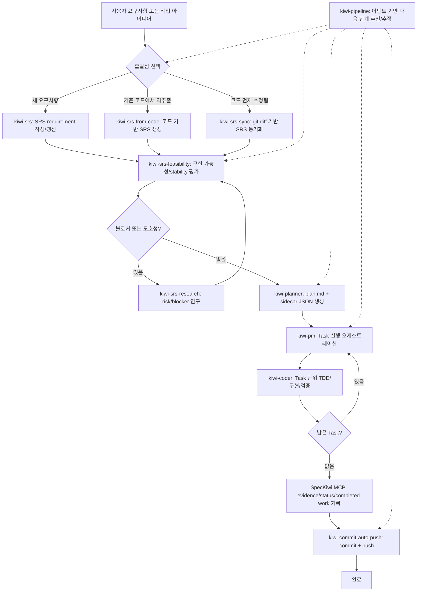
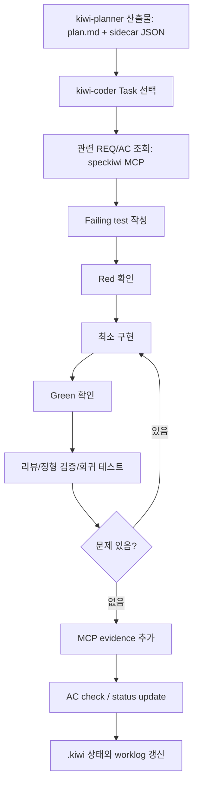
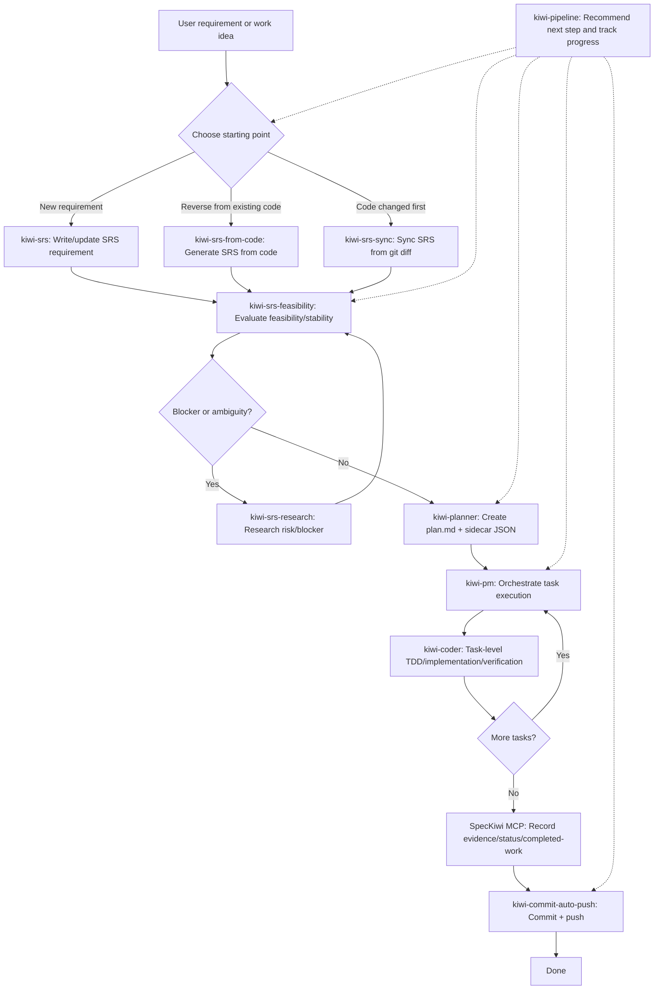
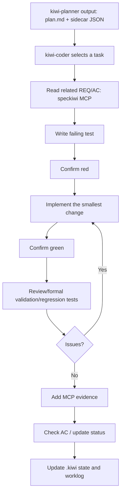

<p align="right"><a href="#english-version">View English version</a></p>

<a id="korean-version"></a>

# SpecKiwi

SpecKiwi는 Git 저장소 안의 Markdown SRS 문서를 요구사항의 원본으로 사용하고, CLI와 stdio MCP 서버로 사람과 코딩 에이전트가 같은 요구사항 데이터를 다루게 해 주는 local-first workflow 도구입니다.

Kiwi skills는 SpecKiwi 위에서 동작하는 코딩 에이전트용 작업 스킬 모음입니다. 요구사항 작성, 구현 가능성 검토, 구현 계획 수립, TDD 기반 코딩, SRS 동기화, 커밋과 push까지 하나의 파이프라인으로 연결합니다.

## 요구 사항

- Node.js 22 이상
- npm
- Git
- 코딩 에이전트: `codex`, `claude`, `opencode`, `hermes` 중 하나

## 1. SpecKiwi 설치

프로젝트 루트에서 먼저 SpecKiwi를 설치합니다.

```sh
npm install speckiwi@latest
```

로컬 설치 후에는 `npx speckiwi`로 실행할 수 있습니다.

```sh
npx speckiwi --version
npx speckiwi --help
```

`speckiwi` 명령을 전역 PATH에서 바로 쓰려면 전역 설치를 사용할 수 있습니다.

```sh
npm install -g speckiwi@latest
speckiwi --version
```

이 README의 명령 예시는 짧게 `speckiwi`로 표기합니다. 로컬 설치만 사용한다면 각 명령 앞에 `npx`를 붙이면 됩니다.

## 2. 프로젝트 초기화

SpecKiwi SRS workspace가 아직 없다면 Git 프로젝트 루트에서 초기화합니다.

```sh
speckiwi init --target v0.1.0 --scope "App:APP"
```

생성되는 주요 구조는 다음과 같습니다.

```text
AGENTS.md
CLAUDE.md
docs/
├─ rule/
│  └─ SRS-MD-Rules-v1.0.0.md
└─ spec/
   ├─ 00.index.md
   ├─ 10.app.srs.md
   └─ 90.appendix.md
```

`docs/spec/00.index.md`가 target, scope, completed work log의 중심입니다. 요구사항 본문은 `docs/spec/**/*.srs.md` Markdown 파일이 canonical source of truth입니다.

## 3. Kiwi Skills 설치

프로젝트에 필요한 코딩 에이전트 종류를 골라 전체 Kiwi skill set을 설치합니다.

```sh
speckiwi skills install {코딩_에이전트_종류} all
```

지원되는 `{코딩_에이전트_종류}` 값은 다음 네 가지입니다.

```text
codex
claude
opencode
hermes
```

예시:

```sh
speckiwi skills install codex all
speckiwi skills install claude all
speckiwi skills install opencode all
speckiwi skills install hermes all --global
```

설치 전에 변경 계획을 확인하려면 `--dry-run --json`을 사용합니다.

```sh
speckiwi skills install codex all --dry-run --json
```

이미 설치된 같은 identity의 skill은 `update`로 처리됩니다. 완전히 동일하면 `skip`이 됩니다. 기존 대상이 유효한 skill이 아니거나 안전하지 않은 경로라면 `conflict`로 중단되고 부분 설치를 하지 않습니다.

## 4. 설치 대상 에이전트

| Agent | 설치 명령 | 패키지 내 source root | 기본 프로젝트 설치 위치 | 전역 설치 위치 |
| --- | --- | --- | --- | --- |
| Codex | `speckiwi skills install codex all` | `skills/codex` | `.agents/skills/<skill>` | `${CODEX_HOME:-$HOME/.codex}/skills/<skill>` |
| Claude | `speckiwi skills install claude all` | `skills/claude` | `.claude/skills/<skill>` | `$HOME/.claude/skills/<skill>` |
| OpenCode | `speckiwi skills install opencode all` | `skills/etc` | `.opencode/skills/<skill>` | `$HOME/.config/opencode/skills/<skill>` |
| Hermes | `speckiwi skills install hermes all --global` | `skills/etc` | `--dest <dir>` 필요 | `$HOME/.hermes/skills/<category>/<skill>` |

추가 옵션:

| Option | 설명 |
| --- | --- |
| `--global`, `-g` | 사용자 전역 skill directory에 설치합니다. |
| `--dest <dir>` | 사용자 지정 destination root에 설치합니다. 각 skill은 `<dir>/<skill>` 아래에 들어갑니다. |
| `--category <name>` | Hermes 전역 설치 category입니다. 기본값은 `kiwi`입니다. Hermes global install에서만 유효합니다. |
| `--dry-run` | 파일을 복사하지 않고 설치 계획만 출력합니다. |
| `--json` | 자동화용 JSON 결과를 출력합니다. |

`--global`과 `--dest`는 함께 사용할 수 없습니다.

## 5. MCP 연결

Kiwi skills의 정상 작업 흐름은 `speckiwi mcp`가 연결되어 있어야 합니다.

```sh
speckiwi mcp
```

또는 명시적으로 root를 지정합니다.

```sh
speckiwi --root /path/to/project mcp
```

Kiwi skills는 요구사항 조회, 상태 변경, stability 변경, acceptance criteria 체크, verification evidence 추가, trace link 추가, completed work 기록을 MCP 도구로 수행합니다. CLI fallback은 진단과 복구 안내 용도이며, 정상적인 SRS mutation 경로가 아닙니다.

## 6. Kiwi Skill 종류

| Skill | 주 용도 |
| --- | --- |
| `kiwi-srs` | 신규 요구사항이나 변경 요청을 분석해 SpecKiwi SRS requirement로 등록하거나 기존 requirement와 정합성을 맞춥니다. |
| `kiwi-srs-from-code` | 기존 코드베이스를 역분석해 scope별 SRS 초안을 생성합니다. |
| `kiwi-srs-feasibility` | 활성 target의 SRS를 구현 가능성, risk, stability 관점에서 평가합니다. |
| `kiwi-srs-research` | 모호한 requirement, blocker, 외부 제약, risk를 별도 research 단계로 분석합니다. |
| `kiwi-planner` | 활성 target requirements를 Phase와 Task로 분해하고 `plan.md`와 sidecar JSON을 생성합니다. |
| `kiwi-coder` | `kiwi-planner` 산출물을 기준으로 Task 단위 TDD, 구현, 검증, MCP evidence 기록을 수행합니다. |
| `kiwi-pm` | `kiwi-planner` 계획을 읽고 각 Task를 `kiwi-coder`로 순차 실행하는 coder-loop runner입니다. |
| `kiwi-srs-sync` | 코드를 먼저 수정한 뒤 `git diff`를 분석해 SRS를 사후 동기화합니다. |
| `kiwi-commit-auto-push` | Git 변경사항을 requirement evidence와 연결해 commit하고 push까지 진행합니다. |
| `kiwi-pipeline` | `.kiwi/pipeline.jsonl` 이벤트를 읽어 다음 Kiwi skill 단계를 추천하거나 자동 진행합니다. |

같은 skill set은 에이전트별 source tree로 배포됩니다.

| Agent | Source tree | 특징 |
| --- | --- | --- |
| Codex | `skills/codex` | Codex skill invocation과 Codex clarification gate 용어에 맞춘 variant입니다. |
| Claude | `skills/claude` | Claude skill 환경에 맞춘 variant입니다. |
| OpenCode / Hermes | `skills/etc` | Agent Skills 형식과 local-LLM 사용을 고려한 variant입니다. 기본적으로 단일 evaluator/sub-agent profile을 사용합니다. |

## 7. Skill 사용 파이프라인

신규 기능이나 변경 요청은 보통 다음 순서로 진행합니다.



Task 실행 내부는 TDD를 전제로 합니다.



## 8. 자주 쓰는 명령

SRS workspace 검증:

```sh
speckiwi validate
speckiwi validate --fail-on-warning
speckiwi validate --json
```

활성 target 확인:

```sh
speckiwi active-target
speckiwi summary --target v0.1.0
```

요구사항 조회:

```sh
speckiwi list --target v0.1.0
speckiwi show FR-APP-001 --markdown
```

완료 작업 조회:

```sh
speckiwi completed-work --target v0.1.0 --order latest
```

skill 설치 계획 확인:

```sh
speckiwi skills install codex all --dry-run --json
```

## 9. SRS 작업 원칙

- `docs/spec/**/*.srs.md`가 요구사항의 유일한 원본입니다.
- 요구사항 ID는 사람이 직접 임의로 만들지 말고 SpecKiwi mutation 도구로 생성합니다.
- Requirement `Status`는 구현/검증 진행 상태를 나타냅니다.
- Requirement `Stability`는 요구사항 문구의 성숙도와 변경 통제 수준을 나타냅니다.
- `verified`는 acceptance criteria가 체크되고 verification evidence가 연결된 뒤에만 사용합니다.
- Kiwi skills는 정상 작업에서 raw Markdown 수정을 SRS mutation 경로로 사용하지 않습니다. MCP 도구가 우선입니다.

## 10. 패키지 개발자용

소스 체크아웃에서 개발할 때:

```sh
npm ci
npm run build
node bin/speckiwi --help
```

검증 명령:

```sh
npm run typecheck
npm run lint
npm test
npm run test:coverage
npm run test:integration
npm run release:check
```

패키지는 다음 주요 항목을 배포합니다.

```text
bin/
dist/
docs/rule/SRS-MD-Rules-v1.0.0.md
skills/codex/
skills/claude/
skills/etc/
```

## 관련 요구사항

이 README의 skill 설치 및 workflow 설명은 다음 SpecKiwi 요구사항 범위를 문서화합니다.

- `IR-CLI-027`: `speckiwi skills install <agent> <skill|all>` CLI
- `FR-NODE-016`: Kiwi skill installation core service
- `FR-FLOW-012`: Kiwi skills require SpecKiwi MCP for normal operation
- `MIG-FLOW-002`: OpenCode/Hermes용 `skills/etc` migration

---

<a id="english-version"></a>

# SpecKiwi (English)

SpecKiwi is a local-first workflow tool that uses Markdown SRS documents in a Git repository as the canonical requirements source. It gives people and coding agents a shared view of the same requirements through a CLI and a stdio MCP server.

Kiwi skills are coding-agent skills built on top of SpecKiwi. They connect requirements authoring, feasibility review, implementation planning, TDD-based coding, SRS synchronization, commit, and push into one workflow.

## Requirements

- Node.js 22 or newer
- npm
- Git
- One supported coding agent: `codex`, `claude`, `opencode`, or `hermes`

## 1. Install SpecKiwi

First install SpecKiwi in your project.

```sh
npm install speckiwi@latest
```

After local installation, run it with `npx speckiwi`.

```sh
npx speckiwi --version
npx speckiwi --help
```

If you want `speckiwi` available directly on your PATH, install it globally.

```sh
npm install -g speckiwi@latest
speckiwi --version
```

The examples below use the shorter `speckiwi` form. If you only installed it locally, prefix commands with `npx`.

## 2. Initialize a Project

If your Git project does not have a SpecKiwi SRS workspace yet, initialize it at the project root.

```sh
speckiwi init --target v0.1.0 --scope "App:APP"
```

This creates the main workspace structure.

```text
AGENTS.md
CLAUDE.md
docs/
├─ rule/
│  └─ SRS-MD-Rules-v1.0.0.md
└─ spec/
   ├─ 00.index.md
   ├─ 10.app.srs.md
   └─ 90.appendix.md
```

`docs/spec/00.index.md` is the center for targets, scopes, and the completed work log. Requirement bodies are stored in `docs/spec/**/*.srs.md`, which remains the canonical source of truth.

## 3. Install Kiwi Skills

Choose the coding agent you use in the project and install the full Kiwi skill set.

```sh
speckiwi skills install {coding_agent_type} all
```

Supported `{coding_agent_type}` values are:

```text
codex
claude
opencode
hermes
```

Examples:

```sh
speckiwi skills install codex all
speckiwi skills install claude all
speckiwi skills install opencode all
speckiwi skills install hermes all --global
```

Preview the planned install before copying files with `--dry-run --json`.

```sh
speckiwi skills install codex all --dry-run --json
```

If the same-identity skill already exists, SpecKiwi treats the operation as `update`. If it is byte-identical, the operation is `skip`. If the destination is not a valid skill or the path is unsafe, the operation becomes `conflict` and no partial install is performed.

## 4. Supported Agents and Destinations

| Agent | Install command | Package source root | Default project destination | Global destination |
| --- | --- | --- | --- | --- |
| Codex | `speckiwi skills install codex all` | `skills/codex` | `.agents/skills/<skill>` | `${CODEX_HOME:-$HOME/.codex}/skills/<skill>` |
| Claude | `speckiwi skills install claude all` | `skills/claude` | `.claude/skills/<skill>` | `$HOME/.claude/skills/<skill>` |
| OpenCode | `speckiwi skills install opencode all` | `skills/etc` | `.opencode/skills/<skill>` | `$HOME/.config/opencode/skills/<skill>` |
| Hermes | `speckiwi skills install hermes all --global` | `skills/etc` | requires `--dest <dir>` | `$HOME/.hermes/skills/<category>/<skill>` |

Options:

| Option | Description |
| --- | --- |
| `--global`, `-g` | Install into the user-level skill directory. |
| `--dest <dir>` | Install into a custom destination root. Each skill is installed under `<dir>/<skill>`. |
| `--category <name>` | Hermes global install category. The default is `kiwi`. This is valid only for Hermes global installs. |
| `--dry-run` | Print the install plan without copying files. |
| `--json` | Print machine-readable JSON output. |

`--global` and `--dest` are mutually exclusive.

## 5. MCP Connection

Normal Kiwi skill workflows require a connected `speckiwi mcp` server.

```sh
speckiwi mcp
```

You can also pass an explicit root.

```sh
speckiwi --root /path/to/project mcp
```

Kiwi skills use MCP tools for requirement reads, status changes, stability changes, acceptance criteria checks, verification evidence, trace links, and completed work logging. CLI fallback is for diagnostics and remediation guidance only; it is not the normal SRS mutation path.

## 6. Kiwi Skill Types

| Skill | Main purpose |
| --- | --- |
| `kiwi-srs` | Analyze a new request or change request and register or align SpecKiwi SRS requirements. |
| `kiwi-srs-from-code` | Reverse-analyze an existing codebase and generate scope-level SRS drafts. |
| `kiwi-srs-feasibility` | Evaluate active target requirements for feasibility, risk, and stability. |
| `kiwi-srs-research` | Research ambiguous requirements, blockers, external constraints, and risks. |
| `kiwi-planner` | Decompose active target requirements into phases and tasks, producing `plan.md` and sidecar JSON. |
| `kiwi-coder` | Execute task-level TDD, implementation, verification, and MCP evidence recording from `kiwi-planner` outputs. |
| `kiwi-pm` | Run a `kiwi-planner` plan by dispatching each task to `kiwi-coder` sequentially. |
| `kiwi-srs-sync` | Analyze `git diff` after code-first work and synchronize the SRS afterward. |
| `kiwi-commit-auto-push` | Connect Git changes to requirement evidence, then commit and push. |
| `kiwi-pipeline` | Read `.kiwi/pipeline.jsonl` and recommend or run the next Kiwi skill step. |

The same skill set is distributed through agent-specific source trees.

| Agent | Source tree | Notes |
| --- | --- | --- |
| Codex | `skills/codex` | Variant aligned with Codex skill invocation and Codex clarification gate wording. |
| Claude | `skills/claude` | Variant aligned with the Claude skill environment. |
| OpenCode / Hermes | `skills/etc` | Agent Skills format variant for local-LLM usage. It defaults to a single evaluator/sub-agent profile. |

## 7. Skill Pipeline

New features and change requests usually follow this flow.



Task execution is TDD-first.



## 8. Common Commands

Validate the SRS workspace:

```sh
speckiwi validate
speckiwi validate --fail-on-warning
speckiwi validate --json
```

Check the active target:

```sh
speckiwi active-target
speckiwi summary --target v0.1.0
```

Read requirements:

```sh
speckiwi list --target v0.1.0
speckiwi show FR-APP-001 --markdown
```

Read completed work:

```sh
speckiwi completed-work --target v0.1.0 --order latest
```

Preview skill installation:

```sh
speckiwi skills install codex all --dry-run --json
```

## 9. SRS Working Principles

- `docs/spec/**/*.srs.md` is the only canonical requirements source.
- Do not manually invent requirement IDs; use SpecKiwi mutation tools.
- Requirement `Status` tracks implementation and verification progress.
- Requirement `Stability` tracks the maturity and change-control level of the requirement text.
- Use `verified` only after acceptance criteria are checked and verification evidence is linked.
- Kiwi skills do not use raw Markdown edits as the normal SRS mutation path. MCP tools come first.

## 10. Package Development

From a source checkout:

```sh
npm ci
npm run build
node bin/speckiwi --help
```

Validation commands:

```sh
npm run typecheck
npm run lint
npm test
npm run test:coverage
npm run test:integration
npm run release:check
```

The package distributes these main artifacts.

```text
bin/
dist/
docs/rule/SRS-MD-Rules-v1.0.0.md
skills/codex/
skills/claude/
skills/etc/
```

## Related Requirements

The skill installation and workflow documentation in this README maps to these SpecKiwi requirements.

- `IR-CLI-027`: `speckiwi skills install <agent> <skill|all>` CLI
- `FR-NODE-016`: Kiwi skill installation core service
- `FR-FLOW-012`: Kiwi skills require SpecKiwi MCP for normal operation
- `MIG-FLOW-002`: `skills/etc` migration for OpenCode and Hermes
