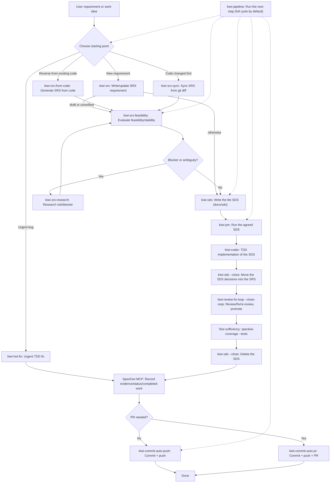
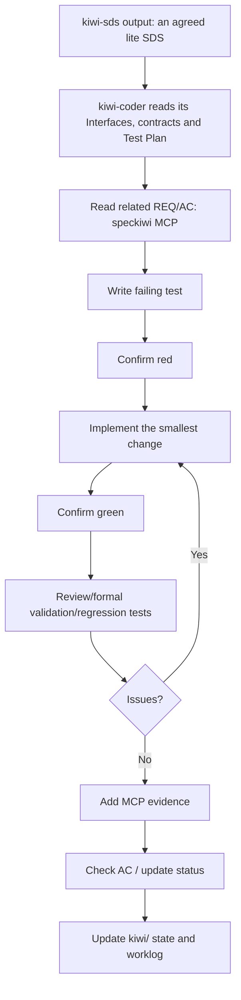
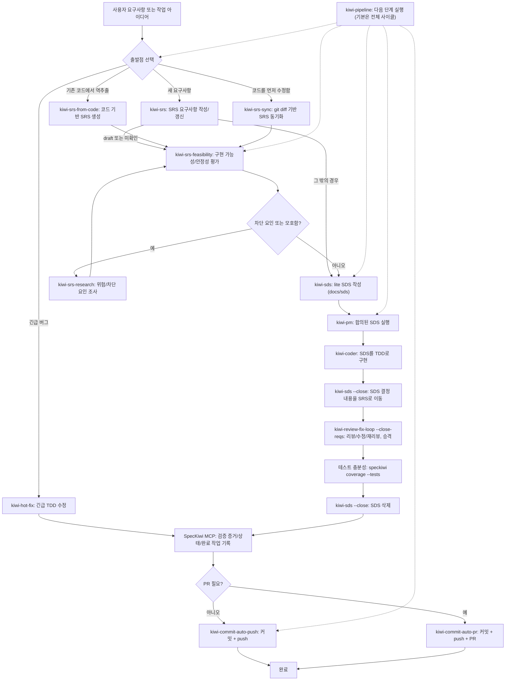
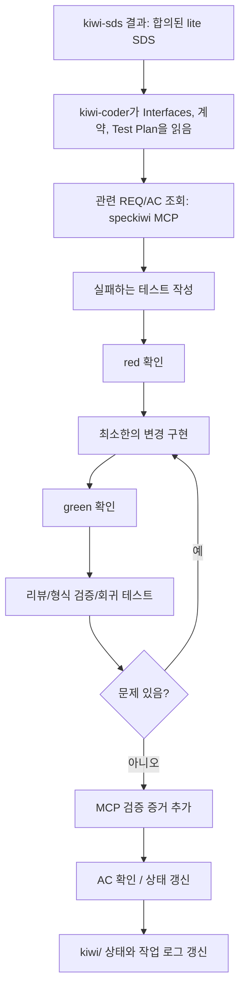

<p align="center">
  <a href="#english-version"><strong>📖 View English documentation</strong></a>
  &nbsp;·&nbsp;
  <a href="#korean-version"><strong>📖 한국어 문서 보기</strong></a>
</p>

---

<a id="english-version"></a>

# SpecKiwi

SpecKiwi keeps your requirements as Markdown SRS (Software Requirements Specification) documents inside your Git repository, and gives people and coding agents the same view of them through a **CLI** and a **stdio MCP server**.

**Kiwi skills** are coding-agent skills built on SpecKiwi. They carry a request from requirement to commit: write the requirement, check that it is feasible, write a short design, implement it test-first, review the code, confirm the tests cover every acceptance criterion, and commit.

- Requirements live in `docs/spec/**/*.srs.md` (GitHub-Flavored Markdown). There is no YAML, no database and no requirements server.
- The CLI and the MCP server share one parser, validator, query engine and mutation engine.
- Everything is a normal Git-tracked file, so requirements are reviewed and versioned like code.

## Table of Contents

**Start with §1 and §2.** They are all you need to begin; everything after them is reference.

1. [Quick start](#en-quickstart): [your first run](#en-first-run) and [updating an existing project](#en-quick-update)
2. [What to ask your agent](#en-entry)
3. [Requirements](#en-requirements)
4. [Install SpecKiwi](#en-install)
5. [Initialize a project](#en-init)
6. [Connect the MCP server](#en-mcp)
7. [Kiwi skills](#en-skill-types), including [installing them for other agents](#en-skills)
8. [How work flows](#en-pipeline), including [parallel waves and `--serial`](#en-waves)
9. [Command reference](#en-commands)
10. [Upgrade and remove](#en-lifecycle)
11. [SRS working principles](#en-principles)
12. [Package development](#en-dev)
13. [Related requirements](#en-reqs)

<a id="en-quickstart"></a>

## 1. Quick start

You need Node.js 22 or newer, Git, and a coding agent (Claude Code, Codex, OpenCode or Hermes). For a new project, run these at the top level of your Git repository. A project that already uses SpecKiwi only needs [an update](#en-quick-update).

```sh
npm install -g speckiwi@latest
speckiwi init --target v0.1.0 --scope "App:APP"
speckiwi set-active-target v0.1.0
speckiwi doctor
```

`init` creates the SRS workspace under `docs/spec/`, registers the MCP server in `.mcp.json`, and installs the Kiwi skills for Claude and Codex. `init --target` only adds the target to the Target Map, so `set-active-target` makes it the target new work goes to. `doctor` confirms the result; in a new project it warns that no requirements exist yet, which is expected. Then **reload or restart your coding agent** so it starts the MCP server.

- **Codex** does not read `.mcp.json`. Register the server once with `codex mcp add speckiwi -- npx -y speckiwi mcp`.
- **OpenCode or Hermes**: `init` installs no skills for them. Run `speckiwi skills install opencode all`, or `speckiwi skills install hermes all --global` (a Hermes project install needs `--dest <dir>`; see [Install skills for other agents](#en-skills)). Then register `npx -y speckiwi mcp` as an MCP server in that agent.

<a id="en-first-run"></a>

### Your first run

With the MCP server connected, ask for work in plain language. The Kiwi skills trigger on intent, or you can call one by name, such as `/kiwi-pipeline`:

> *Use kiwi-pipeline: a user can reset their password by email.*

`kiwi-pipeline` runs the whole chain for that request, asking you before each step; add `--auto` to let it run to the end unattended. `kiwi-srs` allocates a Requirement ID and writes the requirement into a scope document such as `docs/spec/01.app.srs.md`; `kiwi-srs-feasibility` (when needed), `kiwi-sds`, `kiwi-pm` and `kiwi-review-fix-loop` then carry it to reviewed, verified code. §8 explains each step.

To write only the requirement and stop there, ask for `kiwi-srs` instead:

> *Use kiwi-srs to capture a requirement: a user can reset their password by email.*

<a id="en-quick-update"></a>

### Update an existing project

If the project already uses SpecKiwi, update the package first, then refresh the project:

```sh
npm install -g speckiwi@latest
speckiwi upgrade --dry-run   # optional: read the plan first; nothing is written
speckiwi upgrade
speckiwi doctor
```

With a project-local install, update it with `npm install speckiwi@latest` and run the same commands through `npx`.

`upgrade` refreshes what the tool owns (the rules documents, the agent workflow block in `AGENTS.md` and `CLAUDE.md`, and the Kiwi skills). It fixes references to rules documents this release no longer ships in `AGENTS.md` and `CLAUDE.md`, and only reports them elsewhere. It never edits your requirements under `docs/spec/`. If you installed the skills globally (`init -g`), add `--global` so the global Claude and Codex copies are updated too; otherwise your agents keep loading the old global copies. On a machine without global copies, `--global` installs them. `upgrade` covers only the Claude and Codex skills; for OpenCode or Hermes, run the same `speckiwi skills install` command you installed them with again. Reload or restart your coding agent afterwards so it picks up the new MCP server and skills.

Coming from 3.x, also read [Upgrading from 3.x to 4.0](#en-upgrade-4): a global `kiwi-planner` skill, one per agent that has it, has to be deleted by hand. §10 covers every `upgrade` option.

<a id="en-entry"></a>

## 2. What to ask your agent

Find your situation, then ask your agent in plain language or call the skill by name.

| Your situation | Ask for | What happens |
| --- | --- | --- |
| A feature or change you can describe in a sentence or two | `kiwi-pipeline`: *"Use kiwi-pipeline: users can export reports as CSV."* | Runs the whole chain: requirement, design, test-first implementation, code review and test-sufficiency check. It asks before each step; add `--auto` to run it unattended. |
| Work that may split into several parts, or that you cannot size | `kiwi-orchestrator`: *"Use kiwi-orchestrator: add SSO login."* | Sizes the work and picks the path itself: a single step (`kiwi-tdd`) for small work, parallel waves for large work. Resumable. |
| An epic, a roadmap, or long research | `kiwi-wave-master` | Splits the work into ordered waves with a target each, and runs the waves whose dependencies are done in parallel. Resumable. |
| Record a requirement only | `kiwi-srs` | Writes the requirement and its acceptance criteria into the SRS, then stops. |
| An existing codebase with no SRS | `kiwi-srs-from-code` | Drafts SRS documents from the code, one per scope. |
| You already changed the code | `kiwi-srs-sync` | Reads `git diff` and brings the SRS up to date. |
| An urgent bug | `kiwi-hot-fix` | Fixes it test-first, runs regression, then syncs the SRS. |
| Review local changes or PR comments | `kiwi-review-fix-loop` | Reviews, fixes, and reviews again. |
| Commit and push, or open a PR | `kiwi-commit-auto-push` or `kiwi-commit-auto-pr` | Commits and pushes, then records the commit as evidence on the matching requirements; `kiwi-commit-auto-pr` also creates or updates the PR. |
| "What should I do next?" | `kiwi-pipeline --none-cycle` | Recommends the next step without running anything. |

Not sure which one? Start with `kiwi-orchestrator`; it picks the path itself.

Every requirement-driven path ends with a code review, then a check that each acceptance criterion has a test citing it.

**Options you may want**

| Option | Effect |
| --- | --- |
| `--serial` | Runs the parallel steps of `kiwi-orchestrator` and `kiwi-wave-master` one at a time. Saying "one at a time" works too. |
| `--auto` | Decides the user gates for you. Critical gates, such as a failure or a question only you can answer, still stop. |
| `--max` | Verifies more strictly: more independent evaluators and a stricter pass gate. |
| `--mini` / `--loops N` | Caps each verify-and-fix loop at 3 rounds, or at N rounds. |

### Key terms

- **Target**: a release that groups requirements, such as `v0.1.0`. The **Active Target** is the one new work defaults to; set it with `speckiwi set-active-target`.
- **Scope**: a functional area with an ID prefix. `App:APP` produces IDs such as `FR-APP-001`.
- **Status**: implementation and verification progress (`planned`, `in_progress`, `blocked`, `implemented`, `verified`, `discarded`).
- **Stability**: change-control maturity (`draft` → `evolving` → `stable` → `frozen`, plus `deprecated`). Status and Stability are independent of each other.
- **SDS** (Software Design Specification): a short design document an agent writes right before coding. The lite SDS at `docs/sds/<sds-id>.sds.md` is written for agents, not people, and is deleted once the requirements it covers are verified. Orchestrated runs commit it before that, so git history keeps it; in a `kiwi-pipeline` run it survives only if you committed it yourself. In the `tdd` work mode, a step SDS lives at `docs/spec/steps/<name>/design.md` instead.

<a id="en-requirements"></a>

## 3. Requirements

- **Node.js 22 or newer** (`engines.node` is `>=22`). Nothing enforces this floor, so hold to it yourself: npm only warns with `EBADENGINE` unless `engine-strict=true` is set, and `speckiwi doctor` fails only below Node **18**, so Node 20 passes it clean.
- **npm**
- **Git.** SpecKiwi finds the project root by searching upward for a Git repository. **Keep `docs/spec/` at the git top level**: three things follow the git top level rather than the resolved root, namely the pre-commit hook `init` installs, the `kiwi/` pipeline journal the skills pin, and the `.claude` / `.codex` skill folders. `speckiwi doctor` checks this as *project root is the git top level*.
- A supported coding agent: `codex`, `claude`, `opencode` or `hermes`.

<a id="en-install"></a>

## 4. Install SpecKiwi

Install SpecKiwi globally to put `speckiwi` on your PATH:

```sh
npm install -g speckiwi@latest
speckiwi --version
speckiwi --help
```

Or install it into the project and run it through `npx`:

```sh
npm install speckiwi@latest
npx speckiwi --version
```

The examples in this document use the short `speckiwi` form. With a project-local install, put `npx` in front of each command.

> **On Windows, read [Passing a value a command line cannot carry](#en-long-values) before your first mutation.** Anything routed through `cmd.exe` (the npm `.cmd` shim, `cmd /c`, `npm run`, a `shell: true` spawn) silently cuts an argument at its first newline, and every flag written after that point is lost with the rest of the value.

**Global options** available on every command:

| Option | Description |
| --- | --- |
| `--root <path>` | Project root to operate on, for every command **except** `mcp` (see §6). Default: search upward from the current directory. |
| `--json` | Write machine-readable JSON to stdout. |
| `--no-color` | Disable ANSI color. |
| `--quiet` | Suppress non-essential human output. |
| `-V, --version` | Print the version. |
| `-h, --help` | Print help for the command. |

<a id="en-init"></a>

## 5. Initialize a project

Run `init` once at the Git project root. It creates (or tops up) the SRS workspace **and** onboards your coding agents in one step:

```sh
speckiwi init --target v0.1.0 --scope "App:APP"
```

### What `init` does

The whole run holds the SRS mutation lock and is **idempotent**. A file that already exists is reported as `skipped` and never overwritten unless you pass `--force`. The one exception is the agent-instruction block: whenever its content differs from the shipped text, it is replaced in place, whatever version it declares.

| # | Step | Result |
| --- | --- | --- |
| 1 | **SRS scaffold** | `docs/spec/00.index.md` (Target Map, Scope Map, Completed Work Log) and `docs/spec/90.appendix.md`. When the project has no scope document yet, it also creates an empty one from `--scope`, such as `docs/spec/01.app.srs.md`. The number comes from the allocator, not from `--scope`: it is the lowest number no `.md` file in `docs/spec/` already uses. A project that already has scope documents gets no new one; its documents are registered under their own scope names. |
| 2 | **Step state** | `docs/spec/steps/state.md`, with a `Mode: wait` metadata block and an empty step-state table. |
| 3 | **Authoring rules** | `docs/rule/SRS-MD-Rules-v2.5.0.md` and `docs/rule/SDS-MD-Rules-v2.6.0.md`, the bundled SRS and SDS authoring rules. The SDS rules are at 2.6.0 because of the lite SDS profile. |
| 4 | **Agent instructions** | Inserts or updates the *SpecKiwi SRS workflow* block in `AGENTS.md` and `CLAUDE.md`. A block whose content differs from the shipped text is replaced in place; a block that already matches is left untouched. |
| 5 | **Hooks** | `docs/.kiwi/hooks/{pre-commit.mjs,trace.mjs}` and `docs/.kiwi/trace/`; a `.git/hooks/pre-commit` gate that delegates to the runner; `.claude/settings.json` (PostToolUse trace hook); `.codex/hooks.json` (apply_patch trace hook). An existing `.git/hooks/pre-commit` is never overwritten: it is reported as `skipped` if it already delegates to the runner, and otherwise left as it is with a warning that tells you how to connect it. The two agent hook files are reported as `skipped` when they exist, and `--force` overwrites them like every other scaffolded file. |
| 6 | **MCP registration** | Registers the SpecKiwi stdio MCP server in `.mcp.json` (`skipped` if already there). Turn off with `--no-mcp`. |
| 7 | **Skills** | Installs the bundled Kiwi skills for **Claude** (`.claude/skills`) and **Codex** (`.agents/skills`), then prunes orphaned `kiwi-*` skill directories that SpecKiwi installed earlier and nobody edited. Turn off with `--no-skills`. |

The result is reported in five arrays: **`created` / `updated` / `skipped` / `removed` / `warnings`**. Add `--json` for the machine-readable form.

A typical layout after the first run:

```text
AGENTS.md                     # SpecKiwi SRS workflow block
CLAUDE.md                     # SpecKiwi SRS workflow block
.mcp.json                     # speckiwi MCP server registration
.claude/skills/kiwi-*         # Claude Kiwi skills
.claude/skills/_shared/kiwi/  # contracts the skills share
.agents/skills/kiwi-*         # Codex Kiwi skills
.agents/skills/_shared/kiwi/  # the same, for Codex
.claude/settings.json         # PostToolUse trace hook
.codex/hooks.json             # apply_patch trace hook
.git/hooks/pre-commit         # delegates to docs/.kiwi/hooks/pre-commit.mjs
docs/
├─ .kiwi/hooks/               # bundled hook runners
├─ .kiwi/trace/               # trace output written by trace.mjs
├─ rule/
│  ├─ SRS-MD-Rules-v2.5.0.md
│  └─ SDS-MD-Rules-v2.6.0.md
└─ spec/
   ├─ 00.index.md             # targets, scopes, completed work log
   ├─ 01.app.srs.md           # your first scope document
   ├─ 90.appendix.md
   └─ steps/state.md
```

`docs/spec/00.index.md` is the hub for targets, scopes and the completed work log. Requirement bodies live in `docs/spec/**/*.srs.md`, which is the **canonical source of truth**.

Two more directories appear once the skills run, and neither is edited by hand. **`kiwi/`** holds skill-owned run state: `pipeline.jsonl`, `waves.jsonl` and the resume card. **`.kiwi/`** at the project root holds per-run session state (locks, pm and coder state, worklog) under `sessions/<run-id>/`. Do not confuse either with **`docs/.kiwi/`**, which `init` creates for the hook runners.

### `init` options

| Option | Description |
| --- | --- |
| `--target <target>` | When `init` creates the index, add this target (such as `v0.1.0`) to the Target Map as `planned`. It does not become the Active Target; run `speckiwi set-active-target <target>` for that. An existing index is left unchanged, so register a new target with `speckiwi set-active-target <target> --create`. |
| `--scope "Name:PREFIX"` | Initial scope, used only when the project has no scope document yet (`"App:APP"` → `FR-APP-001`). To add a scope later, use `speckiwi scaffold-scope <Name>:<PREFIX> --apply`, which allocates the next document number and registers both index rows. |
| `--no-mcp` | Do not register the MCP server in `.mcp.json`. |
| `--no-skills` | Do not install the bundled Kiwi skills, and do not prune orphans. |
| `-g, --global` | Also install or update the bundled Kiwi skills in each agent's global skills directory (Claude `~/.claude/skills`, Codex `${CODEX_HOME:-~/.codex}/skills`), for every agent whose home directory exists; the others are skipped with a warning. The project install still runs. No orphan prune happens at global scope, because the shared home may hold skills other projects use. |
| `--dry-run` | Preview every step, filling `created` and the other arrays, without writing anything. |
| `--force` | Overwrite existing scaffolded files instead of skipping them. **This rewrites files you own, and their content is lost; no backup is kept, and the run reports the overwritten files as `updated`**: `00.index.md` (Target Map, Scope Map and Completed Work Log), `90.appendix.md`, `docs/spec/steps/state.md` (work mode and step state), and, most painfully, the agent hook files `.claude/settings.json` and `.codex/hooks.json`, which hold your own permissions, hooks and environment settings. It also restores the two bundled hook runners under `docs/.kiwi/hooks/`, so local edits to them are lost too. An **existing** scope document is never rewritten, with or without `--force`. The bundled rules documents are refreshed without it. |
| `--ignore-lock` | Bypass a stale SRS mutation lock. |
| `--json` | Write the result as JSON. |

**Exit codes:** `0` success · `2` usage error (such as an unknown flag) · `5` init failure (such as a held mutation lock).

> **MCP parity note.** The MCP `init_project` tool only scaffolds the SRS files. It never registers the MCP server or installs skills; those two steps belong to the CLI. So running `init` through an agent's MCP connection can never install skills or edit `.mcp.json` on its own.

<a id="en-mcp"></a>

## 6. Connect the MCP server

The Kiwi skills expect a connected SpecKiwi MCP server. `speckiwi init` writes this registration into `.mcp.json`:

```json
{
  "mcpServers": {
    "speckiwi": {
      "command": "npx",
      "args": ["-y", "speckiwi", "mcp"]
    }
  }
}
```

Inside a checkout of SpecKiwi itself, `init` registers the local `bin/speckiwi` instead, so the checkout tests its own build. After `init` writes `.mcp.json`, reload or restart your agent so it launches the server. Codex does not read `.mcp.json`, so `init` leaves `~/.codex/config.toml` untouched and prints the matching `codex mcp add speckiwi -- …` command to run instead (`codex mcp add speckiwi -- npx -y speckiwi mcp` in an ordinary project).

The server is started with this command:

```sh
speckiwi mcp
```

Run it by hand only for debugging: it waits on stdio and can look as if it hangs.

- **The server does not accept `--root`.** It resolves the project root by searching upward from its own working directory, so set the client's working directory (cwd) to the project root. Started with `--root`, the server exits with an error.
- **Git worktrees.** The root is bound to the server process, so a running server does not follow a worktree switch in the middle of a session; restart the agent inside the worktree instead. A session rooted in a worktree must **not allocate new Requirement IDs** and cannot edit the host repository's `docs/spec/`. Do both from the host root.

### MCP tools

The Kiwi skills use MCP tools for every read and every safe SRS mutation. The matching CLI commands are a fallback for diagnostics and manual work, not the normal mutation path.

| Category | Tools |
| --- | --- |
| Target & goal | `get_active_target`, `set_active_target`, `set_target_goal`, `summarize_target` |
| Read | `list_requirements`, `get_requirement`, `list_completed_work`, `search_requirements`, `get_next_work_order` |
| Status & stability | `update_status`, `update_stability` |
| Evidence & trace | `check_acceptance_criteria`, `add_verification_evidence`, `add_trace_link` |
| Authoring & editing | `add_requirement`, `append_section_note`, `add_completed_work`, `edit_requirement_fields`, `edit_requirement_table_rows`, `replace_acceptance_criteria`, `supersede_requirement` |
| Work mode | `get_work_mode`, `set_work_mode` |
| Steps & TDD First | `claim_step`, `scaffold_step`, `validate_step`, `synthesize_step_srs`, `promote_step_requirement`, `update_step_state`, `set_sds_status`, `list_steps`, `check_vibe_gate` |
| Duplicate-ID repair | `diagnose_requirement_id_collisions`, `plan_requirement_id_collision_repair`, `apply_requirement_id_collision_repair` |
| Workspace | `validate_spec`, `sync_index`, `init_project`, `register_scopes`, `scaffold_scope`, `mcp_workspace_info` |
| SDS & test sufficiency | `check_sds`, `check_test_sufficiency` |
| Compatibility | `add_compatibility_check`, `refresh_compatibility_check`, `revoke_compatibility_check`, `list_compat_edges`, `list_dirty_edges` |
| Orchestrator run surface | 25 `orchestrate_*` tools: the run lock and journal, routing probe and freeze, the wave schedule, verification rounds, wave close, resume and replay, and the `--auto` gate decision. |
| Workflow & pipeline | 15 `workflow_*` tools: pipeline emit/status/tail, worklog, artifacts (SDS files included), session status, and repair and reclassification records. |

**88 tools ship in total.** 4.0.0 removed the twelve plan tools along with `kiwi-planner`, and two orchestrate tools along with the handoff validator and the coupling check; it added `check_sds` and `check_test_sufficiency`. The table names every tool a skill calls directly; the last two rows are families whose members are documented in the skills that drive them. After an upgrade, trust the count `speckiwi doctor` reports, because that is what the server actually registered.

#### Per-call `workspaceRoot`

The MCP server resolves its root from the directory it was started in, and that root is the only place it writes SRS. A session whose server is fixed to the host checkout can still reach run state that lives in a linked worktree, and read that worktree's SRS, by passing an optional absolute `workspaceRoot` on each call.

| Family | `workspaceRoot` |
| --- | --- |
| `workflow_*` (all 15) | accepted |
| `orchestrate_*` | accepted, except `orchestrate_replay_apply` (a deferred SRS mutation replays only at the host root) and `orchestrate_preflight` (it already takes `--mcp-root` and `--git-root`) |
| The SRS query tools — `list_requirements`, `search_requirements`, `get_requirement`, `validate_spec`, `summarize_target`, `get_active_target`, `list_completed_work`, `validate_step`, `get_work_mode`, `check_vibe_gate`, `list_dirty_edges`, `list_compat_edges`, `list_steps`, `check_sds`, `check_test_sufficiency` | accepted; each reads the named checkout and writes nothing. Under a per-call root the test-sufficiency check refuses an SDS path under docs/spec (a step design.md), so check a step inside its worktree with `speckiwi coverage --tests` |
| Every tool that writes under `docs/spec` or allocates a Requirement ID — `add_requirement`, `update_status`, `supersede_requirement`, `sync_index`, `diagnose_requirement_id_collisions`, `plan_requirement_id_collision_repair` and the rest | refused |
| `mcp_workspace_info` and `get_next_work_order` | refused: the first reports which root answered, so it cannot take that root as an argument; the second assembles a work order rather than querying a checkout's SRS |

Refusal is the default. A tool accepts the argument only by declaring the workspace scope it admits: `worktree-local` for run state that lives in a worktree, `srs-read-only` for a query that reads a checkout's SRS and writes nothing. A tool that declares no scope, or misspells the one it declares, refuses the argument, so a newly added SRS tool is safe without being listed anywhere.

An accepted root must be an absolute path to an existing directory, a git top level rather than a subdirectory of one, and a worktree that shares the startup root's git common directory. Each failure is refused with its own `workspace-root-*` reason before the tool runs, so a path that does not exist is refused rather than created. An SRS query is also refused when the named checkout holds no `docs/spec/00.index.md`, and the refusal names the checkout it examined. A path argument that lands under `docs/spec` is refused even on a tool that accepts the root, unless the tool declares that it takes no caller-supplied path at all; that declaration is what lets an SRS query filter on a `docs/spec` reference.

**Confirm workspace identity from the envelope before any target-scoped read or mutation.** Every result carries `mcpWorkspace`, with `workspaceRoot`, `rootSource`, `indexPath` and `packageVersion`. `rootSource` is `server-cwd-discovery`, `auto-init` or `per-call-workspace-root`. It is `per-call-workspace-root` exactly when the call supplied a `workspaceRoot` that passed every gate, so every answer names the root it came from.

<a id="en-skill-types"></a>

## 7. Kiwi skills

**Writing requirements**

| Skill | What it does |
| --- | --- |
| `kiwi-srs` | Analyzes a new request or a change request and registers or aligns the SRS requirements for it. |
| `kiwi-srs-from-code` | Reverse-engineers an existing codebase into draft SRS documents, one per scope. |
| `kiwi-srs-feasibility` | Evaluates Active Target requirements for feasibility, risk and stability. |
| `kiwi-srs-research` | Researches ambiguous requirements, blockers, external constraints and risks. |
| `kiwi-srs-sync` | After code-first work, reads `git diff` and brings the SRS up to date. |
| `kiwi-step` | Writes step-local requirement drafts under `docs/spec/steps/<name>/`: claims a step, writes only inside it (never the body-scope SRS), and validates it locally. A lightweight counterpart of `kiwi-srs`. |

**Designing and implementing**

| Skill | What it does |
| --- | --- |
| `kiwi-sds` | Writes the lite SDS (`docs/sds/<sds-id>.sds.md`) for the requirements in scope: the files and symbols to touch, one contract per interpretation decision, and the test that proves each contract. `speckiwi sds check` gates it, and it is agreed without a user approval gate. `--close` later moves its decisions into the SRS and deletes the file. |
| `kiwi-pm` | Runs one agreed SDS through `kiwi-coder`, then hands off to `kiwi-review-fix-loop`. When it runs on its own, it also closes the SDS around that review. |
| `kiwi-coder` | Implements one agreed SDS: tests first (red), the smallest implementation (green), review, regression, and MCP evidence. `kiwi-pm` calls it; you rarely call it directly. |
| `kiwi-tdd` | Drives one step through the `tdd` work mode's TDD First cycle: writes the step SDS (`design.md`), turns its EARS acceptance contracts into failing tests, implements to green, runs regression, then synthesizes and promotes the step requirement with evidence. |
| `kiwi-hot-fix` | Fixes an urgent bug with TDD and regression checks, then syncs the SRS afterward. |

**Reviewing and shipping**

| Skill | What it does |
| --- | --- |
| `kiwi-review-fix-loop` | Reviews local changes or PR comments, fixes them and reviews again. With `--close-reqs` (self-review mode only) it also promotes the affected requirements to `verified` once regression passes with no open findings. |
| `kiwi-commit-auto-push` | Links the Git changes to requirement evidence, then commits and pushes. |
| `kiwi-commit-auto-pr` | Commits and pushes, then creates or updates a GitHub PR with evidence links. |

**Running whole workflows**

| Skill | What it does |
| --- | --- |
| `kiwi-pipeline` | Reads `kiwi/pipeline.jsonl` and runs the next steps. By default it runs the full cycle from `kiwi-srs` to `kiwi-review-fix-loop`; `--none-cycle` recommends a single next step instead. The cycle runs only when the call carries a work input, so a status question stays a status question. |
| `kiwi-orchestrator` | Takes one work item from a single entry point, probes it, routes it to the rung it needs (step or orchestrated), and runs that rung to a recorded close. It owns the run journal (`kiwi/waves.jsonl`), the `--auto` gate table and resume. On the orchestrated rung each wave gets its own SDS and worker, and the waves run in parallel; `--serial` runs every parallel branch (workers, SDS authors, investigators, verifiers) one at a time (see [parallel waves](#en-waves)). Options: `--auto`, `--max`, `--mini` / `--loops N`, `--work`, `--base-branch`, `--lanes N`, `--serial`. |
| `kiwi-wave-master` | Splits an epic, a roadmap or long research into ordered waves, registers a target per wave, and runs the waves under the same parallel contract as `kiwi-orchestrator`; `--serial` runs them one at a time instead of in parallel. Resumable through `kiwi/waves.jsonl`. Options: `--auto`, `--max`, `--mini` / `--loops N`, `--serial`, and `--drive`, which also opens the integration-test and cost gates that `--auto` alone stops at. |

The same skill set ships in three source trees, one per agent family: **`skills/claude`** (the Claude skill environment), **`skills/codex`** (Codex invocation and clarification-gate wording), and **`skills/etc`** (the Agent Skills format for OpenCode, Hermes and local LLMs, defaulting to a single evaluator/sub-agent profile).

<a id="en-skills"></a>

### Install skills for other agents

`speckiwi init` already installs the Claude and Codex project skills. Use `skills install` for **another agent** (OpenCode, Hermes), a **global** install, or a **custom destination**:

```sh
speckiwi skills install <agent> <skill|all>
```

```sh
speckiwi skills install codex all
speckiwi skills install claude all
speckiwi skills install opencode all
speckiwi skills install hermes all --global
speckiwi skills install codex all --dry-run --json   # preview the plan, copy nothing
```

| Agent | Package source | Project destination | Global destination |
| --- | --- | --- | --- |
| Codex | `skills/codex` | `.agents/skills/<skill>` | `${CODEX_HOME:-$HOME/.codex}/skills/<skill>` |
| Claude | `skills/claude` | `.claude/skills/<skill>` | `$HOME/.claude/skills/<skill>` |
| OpenCode | `skills/etc` | `.opencode/skills/<skill>` | `$HOME/.config/opencode/skills/<skill>` |
| Hermes | `skills/etc` | requires `--dest <dir>` | `$HOME/.hermes/skills/<category>/<skill>` |

| Option | Description |
| --- | --- |
| `--global`, `-g` | Install into the user-level skill directory. |
| `--dest <dir>` | Install under a custom root; each skill lands in `<dir>/<skill>`. |
| `--category <name>` | Category for a Hermes global install (default `kiwi`; Hermes global only). |
| `--dry-run` | Print the install plan without copying files. |
| `--json` | Write machine-readable JSON. |

`--global` and `--dest` cannot be combined. Each skill is reported as **`install` / `update` / `skip` / `conflict`**. A `conflict` (an unsafe path, or a destination that is not a valid skill) stops the run before anything is copied.

Two more `skills` subcommands matter only when you maintain the skill sources themselves:

```sh
speckiwi skills add <agent> <skill>    # alias of `skills install`
speckiwi skills mirror --check         # verify .agents/skills/** against skills/codex/**
speckiwi skills mirror --write         # regenerate it
```

`.agents/skills/**` is a generated copy of `skills/codex/**`; never edit it by hand.

<a id="en-pipeline"></a>

## 8. How work flows

A new feature or change request goes through five skills: `kiwi-srs` → (`kiwi-srs-feasibility`) → `kiwi-sds` → `kiwi-pm` → `kiwi-review-fix-loop --close-reqs`. `kiwi-pipeline` runs this chain for you.

1. **`kiwi-srs`** writes or updates the requirement and its acceptance criteria (AC) in the SRS.
2. **`kiwi-srs-feasibility`** checks feasibility and stability. It runs only when a requirement is still `draft` or its implementability is unverified; otherwise the chain goes straight to `kiwi-sds`. A blocker or an ambiguity can send the work to `kiwi-srs-research`; since that leaves two possible next steps, the pipeline asks you which way to go.
3. **`kiwi-sds`** writes the lite SDS: which files to touch, which interpretation decisions to make, and which test proves each. `speckiwi sds check` validates it, with no user approval gate.
4. **`kiwi-pm`** runs the SDS through `kiwi-coder`, which works test-first: a failing test, the smallest change that passes it, then refactoring.
5. **`kiwi-review-fix-loop --close-reqs`** reviews the code, fixes what the review finds, and promotes the requirements to `verified` once regression passes with no open findings.

**Every workflow ends the same way: a code review, then a test-sufficiency check.** The check runs `speckiwi coverage --tests` (MCP `check_test_sufficiency`): every acceptance criterion in scope needs a test whose line cites `<REQ-ID> AC-<n>`. One subagent adds the missing tests once; a gap that remains stops the requirement from being written `verified` (`test-sufficiency-gap`). Around that check, `kiwi-sds --close` runs twice: before the promoting review it moves the SDS's decisions into the SRS, and after the check it deletes the SDS file.


```mermaid
flowchart TD
    A["User requirement or work idea"] --> B{"Choose starting point"}
    B -->|New requirement| C["kiwi-srs: Write/update SRS requirement"]
    B -->|Reverse from existing code| D["kiwi-srs-from-code: Generate SRS from code"]
    B -->|Code changed first| E["kiwi-srs-sync: Sync SRS from git diff"]
    B -->|Urgent bug| Q["kiwi-hot-fix: Urgent TDD fix"]

    C -->|draft or unverified| F["kiwi-srs-feasibility: Evaluate feasibility/stability"]
    C -->|otherwise| I
    D --> F
    E --> F
    Q --> M

    F --> G{"Blocker or ambiguity?"}
    G -->|Yes| H["kiwi-srs-research: Research risk/blocker"]
    H --> F
    G -->|No| I["kiwi-sds: Write the lite SDS (docs/sds)"]

    I --> J["kiwi-pm: Run the agreed SDS"]
    J --> K["kiwi-coder: TDD implementation of the SDS"]
    K --> X["kiwi-sds --close: Move the SDS decisions into the SRS"]
    X --> R["kiwi-review-fix-loop --close-reqs: Review/fix/re-review, promote"]
    R --> V["Test sufficiency: speckiwi coverage --tests"]
    V --> Y["kiwi-sds --close: Delete the SDS"]
    Y --> M["SpecKiwi MCP: Record evidence/status/completed-work"]
    M --> S{"PR needed?"}
    S -->|No| N["kiwi-commit-auto-push: Commit + push"]
    S -->|Yes| T["kiwi-commit-auto-pr: Commit + push + PR"]
    N --> O["Done"]
    T --> O

    P["kiwi-pipeline: Run the next step (full cycle by default)"] -.-> B
    P -.-> F
    P -.-> I
    P -.-> J
    P -.-> N
```

Inside `kiwi-coder`, the SDS runs as a TDD loop:


```mermaid
flowchart TD
    A["kiwi-sds output: an agreed lite SDS"] --> B["kiwi-coder reads its Interfaces, contracts and Test Plan"]
    B --> C["Read related REQ/AC: speckiwi MCP"]
    C --> D["Write failing test"]
    D --> E["Confirm red"]
    E --> F["Implement the smallest change"]
    F --> G["Confirm green"]
    G --> H["Review/formal validation/regression tests"]
    H --> I{"Issues?"}
    I -->|Yes| F
    I -->|No| J["Add MCP evidence"]
    J --> K["Check AC / update status"]
    K --> L["Update kiwi/ state and worklog"]
```

**Step-scoped work** takes a different path. In the `tdd` work mode, `kiwi-tdd` runs the TDD First cycle (step SDS → red → green → regression → `promote_step_requirement`) instead of going through `kiwi-sds` and `kiwi-pm`. See *Work modes and steps* in §9.

To choose between `kiwi-pipeline`, `kiwi-orchestrator` and `kiwi-wave-master`, see [What to ask your agent](#en-entry).

<a id="en-waves"></a>

### Parallel waves and `--serial`

`kiwi-orchestrator` (on its orchestrated rung) and `kiwi-wave-master` split the work into **waves** and group the waves into **stages**:

- Each wave gets its own SRS requirements, its own SDS and **one worker in its own git worktree**. The worker runs `kiwi-pm` for that SDS and reviews its own commits.
- The waves of a stage, whose dependencies are done and whose SDS write sets do not overlap, **run in parallel**.
- Only the host writes the SRS, one wave at a time. After the workers finish, the host merges, verifies and promotes each wave in turn, then moves on to the next stage.
- `--serial`, or simply asking for it in words such as "one at a time", turns every parallel step into a serial one: workers, SDS authors, investigators and verifiers all run one after another, on the same code path.

**Every boundary that records a pass owes a review.** Both orchestrating skills must run `kiwi-review-fix-loop` over the commit window that each boundary judges, exactly once and with no rung exempt, and record the result on the journal line that closes the run. `speckiwi orchestrate validate` refuses a close that reports completion without that review, so the guarantee can be checked rather than merely claimed.

<a id="en-commands"></a>

## 9. Command reference

This section covers the commands worth running by hand. The CLI declares 134 command specs in all; `speckiwi commands --json` lists every one with its arguments and options.

### Validate the workspace

```sh
speckiwi validate                    # exit 0 = ok, 1 = validation failed
speckiwi validate --fail-on-warning  # treat warnings as failures
speckiwi validate --json
speckiwi explain SRS-E002            # explain a diagnostic code
speckiwi explain SRS-W073            # a requirement quotes a stale value of a shipped constant
speckiwi explain SRS-W074            # a trace link names a repository path that does not exist
```

`SRS-W073` and `SRS-W074` check the documents against the code they describe: the first fires when a requirement quotes a constant's value that the source no longer holds, the second when a trace link cites a path that is not in the tree. `SDS-` codes are not in this registry (`explain SDS-E054` reports an unknown code); the SDS rules document describes them.

### Read requirements and status

```sh
speckiwi active-target                        # resolve the Active Target
speckiwi targets                              # list registered targets
speckiwi summary --target v0.1.0              # status/stability/type rollups + blockers
speckiwi list --target v0.1.0                 # list requirements (JSON via --json)
speckiwi show FR-APP-001 --markdown           # a single requirement
speckiwi search "login timeout"               # full-text search
speckiwi scopes                               # registered scopes
speckiwi completed-work --target v0.1.0 --order latest
speckiwi doctor                               # 11 checks: spec parseability, agent block currency, rules drift and reference,
#            SDS rules install, skill mirror and install drift, git-top-level root,
#            Active Target, scope/target consistency, Node version
speckiwi doctor --json                        # the same 11 under `health`, plus 9 package/MCP
#            smoke checks under `checks`: version and lockfile agreement, the bin entrypoint,
#            packed skill entrypoints, MCP metadata and tool schemas, two reads through an
#            in-process MCP server, and one dry-run mutation through it
speckiwi doctor --fix                         # re-upsert the agent workflow blocks; writes files
```

`--fix` is the only `doctor` option that writes. It re-upserts the *SpecKiwi SRS workflow* block in `AGENTS.md` and `CLAUDE.md` when the block is missing or outdated, and touches nothing else: not the rules documents, not the skills, not `docs/spec/`. Use `speckiwi upgrade` when more than that block has drifted.

### Check an SDS and test sufficiency

```sh
speckiwi sds check docs/sds/<sds-id>.sds.md                 # lite SDS diagnostics and parsed summary
speckiwi coverage --tests --target v0.1.0                    # which tests cite each acceptance criterion
speckiwi coverage --tests --ids FR-APP-001,FR-APP-002        # the same for named requirements
speckiwi coverage --tests --sds docs/sds/<sds-id>.sds.md --fail-on-gap   # also check the SDS contracts; exit non-zero on a gap
```

A test counts for an acceptance criterion when its line cites `<REQ-ID> AC-<n>`, such as `it("FR-APP-001 AC-2: rejects an expired token", ...)`. With `--sds`, each SDS contract also needs a line citing `SDS-AC-<n>` in the test file its Test Plan row names; the requirements checked still default to the Active Target unless `--ids` or `--target` narrows them. `--test-glob <glob>` replaces the default test-file patterns. The MCP equivalents are `check_sds` and `check_test_sufficiency`.

### Maintain the index

```sh
speckiwi sync-index            # recompute the §5/§6 rollup summaries in 00.index.md
speckiwi sync-index --dry-run
```

### Resolve duplicate Requirement IDs after a merge

When two branches each add requirements, a merge can produce duplicate IDs (`SRS-E002`) and `validate` fails. Do not edit IDs by hand; use the guided repair workflow, which is also available as MCP tools. Choose the occurrence to keep and the one to rename explicitly, by `file:line:blockHash`:

```sh
speckiwi repair requirement-id-collisions diagnose --json
speckiwi repair requirement-id-collisions plan --duplicate-id <id> \
  --keep <file:line:blockHash> --rename <file:line:blockHash> --allocate-next \
  --write-plan .kiwi/id-repair.json --json
speckiwi repair requirement-id-collisions apply --plan .kiwi/id-repair.json --json
```

### Track progress and traceability

```sh
speckiwi release-readiness --target v0.1.0   # release gate rollup
speckiwi coverage --target v0.1.0            # acceptance-criteria coverage
speckiwi rtm --target v0.1.0                 # requirements traceability matrix
speckiwi history FR-APP-001                  # change history of one requirement
speckiwi changed-since 2026-07-01            # requirements changed since a date
speckiwi stale                               # requirements with no recent activity
speckiwi attention                           # requirements needing attention
speckiwi links check                         # trace-link integrity (workflow gate)
```

### Work modes and steps

The work mode is stored in `docs/spec/steps/state.md`; a new project starts in `wait`.

- **`wait`**: the default. No Active Task; the SRS-first rules apply.
- **`sdd`**: spec-driven body work. Write or adjust body-scope requirements first, then implement.
- **`vibe`**: code-first. Write code against an Active Task, then synthesize the SRS afterward; `vibe-gate` blocks commits that were never synthesized.
- **`tdd`**: the step-scoped **TDD First** cycle through `kiwi-tdd`. Write a step SDS (`design.md`) with EARS acceptance contracts, turn them into failing tests, implement to green, run regression, then synthesize and promote the step requirement.

```sh
speckiwi mode                                    # show the current work mode (sdd | vibe | wait | tdd)
speckiwi mode tdd                                # switch mode (sdd, vibe, wait, or tdd)
speckiwi step claim <name> --touches-scope APP   # claim a step before writing it
speckiwi step scaffold <name>                    # create design.md + intent.md stubs
speckiwi step validate <name>                    # validate a step-local draft under docs/spec/steps/<name>/
speckiwi step sds-status <name> agreed           # advance the step SDS (draft -> agreed -> superseded)
speckiwi step synthesize <name>                  # synthesize the step SRS from design.md
speckiwi step promote <id> --from-step <name> --to-scope APP   # promote into a body scope (evidence required in tdd)
speckiwi step update-state <name> --status merged              # move the step through the completion gate
speckiwi vibe-gate check                         # CI gate that blocks unsynthesized vibe/tdd commits
```

### Mutations (MCP is the normal path; the CLI is for manual work and diagnostics)

`--reason` records a Change Notes row, and `--dry-run` previews the result without writing it.

```sh
speckiwi update-status FR-APP-001 implemented --reason "AC met, regression passed"
speckiwi update-stability FR-APP-001 stable --reason "interface finalized"
speckiwi check-ac FR-APP-001 AC-1 AC-2
speckiwi add-evidence FR-APP-001 --type command --reference "npm test" --covers all --notes "regression passed"
speckiwi add-trace FR-APP-001 --type code --reference "src/app.ts:42" --relation implements
speckiwi append-note FR-APP-001 --section rationale --text "record decision background"
speckiwi set-target-goal v0.1.0 --goal "first usable release"
speckiwi set-active-target v0.2.0
speckiwi set-target-status v0.1.0 completed   # planned|active|frozen|completed|released|archived
speckiwi add-completed-work --date 2026-07-13 --target v0.1.0 --scope APP --summary "..."
```

Most mutation commands accept `--json`, `--dry-run` and `--ignore-lock`. A failed mutation exits with `5`. Discarding a protected requirement (Status `verified`, Stability `stable` or `frozen`, or `implemented` with verification evidence) is refused unless `update-status` also receives `--confirm-discard-verified`.

**`Status` is checked on the way in.** `add_requirement` (and `speckiwi add-requirement`) refuses a `Status` outside `planned`, `in_progress`, `blocked`, `implemented`, `verified` and `discarded` with a `USAGE` failure, and writes nothing. Older versions wrote the value and left `validate` to report `SRS-E005` afterwards; the rule is the same, only the point of enforcement moved. The usual way to hit it is to run `npm i -g speckiwi@latest` without a following `speckiwi upgrade --global`: the package is current, but each agent still loads an older global skill that dictates the old value. Refresh the global skills and the calls pass again.

A bad value already written into `docs/spec/` is not touched by this check, which reads only the call's input. Find it, then repair it one requirement at a time:

```sh
speckiwi validate --json          # SRS-E005 names the requirement holding it
speckiwi explain SRS-E005         # the same remediation, without parsing a workspace
speckiwi update-status FR-APP-001 planned --reason "SRS-E005 repair"
```

`update-status` validates only its own input, so it never blocks the move *out* of an invalid value. There is deliberately no bulk transition for this.

<a id="en-long-values"></a>

### Passing a value a command line cannot carry

A value with a newline in it is not safe on the Windows command line. **`cmd.exe` cuts the command line at the first newline**, so the rest of the value, and every flag written after it, never reaches the process. Measured with the same arguments:

```text
node bin/speckiwi ...  ["--statement","Line one.

Line two.","--dry-run"]
cmd /c node ...        ["--statement","Line one."]
```

Nothing reports this. The surviving line is a legitimate value on its own, so the command does exactly what it received; and because the `--dry-run` written after the newline never arrives, the write happens. The paths that go through `cmd.exe` are the npm `.cmd` shim, `cmd /c`, `npm run`, and a Node `spawn` with `shell: true`. Calling `node bin/speckiwi` directly, or `speckiwi` from PowerShell (which resolves the `.ps1` shim), is not affected.

Length alone also breaks it, though more loudly. 8,191 characters still go through and 8,192 do not: `cmd.exe` refuses the line, the process never starts, and you get *The command line is too long.* (localized, so a Korean Windows says *명령줄이 너무 깁니다.*). This repository's own requirements already contain a single line of 9,475 characters.

**Every command registered as a mutation command accepts its whole argument object on stdin instead**, which no shell rewrites:

```sh
speckiwi edit-requirement --input-json - < payload.json
```

PowerShell has no input redirection (`<` is a reserved operator there, and the line above is a parse error). Pipe the file instead, with `-Raw` so that the newlines survive `Get-Content`:

```powershell
Get-Content payload.json -Raw | speckiwi edit-requirement --input-json -
```

`payload.json` holds the same arguments as a JSON object, with the newlines encoded inside JSON strings where nothing can split them:

```json
{
  "id": "FR-APP-001",
  "statement": "The system SHALL do the first thing.\n\nAnd the second, on its own line.",
  "dryRun": true
}
```

**The keys are the camelCase argument names, not the flag spellings.** `--dry-run` is `dryRun`, `--related-docs` is `relatedDocs`, `--verification-method` is `verificationMethod`. This matters more than it looks: **a key the command does not recognize is dropped without a word**, so a payload saying `"dry-run": true` previews nothing and writes. `speckiwi <command> --help --json` prints the flag spellings, the wrong side of that pair; `speckiwi commands --json` prints each option's `flag` together with its payload key, so read that one when you are unsure. `--input-json <json>` also takes the object inline, for a value short enough to survive the command line.

The set of commands with this channel is derived from the commands actually registered as mutations, not from a list kept beside them; an earlier hand-kept list had fallen out of step twice, leaving ten commands without the channel (`IR-CLI-101`).

**The channel is top-level only.** A subcommand inside a group (anything written as `workflow <sub>`, `step <sub>`, `orchestrate <sub>`, `repair <sub>`, `skills <sub>`, `links <sub>` or `vibe-gate <sub>`) does not have it, including the ones that write: `workflow worklog-emit`, `step promote`, `orchestrate journal append`, `repair rules-references apply`, `skills install`. For those, keep every value on one line, or drive them through MCP, which never touches a command line. Passing `--input-json` to one of them is refused as `unknown option` rather than ignored, so this gap announces itself. `speckiwi <command> --help --json` tells you in advance for any single command: a JSON description means the channel is there, and commander's plain-text help means it is not.

### Inspect an orchestrated run

`kiwi-orchestrator` and `kiwi-wave-master` keep their state in `kiwi/waves.jsonl`. These read-only commands check a run without driving it:

```sh
speckiwi orchestrate validate --run-id <id> --json          # refuse a journal that breaks a run invariant
speckiwi orchestrate validate --run-id <id> --strict        # also fail an unstamped or downgraded line
speckiwi orchestrate validate --run-id <id> \
  --engine kiwi-wave-master                                 # read the other producer's lines
speckiwi orchestrate resume --run-id <id> --json            # what a resume would pick up
```

`--engine` selects which producer's lines are read: the two engines share one file, and a reader sees only its own lines. An unrecognized value is refused rather than defaulted, because a silent fallback would validate a journal it never opened and report it clean.

The other `orchestrate` subcommands (`route`, `schedule`, `wave`, `round`, `issue`, `replay`, `auto-gate` and more) are driven by the skills, not by hand; `speckiwi orchestrate --help` lists them. `speckiwi workflow` works the same way: its subcommands (`artifacts`, `pipeline-status`, `pipeline-tail`, `pipeline-emit`, `worklog-tail`, `session-status` and more) keep `kiwi/pipeline.jsonl` and the run state consistent for the skills, and `speckiwi workflow --help` lists them.

### Less common commands

- `speckiwi repair rules-references diagnose` lists each requirement whose `Related Docs` row still names a rules document this release no longer ships, with the requirement ID, file, line and the replacement it would write. It changes nothing. `speckiwi repair rules-references apply` performs those rewrites and **has no `--dry-run`**, so read the `diagnose` output and commit before running it. This pair exists because `upgrade` does not do it: `upgrade` repairs references in `AGENTS.md` and `CLAUDE.md` but only *reports* the ones under `docs/`, since editing a requirement body is a governance mutation, not a migration (`FR-NODE-092`).
- `speckiwi workflow verification-ledger plan` and `speckiwi workflow verification-ledger record` keep the heading-keyed ledger that limits a prose re-review to the sections that changed.
- `speckiwi workflow work-order next` assembles the next work order from the Active Target.
- `speckiwi commands --json` prints every command spec, including granular editors such as `edit-requirement` and `edit-requirement-table-rows` that the Kiwi skills drive through MCP:

```sh
speckiwi commands --json
```

<a id="en-lifecycle"></a>

## 10. Upgrade and remove

<a id="en-upgrade"></a>

### Bring an older project up to date

After updating the package, refresh the project and the global skills together:

```sh
npm install -g speckiwi@latest
speckiwi upgrade --global
```

`speckiwi init` refreshes everything the tool owns: the rules documents, the agent workflow block, the skills, and the index `Rules` row when there is one. By contract it never edits content you own, so in a project set up by an older version two things survive it:

- a link or a sentence still naming a rules document this release no longer ships, and
- an index whose metadata table has no `Rules` row at all (the refresh only *replaces* an existing row).

`speckiwi upgrade` closes both. It **performs the migration** through the `init` it delegates to; pass `--dry-run` to read the plan first:

```sh
speckiwi upgrade                  # perform it
speckiwi upgrade --dry-run        # print the plan; the workspace is untouched
speckiwi upgrade --json           # the standard mutation result envelope
```

Each repaired reference is reported as `file:line`, in both spellings: the path form (`SRS-MD-Rules-v1.0.0.md`) and the prose form (`SRS-MD Authoring Rules v1.0.0`).

What it deliberately does **not** do, and says so in its report: it never renumbers a scope document, never edits a requirement body under `docs/spec/` (a governance mutation, not a migration), and never overwrites an existing hook. A dangling mention anywhere else under `docs/` is **reported, not rewritten**, because a note recording which rules version a project used to follow is a record, not a defect. `speckiwi doctor` reports the same dangling references under **Rules reference presence**, so you find out even if you never run `upgrade`.

| Option | Description |
| --- | --- |
| `--dry-run` | Print the plan and write nothing. |
| `--apply` | Perform the plan. This is the default; the flag is still accepted for scripts written before the default changed. Combined with `--dry-run`, it is refused rather than resolved by precedence. |
| `-g`, `--global` | Also refresh the bundled skills in each present agent's global skills directory. |
| `--no-skills` / `--no-mcp` | Skip the corresponding `init` step during the refresh. |
| `--ignore-lock` | Bypass a stale SRS mutation lock. |
| `--json` | Write the result as JSON. |

Reach for `--global` right after `npm i -g speckiwi@latest`: that is when the bundled skills are known to have changed, and without it `upgrade` refreshes only the project copies while each agent keeps loading the older global ones. It means the same as on `init`, *in addition to* the project and never instead of it. It never deletes: a global skill this release no longer ships is left alone, because the same home may serve another project still pinned to the version that ships it. `speckiwi remove --global` is what removes those.

**Exit codes:** `0` success · `5` failure (such as a held mutation lock, or `--apply` together with `--dry-run`; nothing is written).

`upgrade` is CLI-only. No MCP tool exposes it, because it rewrites files you own.

<a id="en-upgrade-4"></a>

### Upgrading from 3.x to 4.0

- **The planning step is gone.** 4.0.0 removed `kiwi-planner`, its plan sidecar and the twelve plan tools that served it; `kiwi-sds` now sits where the planner was, and the lite SDS it writes is deleted once its requirements are verified.
- `speckiwi init` and `speckiwi upgrade` remove a project copy of `kiwi-planner` that they installed and nobody edited, but `init -g` and `upgrade -g` never remove a globally installed `kiwi-planner`, so delete that global directory by hand (such as `~/.claude/skills/kiwi-planner` or `${CODEX_HOME:-~/.codex}/skills/kiwi-planner`).
- Orchestrated runs split the work into waves, one SDS and one worker per wave, and run the waves of a stage in parallel (see [parallel waves](#en-waves)); `--serial` runs them one at a time instead.

<a id="en-remove"></a>

### Remove what init wired in

`speckiwi remove` undoes `speckiwi init`. **It never removes your requirements**: `docs/spec/` is what you wrote with the tool, not what the tool wrote, and no flag opens it. `docs/rule/` stays too, because the index `Rules` row cites it, and so does `docs/.kiwi/trace/`, which holds accumulated hook output with no second copy. The report names all three as deliberately kept, so you never have to guess whether they were missed.

```sh
speckiwi remove --dry-run           # read the plan; nothing is written
speckiwi remove --apply             # remove this project's wiring
speckiwi remove --global --apply    # remove the agents' GLOBAL kiwi skills instead
```

There is no default mode. A bare `speckiwi remove` is refused, because this command must never be reachable through a forgotten flag: what it deletes lives outside git or is untracked, so an unintended run cannot be recovered.

**Here `-g` means *instead of*, not *in addition to*.** This is the one place the flag reads differently from `init -g`, and it is deliberate: when a destructive flag is misread, the reading that removes less is the one to be wrong about. (The flag already has both meanings in this CLI: additive on `init`, selective on `skills install`.)

Nothing is deleted on the strength of its path alone. Each item is removed only against proof that speckiwi wrote it:

| What | Proof required | If the proof fails |
| --- | --- | --- |
| `kiwi-*` skill directories | install metadata naming this agent and skill, plus a checksum that still matches the install | kept: you edited it |
| `.mcp.json` | the `speckiwi` key only; other servers and keys stay, and the file is never deleted | kept, reported |
| `.claude/settings.json`, `.codex/hooks.json` | only the hook entry that invokes the trace runner; the file goes only if that leaves it empty | kept, reported |
| `.git/hooks/pre-commit`, `docs/.kiwi/hooks/*.mjs` | byte-identical to what the installer renders | kept: you edited it |
| `AGENTS.md`, `CLAUDE.md` | the managed block, bounded by both its heading and its end marker | kept: a legacy block's extent can only be guessed |

A run that kept anything **exits non-zero** and names what it kept. That is not a failure to fix so much as a fact you need: a removal that reports success while directories remain teaches you the tool is gone, and the next thing you do is uninstall the package that could have finished the job. For the same reason, a project-scope run tells you when managed skills are still installed globally.

`speckiwi` itself is installed by npm, and this command does not remove it; run `npm uninstall -g speckiwi` for that. The report says so.

| Option | Description |
| --- | --- |
| `--dry-run` | Print the plan and write nothing. Required unless `--apply` is given. |
| `--apply` | Perform the removal. Required unless `--dry-run` is given. |
| `-g`, `--global` | Remove the agents' global kiwi skills **instead of** this project's. |
| `--ignore-lock` | Bypass a stale SRS mutation lock. |
| `--json` | Write the result as JSON. |

**Exit codes:** `0` removed everything it found (including nothing to remove) · `2` no mode given, or a positional argument · `5` failure, or a run that kept something.

Like `upgrade`, this command is CLI-only. No MCP tool exposes it, because an agent should not drive an uninstall unattended.

<a id="en-principles"></a>

## 11. SRS working principles

- Before any change, read `docs/spec/00.index.md`, find the relevant Requirement ID, and cite it in your work summary. If no requirement matches, stop and ask whether to write one first.
- `docs/spec/**/*.srs.md` is the only canonical requirements source. Never create another source of truth, and never edit generated JSON as if it were canonical.
- **Do not invent Requirement IDs by hand**; allocate them with the SpecKiwi mutation tools.
- Each requirement carries two independent lifecycle fields:
  - **`Status`** tracks implementation and verification: `planned`, `in_progress`, `blocked`, `implemented`, `verified`, `discarded`.
  - **`Stability`** tracks maturity and change control: `draft` → `evolving` → `stable` → `frozen`, plus `deprecated`. Do not implement a `draft` or `deprecated` requirement without explicit approval.
- When `Status` is `discarded` or `Stability` is `draft`, the requirement heading is decorated with a `[DISCARDED]` or `[DRAFT — pending decision]` marker, which is removed when the requirement is revived.
- Mark a requirement `verified` only after its acceptance criteria are checked **and** verification evidence is linked. Bulk mutations that flip many requirements to `verified` at once, or empty the Active Target, are blocked by the tools.
- Follow TDD for behavior changes: write a failing test for the Requirement ID first, make the smallest change that passes it, then refactor.
- The Kiwi skills never use raw Markdown edits as the normal mutation path; MCP tools come first.

<a id="en-dev"></a>

## 12. Package development

From a source checkout:

```sh
npm ci
npm run build
node bin/speckiwi --help
```

Validation commands:

```sh
npm run typecheck
npm run typecheck:test    # test sources; narrower than the name suggests, see tsconfig.test.json
npm run lint
npm test                  # vitest, --no-file-parallelism
npm run test:coverage
npm run test:integration
npm run release:acceptance
npm run version:check
npm run release:check     # version:check, then the release gate for the Active Target
npm run perf:srs
npm run value-sites:diff
```

`release:check` reads the **Active Target**, so it reports on the target being worked on, not on the version in `package.json`. A target that still holds planned requirements is not release-ready, and the command says so.

Release baseline tag example:

```sh
git tag srs-v1.0.0-baseline
```

The npm package ships:

```text
bin/
dist/
docs/rule/SRS-MD-Rules-v2.5.0.md
docs/rule/SDS-MD-Rules-v2.6.0.md
docs/.kiwi/hooks
skills/codex/
skills/claude/
skills/etc/
```

<a id="en-reqs"></a>

## 13. Related requirements

The behavior this document describes maps to these SpecKiwi requirements. The Target Map in `docs/spec/00.index.md` has the full list.

**Workflow (4.0.0)**

- `FR-FLOW-182` / `FR-FLOW-183`: `kiwi-sds` writes one lite SDS and checks it deterministically; the SDS is disposable, and close-out moves its lasting content into the SRS before deleting the file.
- `FR-FLOW-184` / `FR-FLOW-185`: the chain `kiwi-srs` → `kiwi-srs-feasibility` → `kiwi-sds` → `kiwi-pm` → `kiwi-review-fix-loop`, `kiwi-planner` removed from it, and `kiwi-pm` / `kiwi-coder` running one agreed SDS as a unit.
- `FR-FLOW-186`: every workflow ends with a code review and a test-sufficiency check.
- `FR-FLOW-187` / `FR-FLOW-188`: one SDS per wave on the orchestrated rung, parallel waves by default, and `--serial`.
- `FR-FLOW-189`: this README and the packaged documents describe 4.0.0.
- `FR-NODE-209` / `FR-NODE-210` / `IR-CLI-102` / `FR-MCP-065` / `FR-MCP-066`: SDS lite-profile parsing, `speckiwi sds check`, `speckiwi coverage --tests`, and their MCP tools `check_sds` and `check_test_sufficiency`.
- `FR-NODE-211` / `FR-NODE-212` / `FR-NODE-213`: the plan tools removed, a router with two rungs, and the wave schedule planning one lane per wave from SDS write sets.
- `IR-CLI-103`: `update-status --confirm-discard-verified`.

**Earlier workflow**

- `FR-FLOW-012`: the Kiwi skills require the SpecKiwi MCP for normal operation.
- `FR-FLOW-124` … `FR-FLOW-130`: the `kiwi-pipeline` default cycle and its single `--none-cycle` opt-out (2.9.0).
- `FR-FLOW-131` … `FR-FLOW-135` / `FR-NODE-188`: the terminal review on every rung, and the `terminal_review` journal record without which the run-close validator refuses completion (2.10.0).
- `FR-PARSE-032` / `FR-FLOW-036` / `FR-FLOW-037` / `FR-MCP-052`: the `tdd` work mode, the step SDS (`design.md`), the `kiwi-tdd` skill, and `get_work_mode` / `set_work_mode`.
- Targets `2.5.2-phase1-target-lifecycle`, `2.6.0-phase2-parallel-lanes` and the `kiwi-orchestrator` requirement set: the target status lifecycle, the worktree contract and the orchestrator run surface.
- `FR-NODE-207`: the orchestrator run lock is held by lease expiry, not by the lifetime of the process that wrote it. `REL-NODE-008` is its neighbor: a concurrency test that waits for the signal it needs rather than for a clock.

**Install, onboarding and upgrade**

- `FR-NODE-067` / `FR-NODE-068` / `FR-NODE-069` / `FR-NODE-070` / `IR-CLI-070`: `speckiwi init` MCP registration, Claude/Codex skill installation, the orphan `kiwi-*` prune, and the shared dry-run/report envelope.
- `IR-CLI-027` / `FR-NODE-016`: `speckiwi skills install <agent> <skill|all>` and its core service.
- `MIG-FLOW-002`: the `skills/etc` variant for OpenCode and Hermes.
- `IR-CLI-095` / `IR-CLI-096`: `upgrade --global`, and `remove`, which deletes only against proof that it installed what it deletes (2.13.0).
- `FR-NODE-179`: `docs/spec/` must sit at the git top level, and `doctor` says so (2.7.1).

**SRS model and mutations**

- `FR-PARSE-017` / `FR-MCP-017` / `IR-CLI-026`: the Stability lifecycle and `update_stability`.
- `FR-MCP-018`: the `append_section_note` mutation.
- `FR-PARSE-018` / `FR-MCP-019`: the Target Goal meta block and `set_target_goal`.
- `FR-ARCH-005`: mutation tool-kind classification (bulk-mutation governance).
- `FR-PARSE-016` / `FR-NODE-015` / `IR-CLI-024` / `FR-MCP-016`: Completed Work Log report paths.
- `FR-NODE-198`: an invalid `Status` is refused where it is written, not reported by `validate` afterwards.
- `IR-CLI-058` / `IR-CLI-101`: the `--input-json` stdin channel, and the derivation that keeps every mutation command on it.
- `FR-PARSE-039` / `FR-NODE-206`: `SRS-W073` and `SRS-W074`, which check a requirement's prose against the code and the tree it cites (3.0.0 and 3.1.0).

**MCP and documentation**

- `FR-MCP-058` / `FR-MCP-059` / `FR-MCP-064`: the per-call `workspaceRoot` on the tools that reach worktree-local run state and on the SRS query tools, with writes and ID allocation still refused (2.11.0, extended in 3.1.0 and 4.0.0).
- `REL-FLOW-003`: this document's factual claims are checked against the code that owns them: the commander tree, the MCP tool registry and the doctor check list. A made-up subcommand or a count that drifts fails `npm test` (2.12.0).

---

<a id="korean-version"></a>

# SpecKiwi (한국어)

[English](#english-version) · 목차는 [아래](#ko-toc)에 있습니다.

SpecKiwi는 요구사항을 Git 저장소 안의 Markdown SRS(Software Requirements Specification) 문서로 관리하는 도구입니다. **CLI**와 **stdio MCP 서버**를 함께 제공하므로, 사람과 코딩 에이전트가 같은 요구사항을 같은 방식으로 읽고 고칠 수 있습니다.

**Kiwi 스킬**은 SpecKiwi 위에서 동작하는 코딩 에이전트용 스킬입니다. 요청 하나를 요구사항에서 커밋까지 이어서 처리합니다. 요구사항을 쓰고, 구현할 수 있는지 확인하고, 짧은 설계를 쓰고, 테스트를 먼저 쓰는 방식으로 구현하고, 코드를 리뷰하고, 모든 인수 조건을 테스트가 덮는지 확인한 뒤 커밋합니다.

- 요구사항은 `docs/spec/**/*.srs.md`(GitHub-Flavored Markdown)에 저장됩니다. YAML도, 데이터베이스도, 별도의 요구사항 서버도 없습니다.
- CLI와 MCP 서버는 같은 파서, 검증기, 조회 엔진, 변경 엔진을 공유합니다.
- 모든 파일이 Git으로 추적되는 일반 파일이므로, 요구사항도 코드처럼 리뷰하고 버전을 관리합니다.

<a id="ko-toc"></a>

## 목차

**§1과 §2만 읽으면 바로 시작할 수 있습니다.** 그 뒤의 내용은 필요할 때 찾아보는 참고 자료입니다.

1. [빠른 시작](#ko-quickstart): [첫 실행](#ko-first-run)과 [기존 프로젝트 업데이트](#ko-quick-update)를 포함합니다
2. [에이전트에게 무엇을 요청할까](#ko-entry)
3. [필요 환경](#ko-requirements)
4. [SpecKiwi 설치](#ko-install)
5. [프로젝트 초기화](#ko-init)
6. [MCP 서버 연결](#ko-mcp)
7. [Kiwi 스킬](#ko-skill-types): [다른 에이전트용 설치](#ko-skills)를 포함합니다
8. [작업이 흘러가는 방식](#ko-pipeline): [병렬 wave와 `--serial`](#ko-waves)을 포함합니다
9. [명령 레퍼런스](#ko-commands)
10. [업그레이드와 제거](#ko-lifecycle)
11. [SRS 작업 원칙](#ko-principles)
12. [패키지 개발](#ko-dev)
13. [관련 요구사항](#ko-reqs)

<a id="ko-quickstart"></a>

## 1. 빠른 시작

Node.js 22 이상, Git, 그리고 코딩 에이전트(Claude Code, Codex, OpenCode, Hermes 중 하나)가 필요합니다. 새 프로젝트라면 Git 저장소의 최상위 디렉터리에서 다음 명령을 실행합니다. 이미 SpecKiwi를 쓰는 프로젝트는 [업데이트](#ko-quick-update)만 하면 됩니다.

```sh
npm install -g speckiwi@latest
speckiwi init --target v0.1.0 --scope "App:APP"
speckiwi set-active-target v0.1.0
speckiwi doctor
```

`init`은 `docs/spec/` 아래에 SRS 작업 공간을 만들고, `.mcp.json`에 MCP 서버를 등록하고, Claude와 Codex용 Kiwi 스킬을 설치합니다. `init --target`은 target을 Target Map에 추가하기만 하므로, `set-active-target`으로 새 작업이 향할 target으로 지정합니다. `doctor`는 그 결과를 점검합니다. 새 프로젝트에서는 요구사항이 아직 없다는 경고가 나오는데, 이는 정상입니다. 그다음 **코딩 에이전트를 다시 불러오거나 재시작**해야 MCP 서버가 실행됩니다.

- **Codex**는 `.mcp.json`을 읽지 않습니다. `codex mcp add speckiwi -- npx -y speckiwi mcp`로 서버를 한 번 등록하십시오.
- **OpenCode나 Hermes**에는 `init`이 스킬을 설치하지 않습니다. OpenCode라면 `speckiwi skills install opencode all`을, Hermes라면 `speckiwi skills install hermes all --global`을 실행하십시오(Hermes를 프로젝트에 설치하려면 `--dest <dir>`가 필요합니다. [다른 에이전트용 스킬 설치](#ko-skills) 참조). 그다음 그 에이전트에 `npx -y speckiwi mcp`를 MCP 서버로 등록하십시오.

<a id="ko-first-run"></a>

### 첫 실행

MCP 서버가 연결되면 평소 말하듯이 작업을 요청합니다. Kiwi 스킬은 요청의 의도를 보고 실행되며, `/kiwi-pipeline`처럼 이름으로 직접 부를 수도 있습니다.

> *kiwi-pipeline으로 진행해줘: 사용자가 이메일로 비밀번호를 재설정할 수 있다.*

`kiwi-pipeline`은 이 요청에 대해 전체 사슬을 실행하며, 단계마다 계속할지 묻습니다. `--auto`를 주면 묻지 않고 끝까지 진행합니다. `kiwi-srs`가 Requirement ID를 발급해 `docs/spec/01.app.srs.md` 같은 scope 문서에 요구사항을 기록하고, 이어서 `kiwi-srs-feasibility`(필요할 때), `kiwi-sds`, `kiwi-pm`, `kiwi-review-fix-loop`가 리뷰와 검증을 마친 코드까지 이어 갑니다. 단계별 설명은 §8에 있습니다.

요구사항만 기록하고 멈추려면 `kiwi-srs`를 지정합니다.

> *kiwi-srs로 요구사항을 등록해줘: 사용자가 이메일로 비밀번호를 재설정할 수 있다.*

<a id="ko-quick-update"></a>

### 기존 프로젝트 업데이트

이미 SpecKiwi를 쓰고 있는 프로젝트라면 먼저 패키지를 갱신한 뒤 프로젝트를 갱신합니다.

```sh
npm install -g speckiwi@latest
speckiwi upgrade --dry-run   # 선택: 계획을 먼저 확인 (아무것도 쓰지 않음)
speckiwi upgrade
speckiwi doctor
```

프로젝트에만 설치했다면 `npm install speckiwi@latest`로 갱신하고, 같은 명령을 `npx`로 실행하십시오.

`upgrade`는 도구가 소유한 것(규칙 문서, `AGENTS.md`와 `CLAUDE.md`의 에이전트 workflow 블록, Kiwi 스킬)을 갱신합니다. 이번 릴리스가 더는 배포하지 않는 규칙 문서를 가리키는 참조는 `AGENTS.md`와 `CLAUDE.md`에서 고치고, 다른 곳에서는 보고만 합니다. `docs/spec/` 아래의 요구사항은 고치지 않습니다. 스킬을 전역으로 설치했다면(`init -g`) `--global`을 붙여 Claude와 Codex의 전역 사본도 갱신하십시오. 붙이지 않으면 에이전트가 옛 전역 사본을 계속 읽습니다. 전역 사본이 없는 컴퓨터에서 `--global`을 주면 전역 사본을 새로 설치합니다. `upgrade`는 Claude와 Codex 스킬만 갱신하므로, OpenCode나 Hermes는 처음 설치할 때 쓴 `speckiwi skills install` 명령을 다시 실행하십시오. 갱신이 끝나면 코딩 에이전트를 다시 불러오거나 재시작해야 새 MCP 서버와 스킬이 적용됩니다.

3.x에서 올라오는 경우에는 [3.x에서 4.0으로 올릴 때](#ko-upgrade-4)도 읽으십시오. 전역 스킬 폴더의 `kiwi-planner` 디렉터리(에이전트마다 하나)를 직접 삭제해야 합니다. `upgrade`의 모든 옵션은 §10에 있습니다.

<a id="ko-entry"></a>

## 2. 에이전트에게 무엇을 요청할까

자신의 상황에 맞는 행을 찾은 뒤, 에이전트에게 평소 말하듯이 요청하거나 스킬 이름으로 직접 부르십시오.

| 상황 | 요청할 스킬 | 일어나는 일 |
| --- | --- | --- |
| 한두 문장으로 설명되는 기능이나 변경 | `kiwi-pipeline`: *"kiwi-pipeline으로 진행해줘: 보고서를 CSV로 내보낼 수 있다."* | 요구사항, 설계, 테스트 우선 구현, 코드 리뷰, 테스트 충분성 확인까지 이어서 실행합니다. 단계마다 계속할지 묻고, `--auto`를 주면 묻지 않고 끝까지 진행합니다. |
| 여러 갈래로 나뉠 수 있거나 규모를 가늠하기 어려운 작업 | `kiwi-orchestrator`: *"kiwi-orchestrator로 진행해줘: SSO 로그인 추가."* | 작업 규모를 스스로 판단해 경로를 고릅니다. 작은 작업은 step 하나(`kiwi-tdd`)로, 큰 작업은 병렬 wave로 처리합니다. 재개할 수 있습니다. |
| 에픽, 로드맵, 긴 연구 | `kiwi-wave-master` | 작업을 순서 있는 wave로 나누고 wave마다 target을 둔 뒤, 의존이 끝난 wave끼리 병렬로 실행합니다. 재개할 수 있습니다. |
| 요구사항만 기록 | `kiwi-srs` | 요구사항과 인수 조건을 SRS에 쓰고 멈춥니다. |
| SRS가 없는 기존 코드베이스 | `kiwi-srs-from-code` | 코드에서 scope별 SRS 초안을 만듭니다. |
| 코드를 이미 고친 경우 | `kiwi-srs-sync` | `git diff`를 읽고 SRS를 최신 상태로 맞춥니다. |
| 긴급 버그 | `kiwi-hot-fix` | 테스트를 먼저 쓰는 방식으로 고치고, 회귀 테스트를 돌린 뒤 SRS를 맞춥니다. |
| 로컬 변경이나 PR 코멘트 리뷰 | `kiwi-review-fix-loop` | 리뷰하고, 고치고, 다시 리뷰합니다. |
| 커밋과 push, 또는 PR 생성 | `kiwi-commit-auto-push` 또는 `kiwi-commit-auto-pr` | 커밋하고 push한 뒤, 그 커밋을 해당 요구사항의 검증 증거로 기록합니다. `kiwi-commit-auto-pr`은 PR도 만들거나 갱신합니다. |
| "다음에 뭘 하면 되지?" | `kiwi-pipeline --none-cycle` | 아무것도 실행하지 않고 다음 단계 하나를 추천합니다. |

어느 것을 고를지 모르겠다면 `kiwi-orchestrator`로 시작하십시오. 경로를 스스로 고릅니다.

요구사항에서 출발한 모든 경로는 코드 리뷰를 거친 뒤, 모든 인수 조건에 그 조건을 인용한 테스트가 있는지 확인하고 끝납니다.

**알아 두면 좋은 옵션**

| 옵션 | 효과 |
| --- | --- |
| `--serial` | `kiwi-orchestrator`와 `kiwi-wave-master`에서 병렬로 도는 단계를 하나씩 실행합니다. "하나씩 해줘"라고 말해도 됩니다. |
| `--auto` | 사용자 확인 게이트를 대신 결정합니다. 실패나 사용자만 답할 수 있는 질문 같은 중요한 게이트에서는 여전히 멈춥니다. |
| `--max` | 더 엄격하게 검증합니다. 독립 평가자를 늘리고 통과 기준을 높입니다. |
| `--mini` / `--loops N` | 각 검증·수정 루프의 반복 횟수를 최대 3회, 또는 최대 N회로 제한합니다. |

### 핵심 용어

- **Target**: 요구사항을 릴리스 단위로 묶는 이름입니다(예: `v0.1.0`). **Active Target**은 새 작업에 기본으로 쓰이는 target이며, `speckiwi set-active-target`으로 지정합니다.
- **Scope**: ID 접두사를 가진 기능 영역입니다. `App:APP`이면 `FR-APP-001` 같은 ID가 만들어집니다.
- **Status**: 구현과 검증의 진행 상태입니다(`planned`, `in_progress`, `blocked`, `implemented`, `verified`, `discarded`).
- **Stability**: 변경 통제의 성숙도입니다(`draft` → `evolving` → `stable` → `frozen`, 그리고 `deprecated`). Status와 Stability는 서로 독립적입니다.
- **SDS**(Software Design Specification): 에이전트가 코딩 직전에 쓰는 짧은 설계 문서입니다. `docs/sds/<sds-id>.sds.md`에 두는 lite SDS는 사람이 아니라 에이전트가 읽도록 쓰며, 다루는 요구사항이 검증되면 삭제됩니다. 오케스트레이션 실행은 삭제 전에 커밋하므로 git 기록에 남지만, `kiwi-pipeline` 실행에서는 그 전에 직접 커밋한 경우에만 남습니다. `tdd` 작업 모드에서는 step SDS를 `docs/spec/steps/<name>/design.md`에 둡니다.

<a id="ko-requirements"></a>

## 3. 필요 환경

- **Node.js 22 이상**(`engines.node`는 `>=22`)이 필요합니다. 다만 이 하한을 강제하는 장치가 없으므로 직접 지켜야 합니다. npm은 `engine-strict=true`가 설정되지 않으면 `EBADENGINE` 경고만 내고 설치를 진행하며, `speckiwi doctor`는 Node **18** 미만에서만 실패하므로 Node 20도 문제없이 통과합니다.
- **npm**이 필요합니다.
- **Git**이 필요합니다. SpecKiwi는 상위 디렉터리로 올라가며 Git 저장소를 찾아 프로젝트 루트를 정합니다. **`docs/spec/`는 git 최상위에 두어야 합니다.** 세 가지가 결정된 루트가 아니라 git 최상위를 기준으로 동작하기 때문입니다. 그 세 가지는 `init`이 설치하는 pre-commit 훅, 스킬이 고정해 쓰는 `kiwi/` 파이프라인 저널, `.claude`와 `.codex`의 스킬 설치 위치입니다. `speckiwi doctor`가 *project root is the git top level* 항목으로 이를 검사합니다.
- 지원하는 코딩 에이전트 하나가 필요합니다: `codex`, `claude`, `opencode`, `hermes`.

<a id="ko-install"></a>

## 4. SpecKiwi 설치

전역으로 설치하면 `speckiwi` 명령을 PATH에서 바로 쓸 수 있습니다.

```sh
npm install -g speckiwi@latest
speckiwi --version
speckiwi --help
```

프로젝트에만 설치하고 `npx`로 실행할 수도 있습니다.

```sh
npm install speckiwi@latest
npx speckiwi --version
```

이 문서의 예시는 짧게 `speckiwi`로 적습니다. 프로젝트에만 설치했다면 각 명령 앞에 `npx`를 붙이십시오.

> **Windows에서는 첫 변경 명령을 실행하기 전에 [명령줄로 전달할 수 없는 값 넘기기](#ko-long-values)를 읽으십시오.** `cmd.exe`를 거치는 경로(npm이 만든 `.cmd` 실행 파일, `cmd /c`, `npm run`, `shell: true`로 띄운 프로세스)는 인자를 첫 줄바꿈에서 아무 경고 없이 잘라 냅니다. 값의 나머지 부분과 그 뒤에 쓴 플래그가 모두 사라집니다.

모든 명령에서 쓸 수 있는 **전역 옵션**은 다음과 같습니다.

| 옵션 | 설명 |
| --- | --- |
| `--root <path>` | 대상 프로젝트 루트를 지정합니다. `mcp`를 **제외한** 모든 명령에 쓸 수 있습니다(§6 참조). 기본값은 현재 디렉터리에서 상위로 탐색한 결과입니다. |
| `--json` | 기계가 읽을 수 있는 JSON을 stdout으로 출력합니다. |
| `--no-color` | ANSI 색상을 끕니다. |
| `--quiet` | 꼭 필요하지 않은 출력을 줄입니다. |
| `-V, --version` | 버전을 출력합니다. |
| `-h, --help` | 명령의 도움말을 출력합니다. |

<a id="ko-init"></a>

## 5. 프로젝트 초기화

Git 프로젝트 루트에서 `init`을 한 번 실행합니다. SRS 작업 공간을 만들거나(이미 있으면 빠진 부분을 채우고) 코딩 에이전트 설정까지 한 번에 끝냅니다.

```sh
speckiwi init --target v0.1.0 --scope "App:APP"
```

### `init`이 하는 일

실행 전체가 SRS 변경 잠금을 잡은 상태에서 진행되며, 여러 번 실행해도 결과가 같습니다(멱등). 이미 있는 파일은 `skipped`로 보고하고, `--force`를 주지 않는 한 덮어쓰지 않습니다. 예외는 에이전트 지시 블록 하나입니다. 이 블록은 선언된 버전과 관계없이 내용이 배포본과 다르면 그 위치에서 교체됩니다.

| # | 단계 | 결과 |
| --- | --- | --- |
| 1 | **SRS 뼈대** | `docs/spec/00.index.md`(Target Map, Scope Map, Completed Work Log)와 `docs/spec/90.appendix.md`를 만듭니다. 프로젝트에 scope 문서가 아직 없으면 `--scope`로 빈 scope 문서도 만듭니다(예: `docs/spec/01.app.srs.md`). 번호는 `--scope`가 아니라 번호 할당기가 정하며, `docs/spec/`의 `.md` 파일이 아직 쓰지 않은 가장 낮은 번호입니다. scope 문서가 이미 있는 프로젝트에는 새 문서를 만들지 않고, 기존 문서를 각자의 scope 이름으로 등록합니다. |
| 2 | **Step 상태** | `docs/spec/steps/state.md`를 만듭니다. `Mode: wait` 메타 블록과 빈 step 상태 표가 들어 있습니다. |
| 3 | **저작 규칙** | 번들된 SRS·SDS 저작 규칙인 `docs/rule/SRS-MD-Rules-v2.5.0.md`와 `docs/rule/SDS-MD-Rules-v2.6.0.md`를 둡니다. SDS 규칙은 lite SDS 프로필 때문에 2.6.0입니다. |
| 4 | **에이전트 지시문** | `AGENTS.md`와 `CLAUDE.md`에 *SpecKiwi SRS workflow* 블록을 넣거나 갱신합니다. 내용이 배포본과 다른 블록은 그 위치에서 교체하고, 이미 같은 블록은 그대로 둡니다. |
| 5 | **훅** | `docs/.kiwi/hooks/{pre-commit.mjs,trace.mjs}`와 `docs/.kiwi/trace/`, 러너에 처리를 넘기는 `.git/hooks/pre-commit` 게이트, `.claude/settings.json`(PostToolUse trace 훅), `.codex/hooks.json`(apply_patch trace 훅)을 둡니다. 이미 있는 `.git/hooks/pre-commit`은 어떤 경우에도 덮어쓰지 않습니다. 이미 러너에 넘기고 있으면 `skipped`로 보고하고, 그렇지 않으면 연결 방법을 알려 주는 경고와 함께 그대로 둡니다. 에이전트 훅 파일 둘은 이미 있으면 `skipped`로 보고하지만, `--force`를 주면 다른 뼈대 파일처럼 덮어씁니다. |
| 6 | **MCP 등록** | SpecKiwi stdio MCP 서버를 `.mcp.json`에 등록합니다(이미 있으면 `skipped`). `--no-mcp`로 끌 수 있습니다. |
| 7 | **스킬 설치** | 번들된 Kiwi 스킬을 **Claude**(`.claude/skills`)와 **Codex**(`.agents/skills`)에 설치한 뒤, SpecKiwi가 예전에 설치했고 아무도 고치지 않은 `kiwi-*` 스킬 디렉터리 가운데 더는 배포되지 않는 것을 정리합니다. `--no-skills`로 끌 수 있습니다. |

결과는 **`created` / `updated` / `skipped` / `removed` / `warnings`** 다섯 배열로 보고됩니다. `--json`을 주면 기계가 읽는 형태로 출력합니다.

첫 실행 뒤의 일반적인 구조는 다음과 같습니다.

```text
AGENTS.md                     # SpecKiwi SRS workflow 블록
CLAUDE.md                     # SpecKiwi SRS workflow 블록
.mcp.json                     # speckiwi MCP 서버 등록
.claude/skills/kiwi-*         # Claude용 Kiwi 스킬
.claude/skills/_shared/kiwi/  # 스킬들이 공유하는 계약 문서
.agents/skills/kiwi-*         # Codex용 Kiwi 스킬
.agents/skills/_shared/kiwi/  # 같은 계약 문서의 Codex용 사본
.claude/settings.json         # PostToolUse trace 훅
.codex/hooks.json             # apply_patch trace 훅
.git/hooks/pre-commit         # docs/.kiwi/hooks/pre-commit.mjs로 처리를 넘김
docs/
├─ .kiwi/hooks/               # 번들 훅 러너
├─ .kiwi/trace/               # trace.mjs가 쓰는 trace 출력
├─ rule/
│  ├─ SRS-MD-Rules-v2.5.0.md
│  └─ SDS-MD-Rules-v2.6.0.md
└─ spec/
   ├─ 00.index.md             # target, scope, 완료 작업 기록
   ├─ 01.app.srs.md           # 첫 scope 문서
   ├─ 90.appendix.md
   └─ steps/state.md
```

`docs/spec/00.index.md`는 target, scope, 완료 작업 기록을 모아 두는 중심 문서입니다. 요구사항 본문은 `docs/spec/**/*.srs.md`에 있으며, 이 파일들이 **요구사항의 유일한 원본**입니다.

스킬을 실행하면 디렉터리 두 개가 더 생기며, 둘 다 손으로 고치지 않습니다. **`kiwi/`**에는 스킬이 관리하는 실행 상태(`pipeline.jsonl`, `waves.jsonl`, 재개 카드)가 들어갑니다. 프로젝트 루트의 **`.kiwi/`**에는 실행마다의 세션 상태(잠금, pm·coder 상태, 작업 로그)가 `sessions/<run-id>/` 아래에 들어갑니다. 둘 다 `init`이 훅 러너를 두려고 만드는 **`docs/.kiwi/`**와는 다른 디렉터리입니다.

### `init` 옵션

| 옵션 | 설명 |
| --- | --- |
| `--target <target>` | `init`이 인덱스를 새로 만들 때 이 target(예: `v0.1.0`)을 Target Map에 `planned`로 등록합니다. Active Target이 되지는 않으므로, 지정하려면 `speckiwi set-active-target <target>`을 실행하십시오. 이미 있는 인덱스는 바꾸지 않으므로, 새 target은 `speckiwi set-active-target <target> --create`로 등록합니다. |
| `--scope "Name:PREFIX"` | 처음 만들 scope입니다. 프로젝트에 scope 문서가 없을 때만 쓰입니다(`"App:APP"` → `FR-APP-001`). 나중에 scope를 추가하려면 `speckiwi scaffold-scope <Name>:<PREFIX> --apply`를 씁니다. 다음 문서 번호를 배정하고 인덱스의 두 행을 함께 등록합니다. |
| `--no-mcp` | `.mcp.json`에 MCP 서버를 등록하지 않습니다. |
| `--no-skills` | 번들 Kiwi 스킬을 설치하지 않고, 남은 스킬도 정리하지 않습니다. |
| `-g, --global` | 번들 Kiwi 스킬을 각 에이전트의 전역 스킬 디렉터리(Claude `~/.claude/skills`, Codex `${CODEX_HOME:-~/.codex}/skills`)에도 설치하거나 갱신합니다. 홈 디렉터리가 있는 에이전트에만 적용하고, 없는 에이전트는 경고와 함께 건너뜁니다. 프로젝트 설치도 그대로 수행합니다. 공유 홈에는 다른 프로젝트가 쓰는 스킬이 있을 수 있으므로 전역에서는 남은 스킬을 정리하지 않습니다. |
| `--dry-run` | 디스크에 아무것도 쓰지 않고 모든 단계를 미리 보여 줍니다(`created` 등의 배열이 채워집니다). |
| `--force` | 이미 있는 뼈대 파일을 건너뛰지 않고 덮어씁니다. **사용자가 소유한 파일을 다시 쓰므로 그 내용이 사라지며, 백업을 남기지 않고, 덮어쓴 파일은 `updated`로 보고합니다.** 대상은 `00.index.md`(Target Map, Scope Map, Completed Work Log), `90.appendix.md`, `docs/spec/steps/state.md`(작업 모드와 step 상태), 그리고 가장 큰 피해를 줄 수 있는 에이전트 훅 파일 `.claude/settings.json`과 `.codex/hooks.json`입니다. 이 두 파일에는 직접 설정한 권한, 훅, 환경 변수가 들어 있습니다. `docs/.kiwi/hooks/` 아래의 번들 훅 러너 둘도 원래대로 되돌리므로, 그 파일을 고쳤다면 수정 내용도 사라집니다. **이미 있는** scope 문서는 `--force`를 주어도 다시 쓰지 않습니다. 번들 규칙 문서는 이 옵션 없이도 갱신됩니다. |
| `--ignore-lock` | 남아 있는 오래된 SRS 변경 잠금을 무시합니다. |
| `--json` | 결과를 JSON으로 출력합니다. |

**종료 코드:** `0` 성공 · `2` 사용법 오류(예: 알 수 없는 플래그) · `5` 초기화 실패(예: 다른 프로세스가 변경 잠금을 잡고 있음)

> **MCP와의 차이.** MCP `init_project` 도구는 SRS 파일 뼈대만 만듭니다. MCP 서버 등록과 스킬 설치는 CLI만 하는 일이므로, 에이전트가 MCP 연결로 `init`을 실행해도 스스로 스킬을 설치하거나 `.mcp.json`을 고치는 일은 생기지 않습니다.

<a id="ko-mcp"></a>

## 6. MCP 서버 연결

Kiwi 스킬은 연결된 SpecKiwi MCP 서버가 있어야 정상적으로 동작합니다. `speckiwi init`은 `.mcp.json`에 다음 등록 정보를 씁니다.

```json
{
  "mcpServers": {
    "speckiwi": {
      "command": "npx",
      "args": ["-y", "speckiwi", "mcp"]
    }
  }
}
```

SpecKiwi 저장소 자체를 체크아웃한 곳에서는 `init`이 로컬 `bin/speckiwi`를 대신 등록합니다. 체크아웃이 자기 빌드를 테스트하도록 하기 위해서입니다. `init`이 `.mcp.json`을 쓴 뒤에는 에이전트를 다시 불러오거나 재시작해야 서버가 실행됩니다. Codex는 `.mcp.json`을 읽지 않으므로, `init`은 `~/.codex/config.toml`을 건드리지 않고 대신 실행할 `codex mcp add speckiwi -- …` 명령을 출력합니다(일반 프로젝트에서는 `codex mcp add speckiwi -- npx -y speckiwi mcp`).

서버는 다음 명령으로 시작됩니다.

```sh
speckiwi mcp
```

이 명령을 손으로 실행하는 것은 디버깅할 때뿐입니다. stdio 입력을 기다리므로 멈춘 것처럼 보일 수 있습니다.

- **서버는 `--root`를 받지 않습니다.** 서버 프로세스의 작업 디렉터리에서 상위로 탐색해 프로젝트 루트를 정하므로, MCP 클라이언트 설정에서 작업 디렉터리(cwd)를 프로젝트 루트로 지정하십시오. `--root`를 주고 실행하면 서버를 시작하지 않고 오류로 종료합니다.
- **Git worktree.** 루트는 서버 프로세스에 고정되므로, 이미 실행 중인 서버는 세션 도중의 worktree 전환을 따라가지 않습니다. 에이전트를 worktree 안에서 다시 시작하십시오. worktree를 루트로 삼은 세션은 **새 Requirement ID를 발급하면 안 되고**, 호스트 저장소의 `docs/spec/`를 고칠 수도 없습니다. 두 작업은 호스트 루트에서 하십시오.

### MCP 도구

Kiwi 스킬은 모든 조회와 안전한 SRS 변경을 MCP 도구로 수행합니다. 같은 기능의 CLI 명령은 진단과 수동 작업을 위한 보조 수단이며, 정상적인 변경 경로가 아닙니다.

| 구분 | 도구 |
| --- | --- |
| Target과 목표 | `get_active_target`, `set_active_target`, `set_target_goal`, `summarize_target` |
| 조회 | `list_requirements`, `get_requirement`, `list_completed_work`, `search_requirements`, `get_next_work_order` |
| Status와 Stability | `update_status`, `update_stability` |
| 검증 증거와 추적 | `check_acceptance_criteria`, `add_verification_evidence`, `add_trace_link` |
| 작성과 편집 | `add_requirement`, `append_section_note`, `add_completed_work`, `edit_requirement_fields`, `edit_requirement_table_rows`, `replace_acceptance_criteria`, `supersede_requirement` |
| 작업 모드 | `get_work_mode`, `set_work_mode` |
| Step과 TDD First | `claim_step`, `scaffold_step`, `validate_step`, `synthesize_step_srs`, `promote_step_requirement`, `update_step_state`, `set_sds_status`, `list_steps`, `check_vibe_gate` |
| 중복 ID 복구 | `diagnose_requirement_id_collisions`, `plan_requirement_id_collision_repair`, `apply_requirement_id_collision_repair` |
| 작업 공간 | `validate_spec`, `sync_index`, `init_project`, `register_scopes`, `scaffold_scope`, `mcp_workspace_info` |
| SDS와 테스트 충분성 | `check_sds`, `check_test_sufficiency` |
| 호환성 | `add_compatibility_check`, `refresh_compatibility_check`, `revoke_compatibility_check`, `list_compat_edges`, `list_dirty_edges` |
| 오케스트레이터 실행 | `orchestrate_*` 25개: 실행 잠금과 저널, 라우팅 탐색과 고정, wave 일정, 검증 라운드, wave 종료, 재개와 재생, `--auto` 게이트 결정을 다룹니다. |
| 워크플로와 파이프라인 | `workflow_*` 15개 — 파이프라인 기록·상태·꼬리 읽기, 작업 로그, 산출물(SDS 파일 포함), 세션 상태, 복구와 재분류 기록을 다룹니다. |

**총 88개 도구가 배포됩니다.** 4.0.0에서 `kiwi-planner`와 함께 계획 도구 12개가 제거되었고, handoff 검증기와 coupling 검사와 함께 orchestrate 도구 2개가 제거되었으며, `check_sds`와 `check_test_sufficiency`가 추가되었습니다. 위 표에는 스킬이 직접 부르는 도구를 모두 이름으로 적었고, 마지막 두 행은 도구 묶음이라 각 구성원은 그 묶음을 쓰는 스킬 문서에 설명되어 있습니다. 업그레이드한 뒤에는 `speckiwi doctor`가 보고하는 개수를 믿으십시오. 서버가 실제로 등록한 개수입니다.

#### 호출마다 넘기는 `workspaceRoot`

MCP 서버는 자신이 시작된 디렉터리에서 루트를 정하며, SRS를 쓰는 곳은 그 루트뿐입니다. 그래도 서버가 호스트 체크아웃에 고정된 세션에서 호출마다 절대 경로 `workspaceRoot`를 선택적으로 넘기면, linked worktree에 있는 실행 상태를 다루고 그 worktree의 SRS를 읽을 수 있습니다.

| 계열 | `workspaceRoot` |
| --- | --- |
| `workflow_*` (15개 전부) | 받습니다 |
| `orchestrate_*` | 받습니다. 단 `orchestrate_replay_apply`(미뤄 둔 SRS 변경은 호스트 루트에서만 재생합니다)와 `orchestrate_preflight`(이미 `--mcp-root`와 `--git-root`를 받습니다)는 제외합니다 |
| SRS 조회 도구 — `list_requirements`, `search_requirements`, `get_requirement`, `validate_spec`, `summarize_target`, `get_active_target`, `list_completed_work`, `validate_step`, `get_work_mode`, `check_vibe_gate`, `list_dirty_edges`, `list_compat_edges`, `list_steps`, `check_sds`, `check_test_sufficiency` | 받습니다. 각 도구는 지정된 체크아웃을 읽기만 하고 아무것도 쓰지 않습니다. 호출마다 넘긴 루트에서는 테스트 충분성 확인이 docs/spec 아래의 SDS 경로(step의 design.md)를 거부하므로, step은 그 worktree 안에서 `speckiwi coverage --tests`로 확인합니다 |
| `docs/spec` 아래에 쓰거나 Requirement ID를 발급하는 모든 도구 — `add_requirement`, `update_status`, `supersede_requirement`, `sync_index`, `diagnose_requirement_id_collisions`, `plan_requirement_id_collision_repair` 등 | 거부합니다 |
| `mcp_workspace_info`와 `get_next_work_order` | 거부합니다. 앞의 도구는 어느 루트가 답했는지 알려 주는 도구이므로 그 루트를 인자로 받을 수 없고, 뒤의 도구는 체크아웃의 SRS를 조회하는 대신 작업 지시를 조립합니다 |

기본값은 거부입니다. 도구는 자신이 받아들이는 작업 공간 범위를 선언해야만 이 인자를 받습니다. worktree에 있는 실행 상태에는 `worktree-local`을, 체크아웃의 SRS를 읽기만 하는 조회에는 `srs-read-only`를 선언합니다. 범위를 선언하지 않았거나 선언한 범위의 철자가 틀린 도구는 이 인자를 거부하므로, 새로 추가한 SRS 도구는 어디에도 따로 등재하지 않아도 안전합니다.

받아들여지는 루트는 절대 경로여야 하고, 존재하는 디렉터리여야 하며, 하위 디렉터리가 아닌 git 최상위여야 하고, 시작 루트와 git common 디렉터리를 공유하는 worktree여야 합니다. 조건을 하나라도 어기면 도구가 실행되기 전에 조건마다 다른 `workspace-root-*` 사유로 거부되므로, 존재하지 않는 경로는 만들어지지 않고 거부됩니다. SRS 조회는 지정된 체크아웃에 `docs/spec/00.index.md`가 없을 때에도 거부되며, 거부 메시지는 검사한 체크아웃을 밝힙니다. 루트를 받는 도구라도 `docs/spec` 아래를 가리키는 경로 인자는 거부합니다. 다만 호출자가 넘기는 경로 인자를 아예 받지 않는다고 선언한 도구는 예외이며, SRS 조회가 `docs/spec` 참조로 결과를 거를 수 있는 것은 이 선언 덕분입니다.

**target 범위의 조회나 변경 전에는 결과에 담긴 작업 공간 정보로 루트를 확인하십시오.** 모든 결과에는 `workspaceRoot`, `rootSource`, `indexPath`, `packageVersion`을 담은 `mcpWorkspace`가 함께 옵니다. `rootSource`는 `server-cwd-discovery`, `auto-init`, `per-call-workspace-root` 중 하나입니다. 모든 게이트를 통과한 `workspaceRoot`를 넘긴 호출일 때만 정확히 `per-call-workspace-root`가 되므로, 답이 어느 루트에서 왔는지 언제나 알 수 있습니다.

<a id="ko-skill-types"></a>

## 7. Kiwi 스킬

**요구사항 작성**

| 스킬 | 하는 일 |
| --- | --- |
| `kiwi-srs` | 새 요청이나 변경 요청을 분석해 SRS 요구사항을 등록하거나 기존 요구사항과 맞춥니다. |
| `kiwi-srs-from-code` | 기존 코드베이스를 역분석해 scope별 SRS 초안을 만듭니다. |
| `kiwi-srs-feasibility` | Active Target의 요구사항을 구현 가능성, 위험, 안정성 관점에서 평가합니다. |
| `kiwi-srs-research` | 모호한 요구사항, 차단 요인, 외부 제약, 위험을 조사합니다. |
| `kiwi-srs-sync` | 코드를 먼저 고친 뒤 `git diff`를 읽어 SRS를 최신 상태로 맞춥니다. |
| `kiwi-step` | `docs/spec/steps/<name>/` 아래에 step 범위의 요구사항 초안을 씁니다. step을 선점하고, 그 안에만 쓰며(본문 scope SRS는 고치지 않습니다), step 안에서 검증합니다. `kiwi-srs`의 가벼운 버전입니다. |

**설계와 구현**

| 스킬 | 하는 일 |
| --- | --- |
| `kiwi-sds` | 범위 안 요구사항의 lite SDS(`docs/sds/<sds-id>.sds.md`)를 씁니다. 고칠 파일과 심볼, 해석 결정마다 계약 하나, 그 계약을 증명할 테스트를 적습니다. `speckiwi sds check`가 검사하며, 사용자 승인 없이 합의(agreed) 상태로 올라갑니다. 나중에 `--close`가 결정 내용을 SRS로 옮기고 파일을 삭제합니다. |
| `kiwi-pm` | 합의된 SDS 하나를 `kiwi-coder`로 실행한 뒤 `kiwi-review-fix-loop`로 넘깁니다. 단독으로 실행되면 그 리뷰의 앞뒤에서 SDS 마감도 처리합니다. |
| `kiwi-coder` | 합의된 SDS 하나를 구현합니다. 테스트를 먼저 쓰고(red), 최소한으로 구현하고(green), 리뷰와 회귀 테스트를 거쳐 MCP로 검증 증거를 남깁니다. `kiwi-pm`이 부르므로 직접 부를 일은 드뭅니다. |
| `kiwi-tdd` | step 하나를 `tdd` 작업 모드의 TDD First 사이클로 진행합니다. step SDS(`design.md`)를 쓰고, 그 EARS 인수 계약을 실패하는 테스트로 바꾸고, green까지 구현하고, 회귀 테스트를 돌린 뒤, step 요구사항을 합성해 검증 증거와 함께 승격합니다. |
| `kiwi-hot-fix` | 긴급 버그를 TDD와 회귀 테스트로 고치고, 이어서 SRS를 맞춥니다. |

**리뷰와 배포**

| 스킬 | 하는 일 |
| --- | --- |
| `kiwi-review-fix-loop` | 로컬 변경이나 PR 코멘트를 리뷰하고, 고치고, 다시 리뷰합니다. `--close-reqs`를 주면(셀프 리뷰 모드 전용) 회귀 테스트가 통과하고 남은 지적이 없을 때 해당 요구사항을 `verified`로 승격합니다. |
| `kiwi-commit-auto-push` | Git 변경을 요구사항의 검증 증거와 연결한 뒤 커밋하고 push합니다. |
| `kiwi-commit-auto-pr` | 커밋하고 push한 뒤 GitHub PR을 만들거나 갱신하고 검증 증거 링크를 답니다. |

**전체 흐름 실행**

| 스킬 | 하는 일 |
| --- | --- |
| `kiwi-pipeline` | `kiwi/pipeline.jsonl`을 읽고 다음 단계를 실행합니다. 기본으로 `kiwi-srs`부터 `kiwi-review-fix-loop`까지 전체 사이클을 돌리며, `--none-cycle`을 주면 다음 단계 하나만 추천합니다. 사이클은 호출에 작업 입력이 있을 때만 돌기 때문에, 상태를 묻는 질문은 상태 조회로 끝납니다. |
| `kiwi-orchestrator` | 작업 하나를 받아 규모를 살피고, 필요한 실행 경로(step 또는 orchestrated)로 라우팅한 뒤, 그 경로를 기록된 종료까지 실행합니다. 실행 저널(`kiwi/waves.jsonl`), `--auto` 게이트 표, 재개를 관리합니다. orchestrated 경로에서는 wave마다 SDS와 워커를 하나씩 두고 wave를 병렬로 실행하며, `--serial`을 주면 병렬로 도는 모든 분기(워커, SDS 작성, 조사, 검증)를 하나씩 실행합니다([병렬 wave](#ko-waves) 참조). 옵션: `--auto`, `--max`, `--mini` / `--loops N`, `--work`, `--base-branch`, `--lanes N`, `--serial` |
| `kiwi-wave-master` | 에픽, 로드맵, 긴 연구처럼 큰 작업을 순서 있는 wave로 나누고, wave마다 target을 등록한 뒤, `kiwi-orchestrator`와 같은 병렬 계약으로 실행합니다. `--serial`을 주면 병렬 대신 하나씩 실행합니다. `kiwi/waves.jsonl`로 재개할 수 있습니다. 옵션: `--auto`, `--max`, `--mini` / `--loops N`, `--serial`, 그리고 `--auto`만으로는 멈추는 통합 테스트·비용 게이트까지 여는 `--drive` |

같은 스킬 묶음이 에이전트 계열별로 세 소스 트리에 들어 있습니다. **`skills/claude`**는 Claude 스킬 환경용이고, **`skills/codex`**는 Codex 호출 방식과 확인 게이트 문구에 맞춘 것이며, **`skills/etc`**는 OpenCode, Hermes, 로컬 LLM을 위한 Agent Skills 형식입니다(기본으로 평가자·서브에이전트를 하나만 씁니다).

<a id="ko-skills"></a>

### 다른 에이전트용 스킬 설치

`speckiwi init`은 이미 Claude와 Codex용 프로젝트 스킬을 설치합니다. **다른 에이전트**(OpenCode, Hermes), **전역 설치**, **원하는 설치 위치**가 필요하면 `skills install`을 씁니다.

```sh
speckiwi skills install <agent> <skill|all>
```

```sh
speckiwi skills install codex all
speckiwi skills install claude all
speckiwi skills install opencode all
speckiwi skills install hermes all --global
speckiwi skills install codex all --dry-run --json   # 복사하지 않고 설치 계획만 확인
```

| 에이전트 | 패키지 소스 | 프로젝트 설치 위치 | 전역 설치 위치 |
| --- | --- | --- | --- |
| Codex | `skills/codex` | `.agents/skills/<skill>` | `${CODEX_HOME:-$HOME/.codex}/skills/<skill>` |
| Claude | `skills/claude` | `.claude/skills/<skill>` | `$HOME/.claude/skills/<skill>` |
| OpenCode | `skills/etc` | `.opencode/skills/<skill>` | `$HOME/.config/opencode/skills/<skill>` |
| Hermes | `skills/etc` | `--dest <dir>` 필요 | `$HOME/.hermes/skills/<category>/<skill>` |

| 옵션 | 설명 |
| --- | --- |
| `--global`, `-g` | 사용자 전역 스킬 디렉터리에 설치합니다. |
| `--dest <dir>` | 지정한 디렉터리 아래에 설치합니다. 각 스킬은 `<dir>/<skill>`에 들어갑니다. |
| `--category <name>` | Hermes 전역 설치의 category입니다(기본값 `kiwi`, Hermes 전역 설치 전용). |
| `--dry-run` | 파일을 복사하지 않고 설치 계획만 출력합니다. |
| `--json` | 기계가 읽을 수 있는 JSON을 출력합니다. |

`--global`과 `--dest`는 함께 쓸 수 없습니다. 스킬마다 처리 결과를 **`install` / `update` / `skip` / `conflict`**로 보고합니다. `conflict`(안전하지 않은 경로, 또는 유효한 스킬이 아닌 대상)가 하나라도 있으면 아무것도 복사하기 전에 중단합니다.

스킬 소스를 직접 관리할 때만 필요한 하위 명령이 두 개 더 있습니다.

```sh
speckiwi skills add <agent> <skill>    # `skills install`의 별칭
speckiwi skills mirror --check         # .agents/skills/**가 skills/codex/**와 같은지 검사
speckiwi skills mirror --write         # 다시 생성
```

`.agents/skills/**`는 `skills/codex/**`에서 생성한 사본이므로 손으로 고치면 안 됩니다.

<a id="ko-pipeline"></a>

## 8. 작업이 흘러가는 방식

새 기능이나 변경 요청은 다섯 스킬을 거칩니다: `kiwi-srs` → (`kiwi-srs-feasibility`) → `kiwi-sds` → `kiwi-pm` → `kiwi-review-fix-loop --close-reqs`. `kiwi-pipeline`이 이 사슬을 대신 실행합니다.

1. **`kiwi-srs`**가 SRS에 요구사항과 인수 조건(AC)을 쓰거나 갱신합니다.
2. **`kiwi-srs-feasibility`**가 구현 가능성과 안정성을 평가합니다. 요구사항이 아직 `draft`이거나 구현 가능성이 확인되지 않았을 때만 실행되며, 그렇지 않으면 사슬이 곧바로 `kiwi-sds`로 넘어갑니다. 차단 요인이나 모호한 점이 있으면 `kiwi-srs-research`로 조사할 수도 있는데, 이때는 다음 단계 후보가 둘이 되므로 파이프라인이 어느 쪽으로 갈지 묻습니다.
3. **`kiwi-sds`**가 lite SDS를 씁니다. 어느 파일을 고칠지, 어떤 해석 결정을 내릴지, 무슨 테스트로 각 결정을 증명할지를 적습니다. `speckiwi sds check`가 검사하며, 사용자 승인 단계는 없습니다.
4. **`kiwi-pm`**이 SDS를 `kiwi-coder`로 실행합니다. `kiwi-coder`는 실패하는 테스트를 먼저 쓰고, 그 테스트를 통과하는 최소한의 변경을 한 뒤, 리팩터링합니다.
5. **`kiwi-review-fix-loop --close-reqs`**가 코드를 리뷰하고, 리뷰에서 나온 문제를 고치고, 회귀 테스트가 통과하고 남은 지적이 없으면 요구사항을 `verified`로 승격합니다.

**모든 워크플로는 같은 방식으로 끝납니다. 코드 리뷰를 하고, 이어서 테스트 충분성을 확인합니다.** 확인은 `speckiwi coverage --tests`(MCP `check_test_sufficiency`)로 합니다. 범위 안의 모든 인수 조건에는 그 줄에 `<REQ-ID> AC-<n>`을 인용한 테스트가 있어야 합니다. 빠진 테스트는 서브에이전트 하나가 한 번 채우고, 그래도 남은 공백이 있으면 그 요구사항은 `verified`로 올라가지 못합니다(`test-sufficiency-gap`). 이 확인의 앞뒤로 `kiwi-sds --close`가 두 번 실행됩니다. 승격하는 리뷰 전에는 SDS의 결정 내용을 SRS로 옮기고, 확인이 끝난 뒤에는 SDS 파일을 삭제합니다.


```mermaid
flowchart TD
    A["사용자 요구사항 또는 작업 아이디어"] --> B{"출발점 선택"}
    B -->|새 요구사항| C["kiwi-srs: SRS 요구사항 작성/갱신"]
    B -->|기존 코드에서 역추출| D["kiwi-srs-from-code: 코드 기반 SRS 생성"]
    B -->|코드를 먼저 수정함| E["kiwi-srs-sync: git diff 기반 SRS 동기화"]
    B -->|긴급 버그| Q["kiwi-hot-fix: 긴급 TDD 수정"]

    C -->|draft 또는 미확인| F["kiwi-srs-feasibility: 구현 가능성/안정성 평가"]
    C -->|그 밖의 경우| I
    D --> F
    E --> F
    Q --> M

    F --> G{"차단 요인 또는 모호함?"}
    G -->|예| H["kiwi-srs-research: 위험/차단 요인 조사"]
    H --> F
    G -->|아니오| I["kiwi-sds: lite SDS 작성 (docs/sds)"]

    I --> J["kiwi-pm: 합의된 SDS 실행"]
    J --> K["kiwi-coder: SDS를 TDD로 구현"]
    K --> X["kiwi-sds --close: SDS 결정 내용을 SRS로 이동"]
    X --> R["kiwi-review-fix-loop --close-reqs: 리뷰/수정/재리뷰, 승격"]
    R --> V["테스트 충분성: speckiwi coverage --tests"]
    V --> Y["kiwi-sds --close: SDS 삭제"]
    Y --> M["SpecKiwi MCP: 검증 증거/상태/완료 작업 기록"]
    M --> S{"PR 필요?"}
    S -->|아니오| N["kiwi-commit-auto-push: 커밋 + push"]
    S -->|예| T["kiwi-commit-auto-pr: 커밋 + push + PR"]
    N --> O["완료"]
    T --> O

    P["kiwi-pipeline: 다음 단계 실행 (기본은 전체 사이클)"] -.-> B
    P -.-> F
    P -.-> I
    P -.-> J
    P -.-> N
```

`kiwi-coder` 안에서는 SDS가 다음 TDD 반복으로 실행됩니다.


```mermaid
flowchart TD
    A["kiwi-sds 결과: 합의된 lite SDS"] --> B["kiwi-coder가 Interfaces, 계약, Test Plan을 읽음"]
    B --> C["관련 REQ/AC 조회: speckiwi MCP"]
    C --> D["실패하는 테스트 작성"]
    D --> E["red 확인"]
    E --> F["최소한의 변경 구현"]
    F --> G["green 확인"]
    G --> H["리뷰/형식 검증/회귀 테스트"]
    H --> I{"문제 있음?"}
    I -->|예| F
    I -->|아니오| J["MCP 검증 증거 추가"]
    J --> K["AC 확인 / 상태 갱신"]
    K --> L["kiwi/ 상태와 작업 로그 갱신"]
```

**step 범위의 작업**은 다른 경로를 탑니다. `tdd` 작업 모드에서는 `kiwi-sds`와 `kiwi-pm`을 거치지 않고 `kiwi-tdd`가 TDD First 사이클(step SDS → red → green → 회귀 → `promote_step_requirement`)을 실행합니다. §9의 *작업 모드와 step*을 참고하십시오.

`kiwi-pipeline`, `kiwi-orchestrator`, `kiwi-wave-master` 가운데 무엇을 쓸지는 [에이전트에게 무엇을 요청할까](#ko-entry)를 참고하십시오.

<a id="ko-waves"></a>

### 병렬 wave와 `--serial`

`kiwi-orchestrator`(orchestrated 경로)와 `kiwi-wave-master`는 작업을 **wave**로 나누고, wave를 다시 **stage**로 묶습니다.

- wave마다 자기 SRS 요구사항과 SDS를 가지며, **별도의 git worktree에서 워커 하나**가 실행합니다. 워커는 그 SDS로 `kiwi-pm`을 실행하고 자기 커밋을 스스로 리뷰합니다.
- 한 stage 안에서 의존하는 wave가 모두 끝났고 SDS의 쓰기 대상 파일이 서로 겹치지 않는 wave들은 **병렬로 실행됩니다**.
- SRS는 호스트만 쓰며, wave 하나씩 차례로 씁니다. 워커가 끝나면 호스트가 wave를 하나씩 병합하고 검증하고 승격한 뒤 다음 stage로 넘어갑니다.
- `--serial`을 주거나 "하나씩 해줘"처럼 말로 요청하면 병렬로 돌던 모든 단계가 직렬로 바뀝니다. 워커, SDS 작성 에이전트, 조사 에이전트, 검증 에이전트가 모두 같은 코드 경로에서 하나씩 차례로 실행됩니다.

**통과를 기록하는 모든 경계에는 리뷰가 따라야 합니다.** 두 오케스트레이션 스킬은 각 경계가 판정하는 커밋 범위에 대해 `kiwi-review-fix-loop`를 정확히 한 번씩, 예외 없이 실행하고, 그 결과를 실행을 닫는 저널 줄에 기록해야 합니다. 리뷰 없이 완료를 보고하는 종료는 `speckiwi orchestrate validate`가 거부하므로, 이 보장은 말로만 하는 약속이 아니라 검사할 수 있는 사실입니다.

<a id="ko-commands"></a>

## 9. 명령 레퍼런스

이 절에는 손으로 실행할 만한 명령을 모았습니다. CLI에는 모두 134개의 명령 명세가 있으며, `speckiwi commands --json`이 인자와 옵션까지 전부 보여 줍니다.

### 작업 공간 검증

```sh
speckiwi validate                    # 종료 코드 0 = 정상, 1 = 검증 실패
speckiwi validate --fail-on-warning  # 경고도 실패로 처리
speckiwi validate --json
speckiwi explain SRS-E002            # 진단 코드 설명
speckiwi explain SRS-W073            # 요구사항이 배포 상수의 옛 값을 인용함
speckiwi explain SRS-W074            # 추적 링크가 존재하지 않는 저장소 경로를 가리킴
```

`SRS-W073`과 `SRS-W074`는 문서를 그 문서가 설명하는 코드와 대조합니다. 앞의 경고는 요구사항이 인용한 상수 값을 소스가 더는 갖고 있지 않을 때, 뒤의 경고는 추적 링크가 저장소에 없는 경로를 가리킬 때 발생합니다. `SDS-` 코드는 이 목록에 없습니다(`explain SDS-E054`는 알 수 없는 코드라고 보고합니다). SDS 코드는 SDS 규칙 문서에 설명되어 있습니다.

### 요구사항과 상태 조회

```sh
speckiwi active-target                        # Active Target 확인
speckiwi targets                              # 등록된 target 목록
speckiwi summary --target v0.1.0              # status/stability/type 집계와 차단 요인
speckiwi list --target v0.1.0                 # 요구사항 목록 (--json으로 JSON 출력)
speckiwi show FR-APP-001 --markdown           # 요구사항 하나
speckiwi search "login timeout"               # 전문 검색
speckiwi scopes                               # 등록된 scope
speckiwi completed-work --target v0.1.0 --order latest
speckiwi doctor                               # 11개 검사: spec 파싱, 에이전트 블록 최신 여부, 규칙 drift와 참조, SDS 규칙 설치,
#            스킬 미러와 설치 drift, git 최상위 루트, Active Target, scope/target 정합, Node 버전
speckiwi doctor --json                        # 위 11개를 `health`에 담고, 패키지·MCP 점검
#            9개를 `checks`에 담습니다: 버전과 잠금 파일 정합, bin 진입점, 패키징된 스킬 진입점,
#            MCP 메타데이터와 도구 스키마, 같은 프로세스 안의 MCP 서버를 통한 조회 두 번,
#            그 서버를 통한 dry-run 변경 한 번
speckiwi doctor --fix                         # 에이전트 workflow 블록을 다시 씀 (파일을 수정함)
```

`doctor`의 옵션 가운데 파일을 쓰는 것은 `--fix` 하나입니다. `AGENTS.md`와 `CLAUDE.md`의 *SpecKiwi SRS workflow* 블록이 없거나 오래되었으면 다시 쓰고, 다른 것은 건드리지 않습니다. 규칙 문서도, 스킬도, `docs/spec/`도 그대로입니다. 그 블록 말고도 어긋난 것이 있으면 `speckiwi upgrade`를 쓰십시오.

### SDS와 테스트 충분성 확인

```sh
speckiwi sds check docs/sds/<sds-id>.sds.md                 # lite SDS 진단과 파싱 요약
speckiwi coverage --tests --target v0.1.0                    # 인수 조건마다 인용한 테스트
speckiwi coverage --tests --ids FR-APP-001,FR-APP-002        # 지정한 요구사항에 대해 같은 확인
speckiwi coverage --tests --sds docs/sds/<sds-id>.sds.md --fail-on-gap   # SDS 계약도 확인하고, 공백이 있으면 0이 아닌 코드로 종료
```

테스트가 인수 조건을 덮는다고 인정받으려면 그 테스트의 줄에 `<REQ-ID> AC-<n>`이 인용되어 있어야 합니다(예: `it("FR-APP-001 AC-2: rejects an expired token", ...)`). `--sds`를 주면 SDS 계약마다 그 Test Plan 행이 지정한 테스트 파일 안에 `SDS-AC-<n>`을 인용한 줄도 있어야 합니다. 이때도 확인할 요구사항은 `--ids`나 `--target`으로 좁히지 않는 한 Active Target 전체입니다. `--test-glob <glob>`을 주면 기본 테스트 파일 패턴 대신 그 패턴을 씁니다. 같은 일을 하는 MCP 도구는 `check_sds`와 `check_test_sufficiency`입니다.

### 인덱스 유지보수

```sh
speckiwi sync-index            # 00.index.md의 §5/§6 집계 요약을 다시 계산
speckiwi sync-index --dry-run
```

### 병합 뒤 중복 Requirement ID 해결

두 브랜치가 각자 요구사항을 추가하면 병합 뒤에 ID가 중복되어(`SRS-E002`) `validate`가 실패할 수 있습니다. ID를 손으로 고치지 말고 안내된 복구 절차를 쓰십시오. 같은 기능을 MCP 도구로도 쓸 수 있습니다. 남길 항목과 이름을 바꿀 항목은 `file:line:blockHash`로 명시해 고릅니다.

```sh
speckiwi repair requirement-id-collisions diagnose --json
speckiwi repair requirement-id-collisions plan --duplicate-id <id> \
  --keep <file:line:blockHash> --rename <file:line:blockHash> --allocate-next \
  --write-plan .kiwi/id-repair.json --json
speckiwi repair requirement-id-collisions apply --plan .kiwi/id-repair.json --json
```

### 진행 상황과 추적성 조회

```sh
speckiwi release-readiness --target v0.1.0   # 릴리스 게이트 집계
speckiwi coverage --target v0.1.0            # 인수 조건 커버리지
speckiwi rtm --target v0.1.0                 # 요구사항 추적 매트릭스
speckiwi history FR-APP-001                  # 요구사항 하나의 변경 이력
speckiwi changed-since 2026-07-01            # 특정 날짜 이후 바뀐 요구사항
speckiwi stale                               # 최근 활동이 없는 요구사항
speckiwi attention                           # 주의가 필요한 요구사항
speckiwi links check                         # 추적 링크 무결성 (워크플로 게이트)
```

### 작업 모드와 step

작업 모드는 `docs/spec/steps/state.md`에 저장되며, 새 프로젝트는 `wait`에서 시작합니다.

- **`wait`**: 기본값입니다. Active Task가 없고 SRS 우선 규칙을 따릅니다.
- **`sdd`**: 명세가 이끄는 본문 작업입니다. 본문 scope 요구사항을 먼저 쓰거나 고친 뒤 구현합니다.
- **`vibe`**: 코드를 먼저 쓰는 방식입니다. Active Task에 맞춰 코드를 쓰고 나중에 SRS를 합성하며, 합성하지 않은 커밋은 `vibe-gate`가 막습니다.
- **`tdd`**: `kiwi-tdd`로 진행하는 step 범위의 **TDD First** 사이클입니다. EARS 인수 계약을 담은 step SDS(`design.md`)를 쓰고, 그 계약을 실패하는 테스트로 바꾸고, green까지 구현하고, 회귀 테스트를 돌린 뒤, step 요구사항을 합성해 승격합니다.

```sh
speckiwi mode                                    # 현재 작업 모드 표시 (sdd | vibe | wait | tdd)
speckiwi mode tdd                                # 모드 전환 (sdd, vibe, wait, tdd)
speckiwi step claim <name> --touches-scope APP   # step을 쓰기 전에 선점
speckiwi step scaffold <name>                    # design.md와 intent.md 초안 생성
speckiwi step validate <name>                    # docs/spec/steps/<name>/ 아래 step 초안 검증
speckiwi step sds-status <name> agreed           # step SDS 상태 진행 (draft -> agreed -> superseded)
speckiwi step synthesize <name>                  # design.md에서 step SRS 합성
speckiwi step promote <id> --from-step <name> --to-scope APP   # 본문 scope로 승격 (tdd에서는 검증 증거 필수)
speckiwi step update-state <name> --status merged              # 완료 게이트를 거쳐 step 상태 전환
speckiwi vibe-gate check                         # 합성되지 않은 vibe/tdd 커밋을 막는 CI 게이트
```

### 변경 명령 (정상 경로는 MCP이며, CLI는 수동 작업과 진단용입니다)

`--reason`은 Change Notes 행을 남기고, `--dry-run`은 결과를 쓰지 않고 미리 보여 줍니다.

```sh
speckiwi update-status FR-APP-001 implemented --reason "AC met, regression passed"
speckiwi update-stability FR-APP-001 stable --reason "interface finalized"
speckiwi check-ac FR-APP-001 AC-1 AC-2
speckiwi add-evidence FR-APP-001 --type command --reference "npm test" --covers all --notes "regression passed"
speckiwi add-trace FR-APP-001 --type code --reference "src/app.ts:42" --relation implements
speckiwi append-note FR-APP-001 --section rationale --text "record decision background"
speckiwi set-target-goal v0.1.0 --goal "first usable release"
speckiwi set-active-target v0.2.0
speckiwi set-target-status v0.1.0 completed   # planned|active|frozen|completed|released|archived
speckiwi add-completed-work --date 2026-07-13 --target v0.1.0 --scope APP --summary "..."
```

대부분의 변경 명령은 `--json`, `--dry-run`, `--ignore-lock`을 받습니다. 변경이 실패하면 종료 코드 `5`로 끝납니다. 보호되는 요구사항(Status가 `verified`이거나, Stability가 `stable`·`frozen`이거나, 검증 증거가 있는 `implemented`)을 `discarded`로 바꾸려면 `update-status`에 `--confirm-discard-verified`를 함께 주어야 하며, 없으면 거부됩니다.

**`Status` 값은 쓰는 시점에 검사합니다.** `add_requirement`(그리고 `speckiwi add-requirement`)는 `planned`, `in_progress`, `blocked`, `implemented`, `verified`, `discarded` 밖의 `Status`를 `USAGE` 실패로 거부하고 아무것도 쓰지 않습니다. 예전 버전은 그 값을 기록한 뒤 `validate`가 나중에 `SRS-E005`로 보고하게 두었습니다. 규칙은 같고 검사하는 시점만 앞당겨졌습니다. 이 거부를 만나는 흔한 경우는 `npm i -g speckiwi@latest` 뒤에 `speckiwi upgrade --global`을 실행하지 않은 경우입니다. 패키지는 최신이지만 각 에이전트가 옛 값을 쓰라고 지시하는 옛 전역 스킬을 계속 읽기 때문입니다. 전역 스킬을 갱신하면 호출이 다시 통과합니다.

이미 `docs/spec/`에 기록된 잘못된 값은 이 검사가 건드리지 않습니다. 이 검사는 호출 입력만 읽기 때문입니다. 잘못된 값을 찾아 요구사항 하나씩 고치십시오.

```sh
speckiwi validate --json          # SRS-E005가 그 값을 가진 요구사항을 알려 줌
speckiwi explain SRS-E005         # 작업 공간을 파싱하지 않고 같은 해결 방법을 보여 줌
speckiwi update-status FR-APP-001 planned --reason "SRS-E005 repair"
```

`update-status`는 자기 입력만 검증하므로, 잘못된 값에서 *벗어나는* 전환은 막지 않습니다. 이 작업을 한꺼번에 처리하는 일괄 전환은 일부러 두지 않았습니다.

<a id="ko-long-values"></a>

### 명령줄로 전달할 수 없는 값 넘기기

줄바꿈이 들어 있는 값은 Windows 명령줄에서 안전하지 않습니다. **`cmd.exe`는 명령줄을 첫 줄바꿈에서 잘라 내므로**, 값의 나머지 부분과 그 뒤에 쓴 모든 플래그가 프로세스에 전달되지 않습니다. 같은 인자로 측정한 결과는 다음과 같습니다.

```text
node bin/speckiwi ...  ["--statement","Line one.

Line two.","--dry-run"]
cmd /c node ...        ["--statement","Line one."]
```

이 현상을 알려 주는 것은 아무것도 없습니다. 남은 한 줄도 그 자체로 올바른 값이므로 명령은 받은 요청을 그대로 수행합니다. 그리고 줄바꿈 뒤에 쓴 `--dry-run`은 전달되지 않았으므로 실제로 쓰기가 일어납니다. `cmd.exe`를 거치는 경로는 npm의 `.cmd` 실행 파일, `cmd /c`, `npm run`, `shell: true`를 준 Node `spawn`입니다. `node bin/speckiwi`를 직접 호출하거나 PowerShell에서 `speckiwi`를 실행하는 경우(`.ps1` 실행 파일을 씁니다)에는 영향이 없습니다.

줄바꿈이 없어도 길이만으로 문제가 생기지만, 이때는 실패가 눈에 띕니다. 8,191자는 통과하고 8,192자는 통과하지 못합니다. `cmd.exe`가 그 줄을 거부해 프로세스가 아예 시작되지 않고 *명령줄이 너무 깁니다.*(영문 Windows에서는 *The command line is too long.*)라는 오류가 나옵니다. 이 저장소의 요구사항에도 이미 9,475자짜리 줄이 있습니다.

**변경 명령으로 등록된 모든 명령은 인자 객체 전체를 stdin으로도 받습니다.** stdin은 어떤 셸도 고쳐 쓰지 않습니다.

```sh
speckiwi edit-requirement --input-json - < payload.json
```

PowerShell에는 입력 리디렉션이 없습니다(`<`는 예약된 연산자라서 위 줄은 구문 오류입니다). 대신 파일을 파이프로 넘기되, 줄바꿈이 `Get-Content`를 거쳐도 살아남도록 `-Raw`를 붙이십시오.

```powershell
Get-Content payload.json -Raw | speckiwi edit-requirement --input-json -
```

`payload.json`에는 같은 인자를 JSON 객체로 담습니다. 줄바꿈은 JSON 문자열 안에 인코딩되어 있으므로 무엇도 그 값을 나누지 못합니다.

```json
{
  "id": "FR-APP-001",
  "statement": "The system SHALL do the first thing.\n\nAnd the second, on its own line.",
  "dryRun": true
}
```

**키는 플래그 철자가 아니라 camelCase 인자 이름입니다.** `--dry-run`은 `dryRun`, `--related-docs`는 `relatedDocs`, `--verification-method`는 `verificationMethod`입니다. 보기보다 중요한 차이입니다. **명령이 모르는 키는 아무 말 없이 버려지므로**, `"dry-run": true`라고 쓴 입력은 미리 보기를 하지 않고 실제로 씁니다. `speckiwi <command> --help --json`은 플래그 철자만 보여 주므로 입력 키를 확인하는 데는 쓸 수 없습니다. `speckiwi commands --json`은 각 옵션의 `flag`와 입력 키를 함께 보여 주므로, 헷갈릴 때는 이쪽을 보십시오. `--input-json <json>`은 명령줄에서 잘리지 않을 만큼 짧은 값이라면 객체를 인라인으로도 받습니다.

이 입력 경로를 가진 명령의 목록은 따로 관리하는 목록이 아니라 실제로 변경 명령으로 등록된 명령에서 도출됩니다. 예전에 손으로 관리하던 목록이 두 번이나 실제와 어긋나, 명령 열 개가 이 경로를 갖지 못한 적이 있었습니다(`IR-CLI-101`).

**이 입력 경로는 최상위 명령에만 있습니다.** 그룹 안의 하위 명령(`workflow <sub>`, `step <sub>`, `orchestrate <sub>`, `repair <sub>`, `skills <sub>`, `links <sub>`, `vibe-gate <sub>` 형태로 쓰는 명령)에는 없으며, 파일을 쓰는 `workflow worklog-emit`, `step promote`, `orchestrate journal append`, `repair rules-references apply`, `skills install`도 마찬가지입니다. 이런 명령에는 모든 값을 한 줄로 넘기거나, 명령줄을 거치지 않는 MCP로 실행하십시오. 이런 명령에 `--input-json`을 주면 무시되지 않고 `unknown option`으로 거부되므로, 이 공백은 스스로 드러납니다. 어떤 명령이든 `speckiwi <command> --help --json`으로 미리 확인할 수 있습니다. JSON 설명이 나오면 입력 경로가 있고, commander의 일반 텍스트 도움말이 나오면 없습니다.

### 오케스트레이션 실행 조회

`kiwi-orchestrator`와 `kiwi-wave-master`는 상태를 `kiwi/waves.jsonl`에 기록합니다. 다음 명령은 읽기 전용이라 실행을 움직이지 않고 상태만 확인합니다.

```sh
speckiwi orchestrate validate --run-id <id> --json          # 실행 불변식을 어긴 저널을 거부
speckiwi orchestrate validate --run-id <id> --strict        # 버전 표시가 없거나 낮아진 줄도 실패 처리
speckiwi orchestrate validate --run-id <id> \
  --engine kiwi-wave-master                                 # 다른 생산자의 줄을 읽음
speckiwi orchestrate resume --run-id <id> --json            # 재개하면 이어받을 지점
```

`--engine`은 어느 생산자의 줄을 읽을지 고릅니다. 두 엔진이 파일 하나를 함께 쓰고, 읽는 쪽은 자기 줄만 봅니다. 알 수 없는 값은 기본값으로 바꾸지 않고 거부합니다. 조용히 기본값으로 돌아가면 열어 보지도 않은 저널을 검증하고 깨끗하다고 보고하게 되기 때문입니다.

나머지 `orchestrate` 하위 명령(`route`, `schedule`, `wave`, `round`, `issue`, `replay`, `auto-gate` 등)은 사람이 아니라 스킬이 실행하며, `speckiwi orchestrate --help`가 목록을 보여 줍니다. `speckiwi workflow`도 같은 구조입니다. 그 하위 명령(`artifacts`, `pipeline-status`, `pipeline-tail`, `pipeline-emit`, `worklog-tail`, `session-status` 등)은 스킬이 `kiwi/pipeline.jsonl`과 실행 상태를 일관되게 유지하는 데 쓰며, `speckiwi workflow --help`가 목록을 보여 줍니다.

### 자주 쓰지 않는 명령

- `speckiwi repair rules-references diagnose`는 `Related Docs` 행이 이번 릴리스에서 더는 배포하지 않는 규칙 문서를 가리키는 요구사항을 요구사항 ID, 파일, 줄, 바꿔 쓸 값과 함께 나열합니다. 아무것도 바꾸지 않습니다. `speckiwi repair rules-references apply`는 그 내용을 실제로 고쳐 쓰며 **`--dry-run`이 없으므로**, `diagnose` 출력을 읽고 커밋한 뒤에 실행하십시오. 이 명령 짝이 따로 있는 이유는 `upgrade`가 이 일을 하지 않기 때문입니다. `upgrade`는 `AGENTS.md`와 `CLAUDE.md`의 참조는 고치지만 `docs/` 아래의 참조는 *보고만* 합니다. 요구사항 본문을 고치는 일은 마이그레이션이 아니라 거버넌스 변경이기 때문입니다(`FR-NODE-092`).
- `speckiwi workflow verification-ledger plan`과 `speckiwi workflow verification-ledger record`는 제목을 키로 삼는 원장을 관리합니다. 이 원장 덕분에 문서를 다시 리뷰할 때 바뀐 절만 보게 됩니다.
- `speckiwi workflow work-order next`는 Active Target에서 다음 작업 지시를 조립합니다.
- `speckiwi commands --json`은 모든 명령 명세를 출력합니다. Kiwi 스킬이 MCP로 쓰는 `edit-requirement`, `edit-requirement-table-rows` 같은 세부 편집 명령도 여기에 나옵니다.

```sh
speckiwi commands --json
```

<a id="ko-lifecycle"></a>

## 10. 업그레이드와 제거

<a id="ko-upgrade"></a>

### 구버전 프로젝트를 최신 상태로 올리기

패키지를 갱신한 뒤에는 프로젝트와 전역 스킬을 함께 갱신하십시오.

```sh
npm install -g speckiwi@latest
speckiwi upgrade --global
```

`speckiwi init`은 도구가 소유한 모든 것을 갱신합니다. 규칙 문서, 에이전트 workflow 블록, 스킬, 그리고 인덱스에 `Rules` 행이 있으면 그 행까지입니다. 그러나 사용자가 소유한 내용은 고치지 않는 것이 계약이므로, 옛 버전으로 설정한 프로젝트에는 두 가지가 남습니다.

- 이번 릴리스가 더는 배포하지 않는 규칙 문서를 가리키는 링크나 문장
- 메타데이터 표에 `Rules` 행이 아예 없는 인덱스(갱신은 이미 있는 행을 *교체*하기만 합니다)

`speckiwi upgrade`가 이 둘을 해결합니다. 내부적으로 `init`을 실행하며 **실제로 마이그레이션을 수행합니다**. 계획을 먼저 보려면 `--dry-run`을 주십시오.

```sh
speckiwi upgrade                  # 실행
speckiwi upgrade --dry-run        # 계획만 출력하고 작업 공간은 건드리지 않음
speckiwi upgrade --json           # 표준 변경 결과 형식으로 출력
```

고친 참조는 `file:line` 형식으로, 두 가지 표기 모두 보고합니다. 경로 표기(`SRS-MD-Rules-v1.0.0.md`)와 문장 표기(`SRS-MD Authoring Rules v1.0.0`)입니다.

일부러 **하지 않는** 일도 있으며, 보고서에 그 사실을 적습니다. scope 문서의 번호를 바꾸지 않고, `docs/spec/` 아래의 요구사항 본문을 고치지 않으며(마이그레이션이 아니라 거버넌스 변경이기 때문입니다), 이미 있는 훅을 덮어쓰지 않습니다. `docs/` 아래 다른 곳에 남은 옛 참조는 **고치지 않고 보고만 합니다**. 프로젝트가 예전에 어느 규칙 버전을 따랐는지 남긴 메모는 결함이 아니라 기록이기 때문입니다. `speckiwi doctor`도 같은 참조를 **Rules reference presence** 항목으로 보고하므로, `upgrade`를 실행하지 않아도 알 수 있습니다.

| 옵션 | 설명 |
| --- | --- |
| `--dry-run` | 계획만 출력하고 아무것도 쓰지 않습니다. |
| `--apply` | 계획을 실행합니다. 기본 동작이므로 따로 줄 필요는 없으며, 기본값이 바뀌기 전에 작성된 스크립트를 위해 계속 받습니다. `--dry-run`과 함께 주면 어느 한쪽을 우선하지 않고 거부합니다. |
| `-g`, `--global` | 각 에이전트의 전역 스킬 디렉터리에 있는 번들 스킬도 갱신합니다. |
| `--no-skills` / `--no-mcp` | 갱신하는 동안 해당 `init` 단계를 건너뜁니다. |
| `--ignore-lock` | 남아 있는 오래된 SRS 변경 잠금을 무시합니다. |
| `--json` | 결과를 JSON으로 출력합니다. |

`--global`은 `npm i -g speckiwi@latest` 직후에 써야 하는 옵션입니다. 그때가 번들 스킬이 바뀌었다고 확실히 알 수 있는 시점이며, 이 옵션이 없으면 `upgrade`는 프로젝트 사본만 갱신하고 각 에이전트는 옛 전역 스킬을 계속 읽습니다. 의미는 `init`에서와 같습니다. 프로젝트 *대신*이 아니라 프로젝트에 *더해서* 갱신합니다. 이 옵션은 아무것도 삭제하지 않습니다. 같은 홈을 아직 옛 버전에 머문 다른 프로젝트가 쓸 수 있으므로, 이번 릴리스가 더는 배포하지 않는 전역 스킬도 그대로 둡니다. 그런 스킬을 지우는 명령은 `speckiwi remove --global`입니다.

**종료 코드:** `0` 성공 · `5` 실패(예: 다른 프로세스가 변경 잠금을 잡고 있음, 또는 `--apply`와 `--dry-run`을 함께 줌. 이때는 아무것도 쓰지 않습니다)

`upgrade`는 CLI 전용입니다. 사용자가 소유한 파일을 고쳐 쓰므로 이 기능을 제공하는 MCP 도구는 없습니다.

<a id="ko-upgrade-4"></a>

### 3.x에서 4.0으로 올릴 때

- **계획 단계가 없어졌습니다.** 4.0.0에서 `kiwi-planner`와 계획 사이드카, 그리고 이를 위한 계획 도구 12개가 제거되었습니다. 사슬에서 계획 단계가 있던 곳은 이제 `kiwi-sds`가 맡으며, `kiwi-sds`가 쓰는 lite SDS는 요구사항이 검증되면 삭제됩니다.
- `speckiwi init`과 `speckiwi upgrade`는 자신이 설치했고 아무도 고치지 않은 프로젝트의 `kiwi-planner` 사본을 제거하지만, 전역으로 설치된 `kiwi-planner`(예: `~/.claude/skills/kiwi-planner`, `${CODEX_HOME:-~/.codex}/skills/kiwi-planner`)는 `init -g`도 `upgrade -g`도 제거하지 않으므로 그 디렉터리를 직접 삭제하십시오.
- 오케스트레이션 실행은 작업을 wave로 나누고, wave마다 SDS와 워커를 하나씩 두어 한 stage의 wave를 병렬로 실행합니다([병렬 wave](#ko-waves) 참조). `--serial`을 주면 하나씩 실행합니다.

<a id="ko-remove"></a>

### init이 설치한 것 제거하기

`speckiwi remove`는 `speckiwi init`이 한 일을 되돌립니다. **요구사항은 절대 지우지 않습니다.** `docs/spec/`는 도구가 쓴 것이 아니라 사용자가 도구로 쓴 것이며, 어떤 플래그로도 이 디렉터리를 지울 수 없습니다. 인덱스의 `Rules` 행이 인용하는 `docs/rule/`도 남기고, 다른 사본이 없는 누적 훅 출력인 `docs/.kiwi/trace/`도 남깁니다. 보고서가 세 디렉터리를 일부러 남긴 것으로 명시하므로, 빠뜨린 것인지 추측할 필요가 없습니다.

```sh
speckiwi remove --dry-run           # 계획만 확인하고 아무것도 쓰지 않음
speckiwi remove --apply             # 이 프로젝트에 설치한 것을 제거
speckiwi remove --global --apply    # 대신 에이전트의 전역 kiwi 스킬을 제거
```

기본 모드가 없습니다. 아무 옵션 없이 `speckiwi remove`만 실행하면 거부합니다. 이 명령이 지우는 것은 git 밖에 있거나 추적되지 않는 파일이라 실수로 실행하면 되돌릴 수 없으므로, 플래그 하나를 잊은 것만으로 실행되어서는 안 되기 때문입니다.

**여기서 `-g`는 *더해서*가 아니라 *대신*이라는 뜻입니다.** `init -g`와 의미가 다른 유일한 곳이며, 일부러 그렇게 정했습니다. 파괴적인 플래그를 잘못 읽을 때는 덜 지우는 쪽으로 틀리는 편이 낫기 때문입니다. (이 CLI에서 이 플래그는 원래 두 뜻을 모두 가집니다. `init`에서는 더하는 뜻이고, `skills install`에서는 고르는 뜻입니다.)

경로만 보고 지우는 것은 없습니다. 각 항목은 speckiwi가 썼다는 증거가 있을 때만 제거합니다.

| 대상 | 필요한 증거 | 증거가 없으면 |
| --- | --- | --- |
| `kiwi-*` 스킬 디렉터리 | 이 에이전트와 스킬 이름이 적힌 설치 메타데이터, 그리고 설치 당시와 여전히 일치하는 체크섬 | 남깁니다: 사용자가 고친 것입니다 |
| `.mcp.json` | `speckiwi` 키만 지웁니다. 다른 서버와 키는 그대로 두고, 파일 자체는 지우지 않습니다 | 남기고 보고합니다 |
| `.claude/settings.json`, `.codex/hooks.json` | trace 러너를 부르는 훅 항목만 지웁니다. 그 결과 파일이 비었을 때만 파일도 지웁니다 | 남기고 보고합니다 |
| `.git/hooks/pre-commit`, `docs/.kiwi/hooks/*.mjs` | 설치 프로그램이 만드는 내용과 바이트 단위로 같아야 합니다 | 남깁니다: 사용자가 고친 것입니다 |
| `AGENTS.md`, `CLAUDE.md` | 제목과 끝 표식 둘 다로 경계가 정해지는 관리 블록 | 남깁니다: 옛 형식 블록은 범위를 추측할 수밖에 없습니다 |

무언가를 남긴 실행은 **0이 아닌 코드로 종료**하고 남긴 것을 밝힙니다. 이것은 고쳐야 할 실패라기보다 알아야 할 사실입니다. 디렉터리가 남아 있는데 제거가 성공했다고 보고하면 도구가 다 지워졌다고 믿게 되고, 그다음에는 작업을 마무리할 수 있었던 패키지까지 삭제하게 됩니다. 같은 이유로, 프로젝트 범위로 실행했을 때 관리 대상 스킬이 전역에 아직 설치되어 있으면 그 사실도 알려 줍니다.

`speckiwi` 자체는 npm이 설치한 것이므로 이 명령이 지우지 않습니다. 패키지를 지우려면 `npm uninstall -g speckiwi`를 실행하십시오. 보고서에도 이 내용이 나옵니다.

| 옵션 | 설명 |
| --- | --- |
| `--dry-run` | 계획만 출력하고 아무것도 쓰지 않습니다. `--apply`를 주지 않았다면 필수입니다. |
| `--apply` | 제거를 실행합니다. `--dry-run`을 주지 않았다면 필수입니다. |
| `-g`, `--global` | 이 프로젝트 **대신** 에이전트의 전역 kiwi 스킬을 제거합니다. |
| `--ignore-lock` | 남아 있는 오래된 SRS 변경 잠금을 무시합니다. |
| `--json` | 결과를 JSON으로 출력합니다. |

**종료 코드:** `0` 찾은 것을 모두 제거함(제거할 것이 없는 경우 포함) · `2` 모드를 주지 않았거나 위치 인자를 줌 · `5` 실패, 또는 무언가를 남긴 실행

`upgrade`와 마찬가지로 이 명령도 CLI 전용입니다. 에이전트가 사람 없이 제거를 진행하면 안 되므로, 이 기능을 제공하는 MCP 도구는 없습니다.

<a id="ko-principles"></a>

## 11. SRS 작업 원칙

- 무엇이든 바꾸기 전에 `docs/spec/00.index.md`를 읽고, 관련 Requirement ID를 찾아 작업 요약에 적습니다. 맞는 요구사항이 없으면 멈추고, 요구사항을 먼저 쓸지 물어봅니다.
- 요구사항의 원본은 `docs/spec/**/*.srs.md`뿐입니다. 다른 원본을 만들지 말고, 생성된 JSON을 원본처럼 고치지 마십시오.
- **Requirement ID를 손으로 만들지 마십시오.** SpecKiwi 변경 도구로 발급합니다.
- 요구사항에는 서로 독립적인 수명 주기 필드가 두 개 있습니다.
  - **`Status`**는 구현과 검증의 진행 상태입니다: `planned`, `in_progress`, `blocked`, `implemented`, `verified`, `discarded`.
  - **`Stability`**는 요구사항의 성숙도와 변경 통제 수준입니다: `draft` → `evolving` → `stable` → `frozen`, 그리고 `deprecated`. `draft`나 `deprecated` 요구사항은 명시적인 승인 없이 구현하지 않습니다.
- `Status`가 `discarded`이거나 `Stability`가 `draft`이면 요구사항 제목에 `[DISCARDED]` 또는 `[DRAFT — pending decision]` 표식이 자동으로 붙고, 요구사항이 되살아나면 표식이 사라집니다.
- 인수 조건을 확인하고 **그리고** 검증 증거를 연결한 뒤에만 `verified`로 올립니다. 여러 요구사항을 한 번에 `verified`로 바꾸거나 Active Target을 비우는 일괄 변경은 도구가 막습니다.
- 동작을 바꿀 때는 TDD를 따릅니다. 해당 Requirement ID에 대해 실패하는 테스트를 먼저 쓰고, 그 테스트를 통과하는 최소한의 변경을 한 뒤, 리팩터링합니다.
- Kiwi 스킬은 Markdown을 직접 고치는 것을 정상적인 변경 방법으로 쓰지 않습니다. MCP 도구를 먼저 씁니다.

<a id="ko-dev"></a>

## 12. 패키지 개발

소스 체크아웃에서 다음을 실행합니다.

```sh
npm ci
npm run build
node bin/speckiwi --help
```

검증 명령은 다음과 같습니다.

```sh
npm run typecheck
npm run typecheck:test    # 테스트 소스 검사. 이름보다 범위가 좁으니 tsconfig.test.json을 참고하십시오
npm run lint
npm test                  # vitest, --no-file-parallelism
npm run test:coverage
npm run test:integration
npm run release:acceptance
npm run version:check
npm run release:check     # version:check를 실행한 뒤 Active Target의 릴리스 게이트 확인
npm run perf:srs
npm run value-sites:diff
```

`release:check`는 **Active Target**을 읽으므로, `package.json`의 버전이 아니라 지금 작업 중인 target을 기준으로 보고합니다. 아직 planned 요구사항이 남은 target은 릴리스 준비가 되지 않은 것이며, 이 명령은 그 사실을 그대로 보고합니다.

릴리스 기준선 태그 예시는 다음과 같습니다.

```sh
git tag srs-v1.0.0-baseline
```

npm 패키지에는 다음이 포함됩니다.

```text
bin/
dist/
docs/rule/SRS-MD-Rules-v2.5.0.md
docs/rule/SDS-MD-Rules-v2.6.0.md
docs/.kiwi/hooks
skills/codex/
skills/claude/
skills/etc/
```

<a id="ko-reqs"></a>

## 13. 관련 요구사항

이 문서가 설명하는 동작은 다음 SpecKiwi 요구사항에 대응합니다. 전체 목록은 `docs/spec/00.index.md`의 Target Map에 있습니다.

**워크플로 (4.0.0)**

- `FR-FLOW-182` / `FR-FLOW-183`: `kiwi-sds`가 lite SDS 하나를 쓰고 결정적으로 검사합니다. SDS는 일회용이며, 마감할 때 남겨야 할 내용을 SRS로 옮긴 뒤 파일을 삭제합니다.
- `FR-FLOW-184` / `FR-FLOW-185`: `kiwi-srs` → `kiwi-srs-feasibility` → `kiwi-sds` → `kiwi-pm` → `kiwi-review-fix-loop` 사슬, `kiwi-planner` 제거, 그리고 `kiwi-pm`과 `kiwi-coder`가 합의된 SDS 하나를 한 단위로 실행하는 방식
- `FR-FLOW-186`: 모든 워크플로가 코드 리뷰와 테스트 충분성 확인으로 끝납니다.
- `FR-FLOW-187` / `FR-FLOW-188`: orchestrated 경로의 wave마다 SDS 하나, 기본 병렬 wave, 그리고 `--serial`
- `FR-FLOW-189`: 이 README와 패키지 문서가 4.0.0을 설명합니다.
- `FR-NODE-209` / `FR-NODE-210` / `IR-CLI-102` / `FR-MCP-065` / `FR-MCP-066`: SDS lite 프로필 파싱, `speckiwi sds check`, `speckiwi coverage --tests`, 그리고 이에 대응하는 MCP 도구 `check_sds`와 `check_test_sufficiency`
- `FR-NODE-211` / `FR-NODE-212` / `FR-NODE-213`: 계획 도구 제거, 실행 경로가 두 개인 라우터, SDS 쓰기 대상에서 wave마다 lane 하나를 계획하는 wave 일정
- `IR-CLI-103`: `update-status --confirm-discard-verified`

**이전 워크플로**

- `FR-FLOW-012`: Kiwi 스킬이 정상 동작하려면 SpecKiwi MCP가 필요합니다.
- `FR-FLOW-124` … `FR-FLOW-130`: `kiwi-pipeline`의 기본 사이클과 유일한 제외 옵션 `--none-cycle` (2.9.0)
- `FR-FLOW-131` … `FR-FLOW-135` / `FR-NODE-188`: 모든 실행 경로의 종료 리뷰, 그리고 이 기록 없이는 실행 종료 검증기가 완료를 거부하는 `terminal_review` 저널 기록 (2.10.0)
- `FR-PARSE-032` / `FR-FLOW-036` / `FR-FLOW-037` / `FR-MCP-052`: `tdd` 작업 모드, step SDS(`design.md`), `kiwi-tdd` 스킬, `get_work_mode` / `set_work_mode`
- target `2.5.2-phase1-target-lifecycle`, `2.6.0-phase2-parallel-lanes`와 `kiwi-orchestrator` 요구사항 묶음: target 상태 수명 주기, worktree 계약, 오케스트레이터 실행 도구
- `FR-NODE-207`: 오케스트레이터 실행 잠금은 잠금을 쓴 프로세스의 수명이 아니라 임대 만료로 유지됩니다. 이웃한 `REL-NODE-008`은 시계가 아니라 필요한 신호를 기다리는 동시성 테스트입니다.

**설치, 온보딩, 업그레이드**

- `FR-NODE-067` / `FR-NODE-068` / `FR-NODE-069` / `FR-NODE-070` / `IR-CLI-070`: `speckiwi init`의 MCP 등록, Claude/Codex 스킬 설치, 남은 `kiwi-*` 정리, 공통 dry-run·보고 형식
- `IR-CLI-027` / `FR-NODE-016`: `speckiwi skills install <agent> <skill|all>`과 그 핵심 서비스
- `MIG-FLOW-002`: OpenCode와 Hermes를 위한 `skills/etc` 변형
- `IR-CLI-095` / `IR-CLI-096`: `upgrade --global`, 그리고 자신이 설치했다는 증거가 있을 때만 지우는 `remove` (2.13.0)
- `FR-NODE-179`: `docs/spec/`는 git 최상위에 있어야 하며 `doctor`가 이를 검사합니다 (2.7.1)

**SRS 모델과 변경**

- `FR-PARSE-017` / `FR-MCP-017` / `IR-CLI-026`: Stability 수명 주기와 `update_stability`
- `FR-MCP-018`: `append_section_note` 변경
- `FR-PARSE-018` / `FR-MCP-019`: Target Goal 메타 블록과 `set_target_goal`
- `FR-ARCH-005`: 변경 도구 종류 분류(일괄 변경 거버넌스)
- `FR-PARSE-016` / `FR-NODE-015` / `IR-CLI-024` / `FR-MCP-016`: Completed Work Log 보고 경로
- `FR-NODE-198`: 잘못된 `Status`를 `validate`가 나중에 보고하는 대신 쓰는 시점에 거부합니다.
- `IR-CLI-058` / `IR-CLI-101`: `--input-json` stdin 입력 경로와, 모든 변경 명령이 이 경로를 갖도록 유지하는 도출 방식
- `FR-PARSE-039` / `FR-NODE-206`: 요구사항의 문장을 그 요구사항이 인용한 코드와 저장소 구조에 대조하는 두 경고 `SRS-W073`과 `SRS-W074` (3.0.0, 3.1.0)

**MCP와 문서**

- `FR-MCP-058` / `FR-MCP-059` / `FR-MCP-064`: worktree의 실행 상태를 다루는 도구와 SRS 조회 도구에 호출마다 넘기는 `workspaceRoot`. 쓰기와 ID 발급은 여전히 거부합니다 (2.11.0, 3.1.0과 4.0.0에서 확장)
- `REL-FLOW-003`: 이 문서의 사실 주장을 그 사실을 소유한 코드(commander 명령 트리, MCP 도구 등록부, doctor 검사 목록)와 대조합니다. 없는 하위 명령을 적거나 개수가 어긋나면 `npm test`가 실패합니다 (2.12.0)
