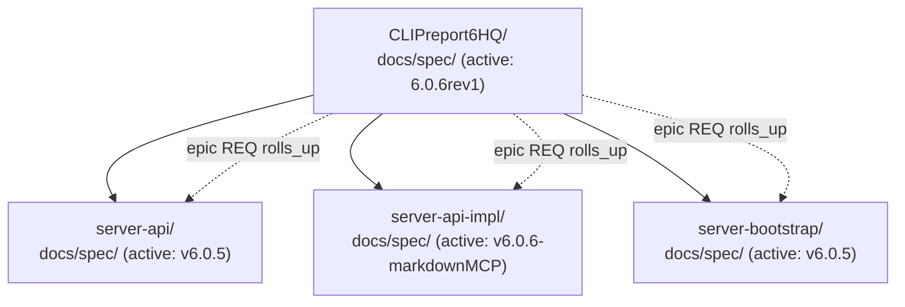

# ORDER-2026-05-26: speckiwi MCP 전 도구 `workspace` 경로 파라미터 추가 요청

| 항목 | 값 |
|---|---|
| 작성일 | 2026-05-26 |
| 요청자 | CLIPreport6HQ 프로젝트 팀 (`rnd@hancomins.com`) |
| 대상 컴포넌트 | speckiwi MCP server, speckiwi CLI |
| 영향 도구 수 | 17개 (전수) |
| 호환성 | Backward-compatible (옵션 파라미터, 기본값 = `process.cwd()`) |
| 우선순위 | High (모노레포 사용자 워크플로 + Kiwi skills multi-workspace 차단 해소) |
| 종류 | Feature request |

---

## 1. 요약 (Executive Summary)

speckiwi MCP 가 노출하는 모든 도구는 현재 호출 시점의 `process.cwd()` 를 기준으로 워크스페이스를 식별한다. 단일 저장소 단일 워크스페이스 시나리오에서는 충분하지만, **하나의 모노레포 안에 git submodule 별로 독립된 speckiwi workspace 가 다수 존재하는 환경** 에서는 다음 문제가 발생한다.

1. MCP 클라이언트(Claude Code / Codex / OpenCode 등)는 일반적으로 세션 단위 단일 cwd 만 유지하므로, 워크스페이스를 바꾸려면 새 MCP 서버 인스턴스를 띄우거나 새 에이전트 세션을 열어야 한다.
2. Cross-workspace trace link 등록 (예: 루트 epic REQ → 서브모듈 세부 REQ `rolls_up`) 을 한 번의 대화 흐름 안에서 처리할 수 없다.
3. `kiwi-srs`, `kiwi-planner`, `kiwi-srs-feasibility` 등의 Kiwi skill 이 "동일 작업을 N 개 워크스페이스에 일괄 반영" 하는 multi-workspace 모드를 가질 수 없다.

본 요청은 **모든 MCP 도구에 선택적 `workspace` 파라미터 1 개를 추가** 하여 위 문제를 해소한다. 기본값은 `process.cwd()` 로 유지되어 기존 호출자는 어떤 변경도 필요하지 않다.

---

## 2. 배경

### 2.1 모노레포 워크스페이스 구조 (요청자 환경)

CLIPreport6HQ 는 한컴이노스트림의 리포팅·전자폼 솔루션으로, Java/JavaScript 멀티모듈 + 17 개 git submodule 로 구성된다. 그중 4 개 위치가 독립된 speckiwi workspace 를 운영한다.



각 워크스페이스는 자체 `docs/spec/00.index.md` 와 SRS 데이터베이스를 가진다. **하지만 실제 작업 단위는 워크스페이스 경계를 자주 넘는다**:

- 루트에 정의된 보안 아키텍처 epic 이 서브모듈 3 곳에서 동시에 구현되어야 함.
- 한 PR 이 server-api 의 인터페이스 + server-api-impl 의 구현 + server-bootstrap 의 부트 시퀀스를 모두 건드림.
- Release readiness 평가 시 4 워크스페이스 stability 를 같은 세션에서 비교해야 함.

### 2.2 현재 cwd 기반 동작의 구체적 마찰

| 시나리오 | 현재 필요한 조작 | 결과 |
|---|---|---|
| 루트 → 서브모듈 trace 등록 | 새 Claude 세션 1 개 추가 또는 MCP 재시작 | 컨텍스트 손실, 비용 증가 |
| 4 워크스페이스 일괄 `validate_spec` | 세션 4 회 분리 또는 cwd 전환 hack | 결과 비교 곤란 |
| Kiwi skill 의 multi-workspace 일괄 처리 | 불가능 (skill 이 cwd 단일 가정) | Skill 자체 미구현 |

---

## 3. 현황 분석 — MCP 도구 17 개 전수 조사

2026-05-26 기준 speckiwi MCP 도구 전수 확인 결과(MCP server 가 노출한 실제 schema 확인), **단 하나도 워크스페이스/프로젝트 경로 파라미터를 노출하지 않는다.**

| # | 도구 | 현재 파라미터 | 경로 파라미터 |
|---|---|---|:---:|
| 1 | `get_active_target` | (없음) | 없음 |
| 2 | `set_active_target` | `target`, `dryRun` | 없음 |
| 3 | `set_target_goal` | `target`, `goal`, `dryRun` | 없음 |
| 4 | `summarize_target` | `target` | 없음 |
| 5 | `list_requirements` | `scope`, `status`, `tag`, `target`, `type` | 없음 |
| 6 | `add_requirement` | 23 개 필드 (필수 6: `type`, `scope`, `target`, `title`, `requirement`, `acceptanceCriteria` + 선택 17) | 없음 |
| 7 | `add_trace_link` | `id`, `type`, `reference`, `relation`, `notes` | 없음 |
| 8 | `update_status` | `id`, `status` | 없음 |
| 9 | `update_stability` | `id`, `stability` (draft/evolving/stable/frozen/deprecated), `reason`, `dryRun` | 없음 |
| 10 | `add_completed_work` | `date`, `summary`, `scope`, `target`, `requirementIds`, `reportPaths`, `allowIncomplete`, `dryRun` | 없음 |
| 11 | `add_verification_evidence` | `id`, `type`, `reference`, `covers`, `notes` | 없음 |
| 12 | `get_requirement` | `id`, `includeMarkdown` | 없음 |
| 13 | `list_completed_work` | `limit`, `scope`, `since`, `target` | 없음 |
| 14 | `validate_spec` | `strict`, `failOnWarning` | 없음 |
| 15 | `init_project` | `scope`, `target`, `force` | 없음 |
| 16 | `append_section_note` | `id`, `section`, `text`, `mode` (append/replace), `dryRun` | 없음 |
| 17 | `check_acceptance_criteria` | `id`, `acIds[]`, `checked` | 없음 |

> 항목 10, 16, 17 의 파라미터는 본 요청서 작성 시점에 MCP server 가 노출한 실제 JSON schema (`draft-07`) 를 직접 확인하여 기록하였다.

결과: 모노레포의 4 워크스페이스를 단일 세션에서 동시에 다루는 것은 현재 MCP 표면에서 **표현 불가능** 하다.

---

## 4. 요청 사항

### 4.1 모든 도구에 선택적 `workspace` 파라미터 추가

#### 신규 파라미터 사양

```json
{
  "workspace": {
    "type": "string",
    "description": "Absolute path to the speckiwi workspace root (the directory containing docs/spec/). When omitted, defaults to process.cwd(). Backward-compatible.",
    "examples": [
      "C:\\Work\\git\\CLIPreport6HQ\\server-api",
      "/home/user/project/backend"
    ]
  }
}
```

명명 후보:

| 후보 | 장점 | 단점 |
|---|---|---|
| `workspace` | speckiwi 도메인 용어와 일치 | 다른 의미(VS Code workspace 등)와 혼동 가능 |
| `projectPath` | 일반 개발자에게 직관적 | speckiwi 가 "project" 라는 용어를 거의 안 씀 |
| `root` | speckiwi CLI 의 기존 `--root` 와 일관 | MCP context 에서 의미 모호 |

요청자 권고: **`workspace`** (CLI `--root` 와는 의미가 같지만, MCP 도메인에서는 `workspace` 가 사용자 의도를 더 명확히 표현).

### 4.2 호환성 보장

- 옵션 파라미터로 추가 → 기존 모든 호출자는 변경 없이 동작.
- 미지정 시 동작은 현재 구현과 byte-identical 이어야 함 (`process.cwd()` 사용).
- 신규 호출자만 명시적으로 `workspace` 를 지정.
- MCP tool description 에 default 동작을 명시.

### 4.3 검증 규칙

| 검증 | 동작 | 에러 메시지 (제안) |
|---|---|---|
| 절대 경로 여부 | 상대 경로 거부 | `workspace must be an absolute path, got: <value>` |
| 경로 traversal | `..` 포함 거부 (또는 normalize 후 검증) | `workspace path must not contain '..' segments` |
| 디렉토리 존재 | 존재하지 않으면 거부 | `workspace not found: <value>` |
| `docs/spec/00.index.md` 존재 | 없으면 거부 | `not a speckiwi workspace (missing docs/spec/00.index.md): <value>` |
| 심볼릭 링크 / junction | 정책 명시 필요 (예: realpath 해석 후 검증, 또는 거부) | 별도 정책 문서 |

### 4.4 CLI 도구도 동일 파라미터 추가

speckiwi CLI 는 이미 `--root <path>` 옵션을 가지고 있다. MCP 의 `workspace` 와 CLI 의 `--root` 가 **개념적으로 동일** 함을 문서화하고, MCP 신규 파라미터의 이름을 `workspace` 로 정한다면 README/CLAUDE.md/AGENTS.md 에 매핑 표를 추가한다.

```text
MCP tool param `workspace`   ↔   CLI option `--root`
both mean: absolute path to the directory containing docs/spec/
```

### 4.5 사용 시나리오

#### 시나리오 A — Cross-workspace trace 등록

루트의 epic REQ 가 서브모듈 세부 REQ 를 `rolls_up` 으로 트레이스.

```jsonc
// (1) 루트 워크스페이스에서 trace link 등록
{
  "tool": "add_trace_link",
  "params": {
    "workspace": "C:\\Work\\git\\CLIPreport6HQ",
    "id": "SEC-ARCH-001",
    "type": "requirement",
    "reference": "v6.0.8-licenseSecurity:SEC-LIFE-001",
    "relation": "rolls_up"
  }
}

// (2) 같은 세션 안에서 서브모듈에 세부 REQ 등록
{
  "tool": "add_requirement",
  "params": {
    "workspace": "C:\\Work\\git\\CLIPreport6HQ\\server-api",
    "target": "v6.0.8-licenseSecurity",
    "scope": "Security:SEC",
    "type": "FR",
    "title": "License signature verification API",
    "...": "..."
  }
}
```

#### 시나리오 B — 4 워크스페이스 일괄 검증

```jsonc
// 한 세션, 4 회 호출
for (const ws of [
  "C:\\Work\\git\\CLIPreport6HQ",
  "C:\\Work\\git\\CLIPreport6HQ\\server-api",
  "C:\\Work\\git\\CLIPreport6HQ\\server-api-impl",
  "C:\\Work\\git\\CLIPreport6HQ\\server-bootstrap"
]) {
  await mcp.call("validate_spec", { workspace: ws, strict: true });
}
```

릴리스 readiness 평가, CI 사전 검증, governance audit 등에서 즉시 사용.

#### 시나리오 C — Kiwi skill multi-workspace 모드

`kiwi-srs` / `kiwi-planner` / `kiwi-srs-feasibility` 같은 skill 이 "동일 변경을 4 워크스페이스에 propagate" 하는 mode 를 가질 수 있게 됨.

```text
사용자: "이 보안 요구사항을 4 워크스페이스 전체에 반영해줘"

kiwi-srs (proposed multi-workspace mode):
  1. 사용자가 지정한 workspace 목록 수집
  2. 각 workspace 의 active target / scope 비교 후 매핑 결정
  3. 워크스페이스별 add_requirement 호출 시 workspace 파라미터로 분기
  4. 워크스페이스 간 trace link 자동 생성 (epic → 세부)
```

이 워크플로는 **현재 MCP 표면에서는 불가능**.

### 4.6 추가 제안 — `list_workspaces` 신규 도구

선택적이지만 모노레포 사용성을 크게 끌어올린다.

```jsonc
{
  "tool": "list_workspaces",
  "params": {
    "searchRoot": "C:\\Work\\git\\CLIPreport6HQ",  // optional, defaults to cwd. discovery 시작점이며 §4.1 의 `workspace` (단일 워크스페이스 지정) 와 의미가 다르므로 별도 이름 사용
    "discovery": "git-submodule"                   // "git-submodule" | "tree-scan" | "config-file"
  }
}

// 응답 예시
{
  "workspaces": [
    {
      "path": "C:\\Work\\git\\CLIPreport6HQ",
      "activeTarget": "6.0.6rev1",
      "scopeCount": 12,
      "reqCount": 8,
      "isGitSubmodule": false
    },
    {
      "path": "C:\\Work\\git\\CLIPreport6HQ\\server-api",
      "activeTarget": "v6.0.5",
      "scopeCount": 24,
      "reqCount": 178,
      "isGitSubmodule": true
    },
    {
      "path": "C:\\Work\\git\\CLIPreport6HQ\\server-api-impl",
      "activeTarget": "v6.0.6-markdownMCP",
      "scopeCount": 31,
      "reqCount": 244,
      "isGitSubmodule": true
    },
    {
      "path": "C:\\Work\\git\\CLIPreport6HQ\\server-bootstrap",
      "activeTarget": "v6.0.5",
      "scopeCount": 18,
      "reqCount": 92,
      "isGitSubmodule": true
    }
  ]
}
```

발견 전략 후보:

- `git-submodule`: `.gitmodules` 파싱 후 각 submodule 루트에 `docs/spec/00.index.md` 존재 여부 확인.
- `tree-scan`: depth 제한 트리 스캔 (큰 모노레포에서 비용 우려 → opt-in).
- `config-file`: 프로젝트 루트의 `.speckiwi/workspaces.json` 같은 manifest 사용 (가장 명시적, 권장).

---

## 5. 호환성 분석

### 5.1 기존 호출자

| 호출자 | 영향 |
|---|---|
| 기존 MCP 클라이언트 (모든 Kiwi skill 포함) | 없음 — `workspace` 미지정 시 `process.cwd()` 사용 |
| 기존 CLI 사용자 | 없음 — `--root` 가 이미 동일 역할 |
| CI 스크립트 | 없음 |
| 문서/튜토리얼 | 신규 사용 예시 추가 외 변경 없음 |

### 5.2 SDK 시그니처

TypeScript 타입 시그니처 변경은 **추가 only** (optional 필드 추가) 이므로 SemVer minor bump 으로 충분.

```ts
// Before
interface AddRequirementParams {
  target: string;
  scope: string;
  // ...
}

// After
interface AddRequirementParams {
  target: string;
  scope: string;
  // ...
  workspace?: string;  // NEW, optional
}
```

### 5.3 영향 받는 내부 모듈 (추정)

speckiwi 내부 구현 세부는 메인테이너가 더 잘 알지만, 외부에서 보았을 때 다음이 변경 대상으로 보인다.

- MCP tool dispatcher: workspace 추출 후 내부 service 계층에 전달
- Workspace resolver: 현재 cwd 의존 부분을 명시적 인자 우선으로 변경
- CLI ↔ MCP 공통 service: 이미 `--root` 를 처리하므로 같은 경로 활용 가능

---

## 6. 위험 및 완화

| 위험 | 영향 | 완화 |
|---|---|---|
| **경로 traversal 공격** (사용자가 `..` 로 임의 파일 시스템 영역 접근 시도) | 보안 (RCE 가능성 낮음, 정보 노출 위험 있음) | 절대 경로만 허용 + `..` 차단 + `docs/spec/00.index.md` 검증 (§4.3) |
| **심볼릭 링크 / junction 우회** | 의도하지 않은 경로 접근 | realpath 해석 후 정책에 따라 처리 (정책 명시 필요) |
| **워크스페이스 캐싱 / 동시 mutation** | 성능 저하 또는 race condition | 워크스페이스별 in-memory 인덱스 LRU 캐시 + workspace 단위 mutex |
| **MCP client 가 절대 경로를 잘못 전달** | 알기 어려운 실패 | 명확한 에러 메시지 (§4.3) + tool description 에 예시 명시 |
| **Windows vs POSIX 경로 분리자** | 크로스 플랫폼 버그 | Node `path.resolve()` + `path.normalize()` 사용, 테스트 케이스에 양 OS 포함 |
| **Kiwi skill 의 무분별한 propagate** | 의도치 않은 다중 워크스페이스 mutation | skill 측 dry-run 강제 + 사용자 승인 게이트 (skill 책임, MCP 책임 아님) |
| **scope/target ID 충돌** (워크스페이스 간 동일 ID 가 다른 의미) | 사용자 혼동 | `reference` 표기에 `workspace-name:REQ-ID` 같은 prefix 컨벤션 권장 (별도 RFC 가능) |
| **CLI 와 MCP 의 명명 불일치** (`--root` vs `workspace`) | 학습 비용 | README 에 매핑 표 추가 (§4.4) |

---

## 7. 우선순위 / 비즈니스 가치

### 7.1 직접 수혜자

| 사용자 그룹 | 가치 |
|---|---|
| 모노레포 + git submodule 운영자 | 4+ 워크스페이스를 단일 세션에서 다룸 — 컨텍스트 손실 / 비용 절감 |
| Kiwi skill 사용자 | multi-workspace skill 모드 도입 가능 (kiwi-srs, kiwi-planner, kiwi-srs-feasibility) |
| Release/governance audit 담당 | 워크스페이스 전수 `validate_spec` / `summarize_target` 일괄 실행 |
| Cross-workspace trace 사용자 | epic ↔ 세부 REQ 트레이스 그래프를 한 세션에서 작성 |

### 7.2 간접 효과

- speckiwi 자체의 적용 가능 도메인 확장 (mono-repo 친화)
- "speckiwi workspace" 가 1급 개념으로 격상 → 향후 workspace 단위 권한/감사 기능 자연스러운 확장점 확보
- `kiwi-pipeline` 같은 메타 스킬이 workspace 차원을 인식할 수 있게 됨

### 7.3 차단 해소

본 요청 없이는 다음이 불가능 (요청자 환경 기준):

- `kiwi-srs` 가 루트 epic + 3 서브모듈 세부 REQ 를 한 번에 등록
- `kiwi-planner` 가 4 워크스페이스의 active target 을 묶어 plan 작성
- `kiwi-pm` 이 워크스페이스 경계를 넘는 Task 를 단일 plan 으로 실행

요청자 권고 우선순위: **High** (다른 모노레포 사용자도 동일 차단을 겪을 가능성이 매우 높음).

---

## 8. 참고 OSS 사례

| 도구 | 워크스페이스 처리 방식 | 본 요청과의 관계 |
|---|---|---|
| **GitHub MCP Server** | `owner`, `repo` 를 모든 도구에 명시적으로 받음 (cwd 비의존) | 본 요청과 같은 접근 — 도구마다 컨텍스트를 명시 |
| **Linear MCP** | API 호출 시 workspace ID 가 token 에 묶이고 도구는 cwd 미사용 | 환경 변수 기반 워크스페이스 식별 (대안 1) |
| **VS Code Multi-root Workspaces** | `.code-workspace` JSON manifest 로 다중 폴더 묶음 정의 | `list_workspaces` 의 `config-file` 발견 전략과 유사 |
| **Bazel WORKSPACE / MODULE.bazel** | 루트 마커 파일로 워크스페이스 발견 | speckiwi 의 `docs/spec/00.index.md` 가 같은 역할 (이미 존재) |
| **Nx Monorepo** | `nx.json` 루트 manifest + project 단위 명시적 라우팅 | Cross-project 의존성 관리 케이스 참고 |
| **pnpm workspaces** | `pnpm-workspace.yaml` 글로브 패턴으로 워크스페이스 목록 정의 | discovery 전략 참고 |
| **Cargo workspaces (Rust)** | `[workspace]` 섹션 + members 글로브 | discovery 전략 참고 |

가장 가까운 선례는 **GitHub MCP Server** 의 모델 — 모든 도구가 컨텍스트를 명시적으로 받고 stateless 하게 동작.

---

## 9. 권고 진행 절차

메인테이너의 자율 판단을 전제로 한 제안.

1. **SRS 등록** — 본 요청을 speckiwi 자체 SRS 의 한 requirement 로 등록 (예: `FR-MCP-XXX: MCP tool workspace parameter`).
2. **호환성 영향 분석** — 메인테이너가 본 §5 의 가정 검증.
3. **합의된 명명 확정** — `workspace` vs `projectPath` vs `root` 중 택일 (§4.1).
4. **Phase 1: 모든 tool schema 에 옵션 파라미터 추가** — backward-compatible 한 SDK minor bump.
5. **Phase 2: workspace resolver 통합** — CLI `--root` 와 MCP `workspace` 가 동일 service 경로 사용.
6. **Phase 3: 검증 규칙 구현** (§4.3) + 테스트.
7. **Phase 4 (선택): `list_workspaces` 도구 추가** — 별도 SRS 로 분리 가능.
8. **Phase 5: 문서 갱신** — README, CLAUDE.md, AGENTS.md, 각 Kiwi skill 의 multi-workspace 사용 가이드.

요청자는 Phase 1 만으로도 즉시 가치를 얻을 수 있다. Phase 4 (`list_workspaces`) 는 nice-to-have.

---

## 10. 요청자 컨텍스트 / 환경

| 항목 | 값 |
|---|---|
| 프로젝트 | CLIPreport6HQ (한컴이노스트림 CLIP Report 6.0) |
| 저장소 형태 | Git monorepo + 17 git submodules |
| speckiwi workspace 수 | 4 (root + 3 submodules) |
| 활성 타겟 (워크스페이스별) | 6.0.6rev1 / v6.0.5 / v6.0.6-markdownMCP / v6.0.5 |
| 주 사용 에이전트 | Claude Code (Opus 4.7 1M context) |
| 사용 중인 Kiwi skills | kiwi-srs, kiwi-srs-feasibility, kiwi-planner, kiwi-pm, kiwi-coder, kiwi-srs-sync, kiwi-pipeline, kiwi-commit-auto-push, kiwi-srs-research, kiwi-srs-from-code, kiwi-hot-fix, kiwi-review-fix-loop |
| 작성일 | 2026-05-26 |
| 연락처 | rnd@hancomins.com |

---

## 11. 관련 자료

요청자 측에서 본 요청의 배경이 된 내부 조사 / 사용 사례는 다음 위치에 있다 (외부 공개되지 않은 사내 자료).

- `C:\Work\git\CLIPreport6HQ\docs\research\` — 모노레포 SRS 분리 결정 배경
- `C:\Work\git\CLIPreport6HQ\docs\plan\` — 4 워크스페이스 동시 진행 plan 예시
- `C:\Work\git\CLIPreport6HQ\docs\spec\00.index.md` — 루트 워크스페이스 index
- `C:\Work\git\CLIPreport6HQ\server-api\docs\spec\00.index.md` — 서브모듈 워크스페이스 예시

speckiwi 측 관련 기존 SRS / 코드 참조 권장 (메인테이너 확인 부탁):

- 현재 cwd 의존 로직 위치 (workspace resolver)
- 기존 `--root` CLI 옵션 처리 경로
- MCP tool dispatcher 의 파라미터 검증 계층

---

## 12. 비-요청 사항 (Out of Scope)

본 요청서는 **다음을 요청하지 않음**:

- speckiwi MCP 의 multi-tenant / 다중 사용자 동시 접근 지원
- 워크스페이스 간 자동 동기화 (mirror, replication)
- 워크스페이스 단위 권한/ACL 시스템
- 분산 SRS 저장소 (remote workspace)
- 워크스페이스 간 자동 trace 추론 (사람/skill 결정 영역)

위 항목은 본 요청의 후속 RFC 로 분리되어야 한다.

---

## 13. 결정 요청

메인테이너에게 다음 결정을 부탁드린다.

1. **수용 여부** — 본 요청의 방향성에 동의하는가?
2. **명명 확정** — `workspace` / `projectPath` / `root` / 기타 중 어느 것을 채택할지.
3. **Phase 분할** — §9 진행 절차를 그대로 사용할지, 다르게 묶을지.
4. **`list_workspaces` 포함 범위** — 본 요청과 함께 진행할지, 별도 SRS 로 분리할지.
5. **심볼릭 링크 정책** — realpath 해석 / 거부 / 신뢰 중 택일.

요청자는 결정 결과에 맞춰 사용 패턴 / Kiwi skill multi-workspace 모드 RFC 를 별도로 제출할 의향이 있음.

---

*이 문서는 요청서이며 명령이 아니다. speckiwi 메인테이너의 우선순위 / 로드맵 / 설계 자율성을 존중한다.*
